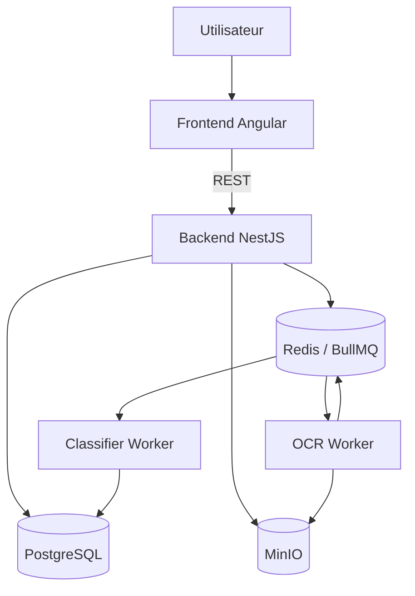
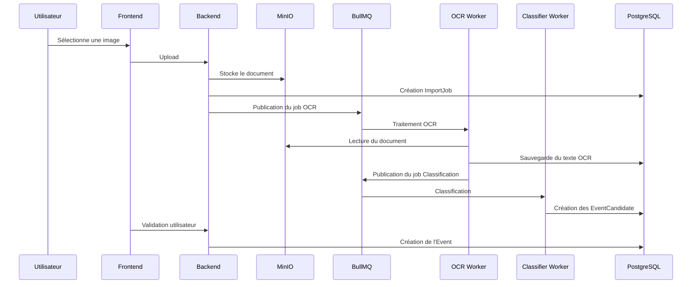

# System Architecture

**Document** : ARCHI.01  
**Fichier** : 01-ARCHI.01-SystemArchitecture-v1.0.md  
**Version** : 1.0  
**Statut** : Validé

---

# Objectif

Définir l'architecture générale de la plateforme EventFoundry.

Ce document décrit les composants, leurs responsabilités et leurs interactions.

Il ne décrit ni le modèle métier, ni le schéma de données, ni les API REST.

Ces sujets sont traités respectivement dans :

- ARCHI.02 – Domain
- ARCHI.03 – Database
- ARCHI.04 – API

---

# Principes d'architecture

L'architecture repose sur les principes suivants :

- une responsabilité par composant ;
- PostgreSQL est l'unique source de vérité ;
- Redis est réservé aux traitements techniques ;
- MinIO est utilisé pour tous les fichiers importés ;
- les workers sont stateless ;
- le backend orchestre les traitements mais ne réalise ni OCR ni classification ;
- chaque composant peut être déployé indépendamment.

---

# Architecture logique

```text
                    Utilisateur
                          │
                          │
                   Frontend Angular
                          │
                    HTTP REST / JSON
                          │
                  Backend (NestJS)
        ┌─────────────────┼─────────────────┐
        │                 │                 │
        │                 │                 │
 PostgreSQL           MinIO          Redis / BullMQ
                                            │
                              ┌─────────────┴─────────────┐
                              │                           │
                         OCR Worker              Classifier Worker
```

---

# Diagramme des composants



---

# Responsabilités des composants

## Frontend Angular

Responsabilités :

- authentification ;
- navigation ;
- upload des documents ;
- recherche d'événements ;
- calendrier ;
- validation des EventCandidate.

Ne réalise jamais :

- OCR ;
- classification ;
- traitements métier complexes.

---

## Backend NestJS

Responsabilités :

- API REST ;
- authentification ;
- gestion des utilisateurs ;
- gestion des événements ;
- orchestration des imports ;
- publication des jobs BullMQ.

Ne réalise jamais :

- OCR ;
- classification.

---

## OCR Worker

Responsabilités :

- récupération des documents dans MinIO ;
- prétraitement des images ;
- exécution de Tesseract ;
- stockage du texte OCR ;
- déclenchement du traitement de classification.

---

## Classifier Worker

Responsabilités :

- lecture du texte OCR ;
- application du moteur expert ;
- création des EventCandidate ;
- calcul des scores de confiance.

Le moteur repose exclusivement sur des règles métier et des référentiels.

---

## PostgreSQL

Source de vérité du système.

Contient les données métier :

- utilisateurs ;
- événements ;
- imports ;
- candidats ;
- référentiels.

---

## MinIO

Stocke :

- images originales ;
- documents importés ;
- pièces jointes.

Aucune image n'est stockée dans PostgreSQL.

---

## Redis / BullMQ

Utilisations autorisées :

- files de traitement ;
- verrous distribués ;
- cache des référentiels.

Redis ne contient aucune donnée métier persistante.

---

# Cycle d'un import

```text
Utilisateur

↓

Upload

↓

Backend

↓

MinIO

↓

Création ImportJob

↓

BullMQ

↓

OCR Worker

↓

Texte OCR

↓

Classifier Worker

↓

EventCandidate(s)

↓

Validation utilisateur

↓

Création Event
```

---

# Diagramme de séquence



---

# Monorepo

```text
event-foundry/

frontend/
backend/

ocr-worker/
classifier-worker/

docs/
docker/
k8s/
scripts/
```

Chaque composant possède son propre cycle de build tout en partageant le même dépôt Git.

---

# Déploiement Kubernetes

Pods applicatifs :

- frontend
- backend
- ocr-worker
- classifier-worker

Services :

- PostgreSQL
- Redis
- MinIO

Tous les pods applicatifs doivent être réplicables horizontalement.

---

# Contraintes

- les workers ne communiquent jamais directement entre eux ;
- toute communication asynchrone passe par BullMQ ;
- toutes les données persistantes sont stockées dans PostgreSQL ou MinIO ;
- tous les traitements doivent être rejouables sans perte de données.

---

# Documents liés

- VISION
- ARCHI.02 – Domain
- ARCHI.03 – Database
- ARCHI.04 – API

---

# Historique

| Version | Description |
|----------|-------------|
| 1.0 | Première version validée. |