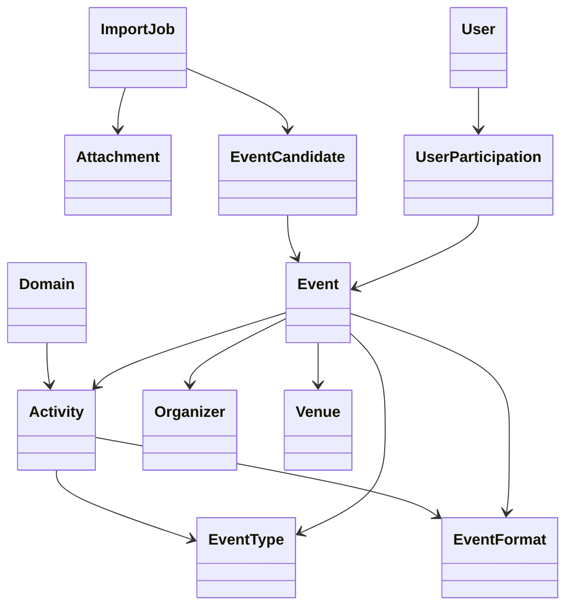

# Domain Model

**Document** : ARCHI.02  
**Fichier** : 01-ARCHI.02-Domain-v1.1.md  
**Version** : 1.1  
**Statut** : Validé

---

# Objectif

Définir le modèle métier d'EventFoundry.

Ce document décrit les concepts manipulés par l'application, leurs responsabilités
et leurs relations.

Il ne décrit ni le modèle relationnel PostgreSQL, ni les API REST.

Ces sujets sont traités respectivement dans :

- ARCHI.03 – Database
- ARCHI.04 – API

---

# Principes

Le modèle métier repose sur les principes suivants :

- un concept métier = une responsabilité ;
- les entités métier sont indépendantes des technologies ;
- les référentiels sont des données métier ;
- les traitements (OCR, classification, files BullMQ...) ne sont pas des concepts métier.

---

# Vue d'ensemble



---

# Hiérarchie métier

```text
Domain
└── Activity
    ├── EventType
    └── EventFormat (optionnel)
```

Cette hiérarchie constitue le référentiel principal d'EventFoundry.

Règles :

- une Activity appartient obligatoirement à un Domain ;
- un EventType appartient obligatoirement à une Activity ;
- un EventFormat appartient obligatoirement à une Activity ;
- un Event peut ne pas posséder de EventFormat.

---

# Déduction du Domain

Le **Domain** est **toujours déduit** de l'Activity.

Il n'est jamais choisi par l'utilisateur.

Exemple :

```text
Activity = Magic

↓

Domain = TCG
```

Cette règle est valable :

- lors de la création manuelle d'un Event ;
- lors de la validation d'un EventCandidate ;
- dans toutes les interfaces utilisateur.

Le Domain reste une donnée métier persistée et exploitable pour les recherches, mais il ne fait jamais partie des informations à saisir.

---

# Exemples

| Domain | Activity | EventType | EventFormat |
|---------|----------|-----------|-------------|
| TCG | Magic | Avant-première | Draft |
| TCG | Pokémon | League Challenge | Standard |
| Musique | Metal | Concert | Festival |
| Sport | Running | Course | Semi-marathon |
| Culture | Manga | Convention | Cosplay |

---

# Entités métier

## User

Représente un utilisateur de la plateforme.

Responsabilités :

- authentification ;
- calendrier personnel ;
- participation aux événements.

---

## Attachment

Document importé dans la plateforme.

Types V1 :

- image ;
- texte.

Responsabilités :

- conserver le document original ;
- permettre un retraitement OCR.

Aucune donnée métier n'est stockée dans cette entité.

---

## ImportJob

Suit le cycle technique d'un import.

États :

- PENDING
- OCR_RUNNING
- OCR_DONE
- CLASSIFICATION_RUNNING
- READY_FOR_VALIDATION
- COMPLETED
- FAILED

Un ImportJob appartient au pipeline technique.

---

## EventCandidate

Résultat produit par le moteur expert.

Cycle de vie :

- PENDING
- CORRECTED
- VALIDATED
- REJECTED

Il représente une proposition d'événement avant validation utilisateur.

Un EventCandidate peut contenir un score de confiance pour chaque information détectée.

---

## Event

Événement officiel de la plateforme.

Un Event est créé uniquement après validation d'un EventCandidate ou par création manuelle.

C'est la seule représentation métier officielle d'un événement.

---

## Domain

Grand domaine fonctionnel.

Le Domain est déterminé automatiquement par l'Activity.

Il n'est jamais sélectionné directement par l'utilisateur.

---

## Activity

Activité appartenant à un Domain.

Exemples :

- Magic
- Pokémon
- Running
- Metal
- Terraforming Mars

[...]

(Le reste du document est inchangé.)

---

# Historique

| Version | Description |
|----------|-------------|
| 1.0 | Première version validée. Généralisation du modèle Domain → Activity. |
| 1.1 | Le Domain devient une donnée déduite de l'Activity et n'est plus jamais saisi par l'utilisateur. |