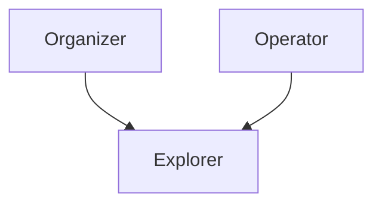
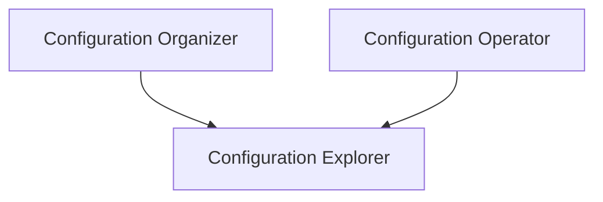
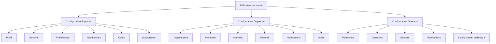

# User Configuration Framework

**Document** : FSPEC.14

**Fichier** : 02-FSPEC.14-UserConfigurationFramework-v3.0.md

**Version** : 3.0

**Statut** : Validé

---

# 1. Objectif

Cette spécification définit l'architecture fonctionnelle des espaces de configuration de la plateforme **EventFoundry**.

Elle décrit :

- les différents niveaux de configuration ;
- les responsabilités associées à chaque rôle ;
- les principes d'héritage entre les rôles ;
- les règles générales de sécurité ;
- les règles d'audit ;
- les principes de gestion des paramètres.

Les détails de chaque espace de configuration sont décrits dans des spécifications dédiées :

- **FSPEC.15 – Explorer Configuration**
- **FSPEC.16 – Organizer Configuration**
- **FSPEC.17 – Operator Configuration**

---

# 2. Périmètre

Cette spécification couvre exclusivement les espaces de configuration accessibles aux utilisateurs authentifiés.

Elle ne couvre pas :

- les fonctionnalités métier ;
- la gestion des événements ;
- les organisations ;
- la modération ;
- les interfaces publiques.

---

# 3. Principes généraux

## 3.1 Trois niveaux de configuration

EventFoundry distingue trois espaces de configuration indépendants.

| Niveau | Objet |
|---------|------|
| Explorer | Configuration personnelle de l'utilisateur |
| Organizer | Configuration des organisations administrées par l'utilisateur |
| Operator | Configuration globale de la plateforme |

Ces espaces sont indépendants mais complémentaires.

---

## 3.2 Héritage des capacités

Les rôles ne représentent pas des utilisateurs différents.

Un même utilisateur peut exercer plusieurs rôles simultanément.

Le rôle actif détermine uniquement l'espace de configuration actuellement consulté.



Ainsi :

- un Organizer dispose toujours des fonctionnalités Explorer ;
- un Operator dispose toujours des fonctionnalités Explorer ;
- les paramètres personnels restent identiques quel que soit le rôle actif.

---

## 3.3 Séparation des responsabilités

Les paramètres sont répartis selon leur portée.

### Configuration personnelle

Les paramètres personnels concernent uniquement l'utilisateur connecté.

Exemples :

- profil
- sécurité
- préférences
- notifications personnelles
- outils personnels

---

### Configuration d'organisation

Les paramètres d'organisation concernent exclusivement une organisation donnée.

Ils sont partagés par tous les administrateurs autorisés de cette organisation.

Exemples :

- identité de l'organisation
- membres
- activités couvertes
- sécurité de publication
- modèles IA de l'organisation

---

### Configuration de la plateforme

Les paramètres plateforme concernent l'ensemble de l'instance EventFoundry.

Ils sont réservés aux Operators.

Exemples :

- configuration générale
- serveur de messagerie
- sécurité globale
- modèles IA de la plateforme
- paramètres techniques

---

# 4. Navigation

La navigation entre les espaces de configuration dépend du rôle actif.

## Explorer

```text
Menu utilisateur

└── Configuration personnelle
```

---

## Organizer

```text
Menu utilisateur

├── Configuration personnelle
└── Organisation
      ├── Organisation A
      ├── Organisation B
      └── ...
```

L'organisation active est sélectionnée dans le menu principal.

Toutes les opérations de configuration concernent exclusivement cette organisation.

---

## Operator

```text
Menu utilisateur

├── Configuration personnelle
└── Plateforme
```

---

# 5. Principes de conception

Les principes suivants s'appliquent à tous les espaces de configuration.

## 5.1 Simplicité

Les paramètres doivent être organisés par domaine fonctionnel.

Exemples :

- Profil
- Sécurité
- Notifications
- Outils
- Souscription

---

## 5.2 Cohérence

Une même fonctionnalité doit toujours être configurée au même endroit.

Exemple :

Les préférences de notification personnelles ne doivent jamais apparaître dans la configuration d'une organisation.

---

## 5.3 Isolation

Une modification ne doit jamais produire d'effet de bord sur un autre niveau de configuration.

Modifier :

- son avatar personnel

ne modifie jamais :

- le logo d'une organisation.

---

## 5.4 Confirmation

Les opérations sensibles doivent demander une confirmation explicite.

Exemples :

- suppression
- désactivation
- révocation d'accès
- changement d'adresse principale
- activation du MFA obligatoire

---

## 5.5 Sauvegarde explicite

Lorsqu'une configuration comporte plusieurs modifications, celles-ci ne deviennent effectives qu'après validation explicite.

Exemple :

Bouton :

> Enregistrer les modifications

Cette règle évite les notifications ou traitements déclenchés prématurément.

---

# 6. Audit

Toutes les modifications de configuration sont historisées.

Chaque modification possède au minimum :

| Champ | Description |
|--------|-------------|
| Auteur | Utilisateur ayant réalisé l'action |
| Date | Horodatage UTC |
| Ressource | Élément modifié |
| Ancienne valeur | Valeur précédente |
| Nouvelle valeur | Valeur appliquée |

Les historiques doivent pouvoir être consultés par les utilisateurs autorisés.

---

# 7. Sécurité

Les paramètres critiques doivent pouvoir nécessiter une authentification renforcée.

Exemples :

- changement de mot de passe
- activation ou désactivation du MFA
- modification des administrateurs
- configuration de la plateforme
- paramètres techniques

Selon la politique de sécurité de la plateforme, une réauthentification peut être demandée avant validation.

---

# 8. Notifications

Certaines modifications peuvent déclencher des notifications.

Afin d'éviter des notifications inutiles ou erronées :

- les modifications peuvent être regroupées ;
- les notifications peuvent être différées ;
- certaines notifications ne sont envoyées qu'après validation complète des paramètres.

---

# 9. Modèles IA

EventFoundry permet la déclaration de modèles IA personnalisés.

Le niveau de portée dépend de l'espace de configuration.

| Niveau | Portée |
|---------|---------|
| Explorer | Utilisateur uniquement |
| Organizer | Organisation |
| Operator | Plateforme entière |

Les modèles définis à un niveau ne sont pas automatiquement hérités par les autres niveaux.

---

# 10. Règles de gestion

| Identifiant | Règle |
|--------------|--------|
| CFG-001 | Chaque utilisateur possède un espace de configuration personnel. |
| CFG-002 | Un Organizer hérite automatiquement de toutes les fonctionnalités Explorer. |
| CFG-003 | Un Operator hérite automatiquement de toutes les fonctionnalités Explorer. |
| CFG-004 | Les paramètres personnels sont indépendants des paramètres des organisations. |
| CFG-005 | Les paramètres des organisations sont indépendants de ceux de la plateforme. |
| CFG-006 | Les modifications importantes nécessitent une validation explicite. |
| CFG-007 | Toutes les modifications sont historisées. |
| CFG-008 | Les paramètres sensibles peuvent nécessiter une réauthentification. |
| CFG-009 | Les notifications ne sont envoyées qu'après validation effective des modifications. |
| CFG-010 | Les modèles IA sont isolés selon leur niveau de portée. |

---

# 11. Diagrammes

## Hiérarchie des espaces



---

## Architecture fonctionnelle



---

# 12. Critères d'acceptation

## AC-001

Un utilisateur disposant uniquement du rôle Explorer ne peut accéder qu'à sa configuration personnelle.

---

## AC-002

Un Organizer peut accéder simultanément :

- à sa configuration personnelle ;
- à la configuration des organisations qu'il administre.

---

## AC-003

Un Operator peut accéder :

- à sa configuration personnelle ;
- à la configuration globale de la plateforme.

---

## AC-004

Les paramètres de chaque niveau sont strictement isolés.

---

## AC-005

Toutes les modifications sont historisées.

---

## AC-006

Les opérations critiques peuvent nécessiter une réauthentification.

---

## AC-007

Les notifications déclenchées par une modification importante ne sont envoyées qu'après validation définitive des changements.

---

# 13. Documents associés

- **FSPEC.XXA – Explorer Configuration**
- **FSPEC.XXB – Organizer Configuration**
- **FSPEC.XXC – Operator Configuration**
- **FSPEC – Security**
- **FSPEC – Notification Management**
- **FSPEC – AI Integration**
- **TSPEC – User Configuration**
- **UISPEC – User Configuration**