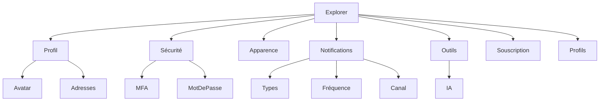

# Explorer Configuration

**Document** : FSPEC.15

**Fichier** : 02-FSPEC.15-ExplorerConfiguration-v3.0.md

**Version** : 3.0

**Statut** : Validé

---

# 1. Objectif

Cette spécification décrit l'ensemble des paramètres de configuration disponibles pour un utilisateur dans son rôle **Explorer**.

L'espace Explorer constitue le socle de configuration commun à tous les utilisateurs de la plateforme.

Les rôles **Organizer** et **Operator** héritent intégralement de cette configuration personnelle.

---

# 2. Objectifs fonctionnels

L'espace Explorer permet à chaque utilisateur de :

- gérer son identité ;
- protéger son compte ;
- personnaliser son expérience utilisateur ;
- choisir ses préférences de notification ;
- gérer ses outils personnels ;
- consulter sa souscription ;
- consulter les profils et droits qui lui sont attribués.

---

# 3. Navigation

Depuis le menu utilisateur situé en bas à gauche de l'application.

Des sections disponibles dans la page permettent de configurer :

```text
    ├── Mon profil
    ├── Sécurité
    ├── Apparence
    ├── Notifications
    ├── Mes outils
    ├── Souscription
    └── Mes profils
```

---

# 4. Mon profil

Cette section permet de gérer l'identité personnelle de l'utilisateur.

## Données modifiables

| Champ | Obligatoire | Description |
|---------|-------------|-------------|
| Pseudo | Oui | Nom public affiché sur la plateforme |
| Identifiant de connexion | Oui | Identifiant unique de connexion |
| Adresse e-mail | Oui | Adresse principale utilisée pour l'authentification |
| Avatar | Non | Image personnalisée ou avatar prédéfini |
| Adresse principale | Non | Adresse de référence utilisée pour les recherches locales |

---

## Avatar

Deux possibilités sont proposées :

- upload d'une image personnelle ;
- sélection dans une bibliothèque d'avatars prédéfinis.

En l'absence d'avatar, l'interface affiche automatiquement les initiales de l'utilisateur.

---

## Adresses secondaires

L'utilisateur peut enregistrer plusieurs adresses nommées.

Exemples :

| Nom | Utilisation |
|------|-------------|
| Travail | Recherche autour du lieu de travail |
| Vacances Été 2026 | Recherche temporaire |
| Maison secondaire | Recherche récurrente |

Chaque adresse peut être utilisée comme point de départ des recherches d'événements.

Une seule adresse est définie comme adresse principale.

---

# 5. Sécurité

La sécurité du compte est entièrement gérée dans cette section.

## Authentification multifacteur

L'utilisateur peut activer ou désactiver le MFA.

Méthodes possibles :

- Application Authenticator
- SMS
- Autres méthodes supportées par la plateforme

L'état est représenté par un interrupteur :

```
MFA

○ Désactivé

● Activé
```

---

## Mot de passe

L'utilisateur peut modifier son mot de passe.

Cette opération peut nécessiter :

- la saisie du mot de passe actuel ;
- une validation MFA.

---

## Sessions

Une évolution future pourra permettre :

- consulter les sessions ouvertes ;
- fermer une session distante ;
- déconnecter tous les appareils.

---

# 6. Apparence

Cette section permet de personnaliser l'interface Explorer.

## Thème graphique

Choix parmi les thèmes proposés par la plateforme.

Exemples :

- Classique
- Ocean
- Forest
- Sunset
- Midnight

La liste est extensible.

---

## Mode d'affichage

Trois options sont disponibles.

- Clair
- Sombre
- Système

Le mode Système suit automatiquement les préférences du système d'exploitation.

---

## Évolutions possibles

Exemples :

- taille des cartes ;
- densité de l'interface ;
- animations ;
- langue.

---

# 7. Notifications

Chaque utilisateur définit indépendamment ses préférences.

Les notifications sont configurées :

- par type ;
- par fréquence ;
- par canal.

---

## Types de notifications

Exemples :

- Nouvel organisateur dans une activité suivie
- Nouvel organisateur dans un rayon défini
- Nouvelle activité dans ma région
- Nouvelle publication d'un organisateur suivi
- Nouvelle publication concernant une activité suivie
- Rappel d'événement
- Modification d'un événement inscrit
- Annulation d'un événement
- Mise à disposition d'une place en liste d'attente

Cette liste est extensible.

---

## Fréquence

Pour chaque type :

- Immédiate
- Quotidienne
- Hebdomadaire
- Mensuelle

---

## Canal

Chaque notification peut être envoyée via :

- Notification In-App
- Notification Push
- E-mail

Plusieurs canaux peuvent être activés simultanément.

---

# 8. Mes outils

Cette rubrique regroupe les outils personnels de l'utilisateur.

## Modèles IA personnels

L'utilisateur peut déclarer plusieurs modèles IA.

Chaque modèle possède notamment :

- un nom ;
- un fournisseur ;
- un endpoint ;
- une clé API ;
- des paramètres éventuels.

Ces modèles sont strictement personnels.

Ils ne sont jamais partagés avec une organisation ou avec la plateforme.

---

## Évolutions possibles

Exemples :

- modèles favoris ;
- prompts enregistrés ;
- connecteurs personnels.

---

# 9. Souscription

Cette section présente le niveau d'abonnement actif.

Exemples :

- FREE
- PRO
- Grand Contributeur
- Developer

Cette page est informative et peut proposer les évolutions de souscription disponibles.

---

# 10. Mes profils

Un utilisateur peut disposer de plusieurs profils fonctionnels.

Exemples :

- Explorer
- Organizer
- Operator

Cette section affiche uniquement les profils effectivement attribués.

Pour chaque profil, l'utilisateur peut consulter :

- son nom ;
- sa description ;
- les droits associés.

Les droits sont présentés dans une fenêtre modale en lecture seule.

---

# 11. Règles de gestion

| Identifiant | Règle |
|--------------|--------|
| EXP-001 | Chaque utilisateur possède une configuration personnelle. |
| EXP-002 | Un pseudo est obligatoire. |
| EXP-003 | L'identifiant de connexion est unique sur la plateforme. |
| EXP-004 | Une seule adresse principale est autorisée. |
| EXP-005 | Plusieurs adresses secondaires peuvent être enregistrées. |
| EXP-006 | En l'absence d'avatar, les initiales sont affichées. |
| EXP-007 | Les notifications sont configurables indépendamment par type. |
| EXP-008 | Plusieurs canaux de notification peuvent être activés simultanément. |
| EXP-009 | Les modèles IA personnels ne sont jamais partagés. |
| EXP-010 | Toutes les modifications sont historisées. |

---

# 12. Diagramme fonctionnel



---

# 13. Critères d'acceptation

## AC-EXP-001

Un Explorer peut modifier son profil personnel.

---

## AC-EXP-002

Un Explorer peut enregistrer plusieurs adresses secondaires.

---

## AC-EXP-003

Une seule adresse est définie comme principale.

---

## AC-EXP-004

L'avatar est remplacé automatiquement par les initiales lorsqu'aucune image n'est définie.

---

## AC-EXP-005

Chaque type de notification possède sa propre fréquence et son propre canal.

---

## AC-EXP-006

Les modèles IA sont accessibles uniquement à leur propriétaire.

---

## AC-EXP-007

Toutes les modifications sont historisées et immédiatement prises en compte, sauf lorsqu'une validation explicite est requise.