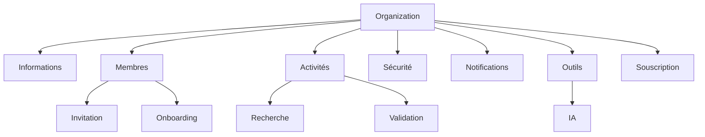

# Organizer Configuration

**Document** : FSPEC.16

**Fichier** : 02-FSPEC.16-OrganizerConfiguration-v3.0.md

**Version** : 3.0

**Statut** : Validé

---

# 1. Objectif

Cette spécification décrit l'ensemble des paramètres accessibles aux utilisateurs disposant du rôle **Organizer**.

Un Organizer hérite intégralement des fonctionnalités de configuration de son profil **Explorer** et dispose d'un espace supplémentaire permettant d'administrer une ou plusieurs organisations.

Chaque organisation possède sa propre configuration indépendante.

---

# 2. Principes généraux

La configuration d'une organisation est totalement indépendante :

- des paramètres personnels de l'Organizer ;
- des autres organisations qu'il administre ;
- de la configuration globale de la plateforme.

L'Organizer sélectionne l'organisation active depuis le sélecteur présent dans le menu principal.

Toutes les opérations concernent exclusivement cette organisation.

---

# 3. Navigation

Depuis le menu utilisateur situé en bas à gauche de l'application, l'utilisateur a toujours accès à ses configurations personnelles.

En complément dans les menus en haut à gauche, un accès Configuration permet d'afficher la page "Configuration de **nom de l'organisation**".
Des sections disponibles dans la page permettent de configurer :

```text
      ├── Informations générales
      ├── Membres
      ├── Activités couvertes
      ├── Sécurité
      ├── Notifications
      ├── Outils
      └── Souscription
```

---

# 4. Informations générales

Cette section permet de définir l'identité de l'organisation.

## Données générales

| Champ | Obligatoire | Description |
|---------|-------------|-------------|
| Nom | Oui | Nom officiel de l'organisation |
| Créateur | Oui | Identifiant du créateur (lecture seule) |
| Email de contact | Oui | Adresse publique de contact |
| Site Web | Non | URL du site, Facebook, Instagram ou autre |
| Logo | Non | Upload ou URL |
| Adresse principale | Non | Adresse principale de l'organisation |

---

## Adresses secondaires

Une organisation peut disposer de plusieurs lieux d'activité.

Exemples :

| Nom | Utilisation |
|------|-------------|
| Boutique | Adresse permanente |
| Salle principale | Organisation d'événements |
| Festival Été | Adresse temporaire |

Ces adresses pourront être proposées lors de la création d'un événement.

---

# 5. Membres de l'organisation

Les utilisateurs de l'organisation sont administrés depuis cette section.

---

## Inviter un membre

L'Organizer peut inviter un nouvel utilisateur.

Workflow :

```text
Bouton [Inviter]

↓

Adresse e-mail

↓

Envoi d'un e-mail

↓

Création ou rattachement du compte Explorer

↓

Onboarding

↓

Accès à l'organisation
```

L'invitation peut être envoyée :

- à un Explorer existant ;
- à une personne ne possédant pas encore de compte.

---

## Utilisateurs actifs

Pour chaque membre sont affichés :

| Information |
|-------------|
| Pseudo |
| Adresse e-mail |
| Niveau d'onboarding |
| Dernière activité |
| Compte actif / inactif |
| Suppression |

La désactivation d'un membre n'efface pas son historique.

---

## Utilisateurs invités

Les invitations non finalisées sont affichées séparément.

Informations disponibles :

- adresse e-mail ;
- date d'envoi ;
- relancer l'invitation ;
- supprimer l'invitation.

---

## Onboarding

Le processus d'intégration peut comprendre plusieurs étapes obligatoires.

Exemples :

- acceptation des conditions d'utilisation de l'organisation ;
- activation obligatoire du MFA ;
- validation de l'adresse e-mail ;
- autres étapes définies par la plateforme.

---

# 6. Activités couvertes

Cette section permet de déclarer les activités prises en charge par l'organisation.

---

## Ajout d'une activité

L'Organizer dispose :

- d'une recherche assistée ;
- d'une sélection parmi les activités existantes.

Si l'activité recherchée n'existe pas, une demande de création peut être effectuée.

---

## Affichage

Les activités sélectionnées apparaissent sous forme de pastilles.

Exemple :

```text
[ Jeux ] [ TCG ] [ Culture ] [ Randonnée ]
```

Chaque pastille peut être supprimée.

---

## Validation différée

Les nouvelles activités apparaissent temporairement dans un état visuel spécifique.

Exemple :

- couleur orange ;
- indicateur "Non enregistré".

Les modifications ne deviennent effectives qu'après :

```
Enregistrer les modifications
```

---

## Notifications différées

L'ajout d'une nouvelle activité peut déclencher des notifications.

Afin de limiter les erreurs de manipulation :

- aucune notification n'est envoyée immédiatement ;
- un délai de stabilisation est appliqué ;
- les notifications sont envoyées uniquement après validation définitive.

Exemple :

> Nouvel organisateur dans une activité suivie.

---

# 7. Sécurité

Cette section permet de définir les règles de sécurité propres à l'organisation.

---

## MFA obligatoire

L'organisation peut imposer une authentification multifacteur.

Cette obligation concerne notamment :

- la modification des paramètres ;
- la publication d'événements.

Cette fonctionnalité est pilotée par un interrupteur.

```
MFA obligatoire

○ Désactivé

● Activé
```

---

## Évolutions possibles

Exemples :

- approbation de certaines actions ;
- validation à plusieurs administrateurs ;
- restrictions horaires.

---

# 8. Notifications

Les notifications sont configurées indépendamment de celles de l'Explorer.

---

## Types de notifications

Exemples :

- Nouvel Explorer suivant l'organisation
- Nouvel Explorer ajoutant un événement dans son planning
- Action attendue dans le processus de publication
- Validation nécessaire
- Refus de publication
- Signalement reçu

---

## Fréquence

- Immédiate
- Quotidienne
- Hebdomadaire
- Mensuelle

Certaines notifications critiques peuvent imposer une fréquence immédiate.

---

## Canaux

- In-App
- Push
- E-mail

---

# 9. Outils

Cette section regroupe les outils propres à l'organisation.

---

## Modèles IA

Les modèles IA configurés ici appartiennent à l'organisation.

Ils sont accessibles à tous les utilisateurs autorisés.

Ils sont totalement indépendants :

- des modèles personnels Explorer ;
- des modèles de la plateforme.

Chaque modèle peut comporter :

- un nom ;
- un fournisseur ;
- une URL d'API ;
- une clé API ;
- des paramètres complémentaires.

---

## Évolutions possibles

Exemples :

- prompts partagés ;
- connecteurs ;
- modèles OCR spécialisés.

---

# 10. Souscription

Cette section présente la souscription de l'organisation.

Exemples :

- FREE
- PRO
- Grand Contributeur
- Developer

Elle détermine les fonctionnalités accessibles à l'organisation.

---

# 11. Règles de gestion

| Identifiant | Règle |
|--------------|--------|
| ORG-001 | Un Organizer hérite des fonctionnalités Explorer. |
| ORG-002 | Une organisation possède sa propre configuration. |
| ORG-003 | Une organisation peut posséder plusieurs adresses. |
| ORG-004 | Une invitation peut être envoyée à un utilisateur existant ou non. |
| ORG-005 | Les activités nouvellement sélectionnées doivent être validées explicitement. |
| ORG-006 | Les notifications liées aux nouvelles activités sont différées. |
| ORG-007 | Les modèles IA appartiennent exclusivement à l'organisation. |
| ORG-008 | L'activation du MFA obligatoire s'applique aux opérations sensibles. |
| ORG-009 | Les suppressions nécessitent une confirmation explicite. |
| ORG-010 | Toutes les modifications sont historisées. |

---

# 12. Diagramme fonctionnel



---

# 13. Critères d'acceptation

## AC-ORG-001

Un Organizer peut administrer plusieurs organisations.

---

## AC-ORG-002

Chaque organisation possède sa propre configuration indépendante.

---

## AC-ORG-003

Une invitation peut être adressée à un utilisateur existant ou à une personne ne possédant pas encore de compte.

---

## AC-ORG-004

Les nouvelles activités ne deviennent effectives qu'après validation explicite.

---

## AC-ORG-005

Les notifications liées aux nouvelles activités sont différées afin de permettre à l'organisation de finaliser sa configuration.

---

## AC-ORG-006

Les modèles IA configurés au niveau de l'organisation sont partagés entre les membres autorisés uniquement.

---

## AC-ORG-007

L'activation du MFA obligatoire empêche toute publication ou modification sensible par un utilisateur ne satisfaisant pas cette exigence.

---

## AC-ORG-008

Toutes les opérations d'administration sont historisées dans le journal d'audit.