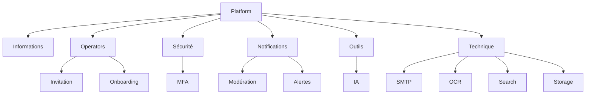

# Operator Configuration

**Document** : FSPEC.17

**Fichier** : 02-FSPEC.17-OperatorConfiguration-v3.0.md

**Version** : 3.0

**Statut** : Validé

---

# 1. Objectif

Cette spécification décrit les fonctionnalités de configuration accessibles aux utilisateurs disposant du rôle **Operator**.

Les Operators administrent la plateforme EventFoundry dans son ensemble.

Ils disposent :

- de leur configuration personnelle Explorer ;
- d'un espace de configuration spécifique à la plateforme.

Les paramètres définis à ce niveau impactent l'ensemble des organisations et des utilisateurs de la plateforme.

---

# 2. Principes généraux

La configuration Operator concerne exclusivement la plateforme.

Elle ne permet pas d'administrer directement les organisations, sauf lorsqu'une fonctionnalité de modération ou d'assistance l'autorise.

Toutes les opérations réalisées par un Operator sont :

- historisées ;
- auditables ;
- potentiellement sensibles.

---

# 3. Navigation

Depuis le menu utilisateur situé en bas à gauche de l'application, l'utilisateur a toujours accès à ses configurations personnelles.

En complément dans les menus en haut à gauche, un accès Configuration permet d'afficher la page "Configuration de la plateforme".
Des sections disponibles dans la page permettent de configurer :

```text
      ├── Informations générales
      ├── Operators
      ├── Sécurité
      ├── Notifications
      ├── Outils
      └── Configuration technique
```

---

# 4. Informations générales

Cette section définit l'identité publique de la plateforme.

## Données générales

| Champ | Obligatoire | Description |
|---------|-------------|-------------|
| Nom de la plateforme | Oui | Nom public |
| Adresse e-mail de contact | Oui | Contact général |
| Adresse e-mail Support | Oui | Support utilisateurs |
| Adresse e-mail Recrutement | Non | Contact recrutement |
| Informations publiques | Non | Données institutionnelles |
| Autres paramètres | Non | Évolutions futures |

---

# 5. Gestion des Operators

Les Operators sont administrés depuis cette section.

---

## Inviter un Operator

Workflow :

```text
Inviter

↓

Adresse e-mail

↓

Envoi d'une invitation

↓

Création ou rattachement d'un compte Explorer

↓

Onboarding spécifique Operator

↓

Accès à la plateforme
```

---

## Operators actifs

Pour chaque Operator :

| Information |
|-------------|
| Pseudo |
| Adresse e-mail |
| Niveau d'onboarding |
| Dernière activité |
| Compte actif |
| Désactivation |
| Suppression |

---

## Invitations en attente

La plateforme conserve la liste des invitations non finalisées.

Pour chacune :

- adresse e-mail ;
- date d'envoi ;
- renvoi de l'invitation ;
- suppression.

---

## Onboarding

Le parcours d'intégration peut comprendre :

- validation de l'identité ;
- acceptation des conditions d'utilisation internes ;
- activation obligatoire du MFA ;
- validation des accès.

---

# 6. Sécurité

La sécurité constitue une responsabilité majeure des Operators.

---

## MFA obligatoire

La plateforme peut imposer une authentification multifacteur aux Operators.

Cette obligation concerne notamment :

- toutes les opérations d'administration ;
- toutes les modifications de configuration ;
- les interventions sur les organisations.

---

## Évolutions possibles

Exemples :

- politiques de mot de passe ;
- durée maximale des sessions ;
- limitation géographique ;
- liste blanche IP ;
- contrôle des appareils.

---

# 7. Notifications

Les notifications Operator concernent principalement :

- l'administration ;
- la modération ;
- la supervision.

---

## Types de notifications

Exemples :

- Nouvelle organisation créée
- Nouvelle activité proposée
- Nouveau type d'événement proposé
- Nouvelle catégorie proposée
- Nouveau tag proposé
- Nouveau lieu proposé
- Ticket Organizer ouvert
- Ticket Explorer ouvert
- Incident technique
- Échec d'un traitement
- Erreur d'import IA
- Détection d'activité suspecte

---

## Modération automatique

Certaines notifications peuvent être précédées d'une validation automatique.

Exemples :

- filtrage de mots interdits ;
- détection d'insultes ;
- contenus haineux ;
- contenus illicites ;
- spam.

Les éléments rejetés automatiquement ne sont jamais publiés.

Ils peuvent néanmoins être consultés par les Operators.

---

## Fréquence

Selon le type de notification :

- Immédiate
- Toutes les heures
- Toutes les 4 heures
- Quotidienne
- Hebdomadaire
- Mensuelle

Les regroupements horaires utilisent le fuseau horaire de l'Operator.

---

## Canaux

Les notifications peuvent être envoyées via :

- In-App
- Push
- E-mail

---

# 8. Outils

Les outils Operator sont communs à l'ensemble de la plateforme.

---

## Modèles IA

Les modèles IA configurés ici sont accessibles aux traitements globaux de la plateforme.

Ils peuvent être utilisés notamment pour :

- OCR ;
- classification ;
- enrichissement des événements ;
- modération ;
- assistants internes.

Ils ne sont pas visibles :

- par les Explorers ;
- par les Organizers.

---

## Configuration du serveur de messagerie

La plateforme permet notamment de configurer :

- serveur SMTP ;
- port ;
- chiffrement ;
- authentification ;
- expéditeur par défaut ;
- paramètres de délivrabilité.

---

## Configurations techniques

Cette section pourra accueillir notamment :

- stockage objet ;
- moteur OCR ;
- cache ;
- moteur de recherche ;
- connecteurs externes ;
- webhooks ;
- files de messages ;
- paramètres IA.

---

# 9. Règles de gestion

| Identifiant | Règle |
|--------------|--------|
| OPR-001 | Un Operator hérite intégralement des fonctionnalités Explorer. |
| OPR-002 | La configuration Operator agit à l'échelle de toute la plateforme. |
| OPR-003 | Les Operators sont invités via un processus d'onboarding spécifique. |
| OPR-004 | Le MFA peut être obligatoire pour tous les Operators. |
| OPR-005 | Les modèles IA Operator sont réservés aux traitements de plateforme. |
| OPR-006 | Les notifications de modération peuvent être regroupées. |
| OPR-007 | Les contenus illicites peuvent être rejetés automatiquement avant publication. |
| OPR-008 | Les paramètres techniques sont réservés aux Operators autorisés. |
| OPR-009 | Toutes les modifications sont historisées. |
| OPR-010 | Les opérations critiques sont soumises à une validation explicite. |

---

# 10. Diagramme fonctionnel



---

# 11. Critères d'acceptation

## AC-OPR-001

Un Operator peut accéder à la configuration globale de la plateforme.

---

## AC-OPR-002

L'invitation d'un nouvel Operator déclenche un processus d'onboarding dédié.

---

## AC-OPR-003

La plateforme peut imposer l'authentification multifacteur pour tous les Operators.

---

## AC-OPR-004

Les notifications de modération peuvent être regroupées selon une fréquence configurable.

---

## AC-OPR-005

Les contenus manifestement illicites peuvent être bloqués automatiquement avant publication.

---

## AC-OPR-006

Les modèles IA configurés au niveau Operator sont disponibles uniquement pour les traitements de la plateforme.

---

## AC-OPR-007

Les paramètres techniques sont accessibles uniquement aux Operators disposant des droits appropriés.

---

## AC-OPR-008

Toutes les modifications de configuration sont historisées et consultables dans le journal d'audit.

---

# 12. Évolutions futures

Les capacités suivantes sont identifiées pour les versions futures :

- supervision temps réel de la plateforme ;
- tableau de bord opérationnel ;
- gestion des quotas IA ;
- gestion des connecteurs externes ;
- monitoring des traitements OCR et IA ;
- configuration des moteurs de recherche ;
- administration des espaces de stockage ;
- politiques globales de rétention des données ;
- configuration des tâches planifiées ;
- observabilité et métriques de performance.