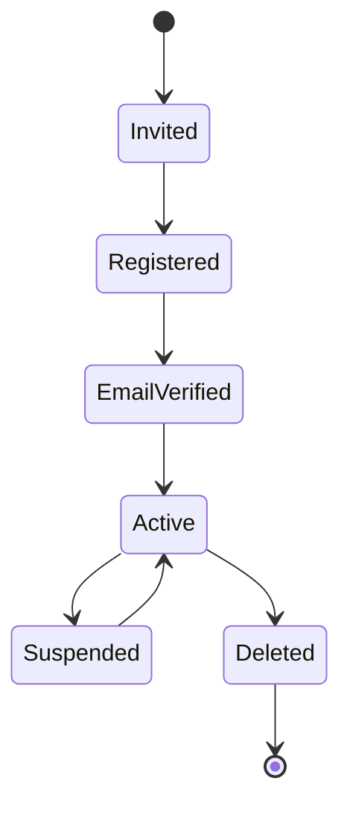

# Identity & Account Management

**Document** : FSPEC.18

**Fichier** : 02-FSPEC.18-IdentityAndAccountManagement-v3.0.md

**Version** : 3.0

**Statut** : Validé

---

# 1. Objectif

Cette spécification décrit le cycle de vie complet d'un compte utilisateur EventFoundry.

Elle couvre :

- la création d'un compte ;
- l'authentification ;
- la vérification de l'identité ;
- la gestion des informations d'identité ;
- la récupération de compte ;
- la désactivation ;
- la suppression ;
- la conformité RGPD.

La gestion des rôles (Explorer, Organizer, Operator) est définie dans les ADR relatifs au modèle de sécurité et ne fait pas partie de cette spécification.

---

# 2. Principes généraux

Un compte EventFoundry représente une personne physique.

Un compte est unique sur la plateforme.

Un utilisateur peut disposer de plusieurs rôles mais ne possède qu'un seul compte.

Toutes les données personnelles sont rattachées à ce compte unique.

---

# 3. Cycle de vie d'un compte



---

# 4. Création d'un compte

Un compte peut être créé de plusieurs manières.

## Inscription libre

L'utilisateur crée lui-même son compte.

Exemples :

- formulaire d'inscription ;
- authentification sociale ;
- fournisseur d'identité externe.

---

## Invitation

Le compte est créé à partir d'une invitation.

Exemples :

- invitation à rejoindre une organisation ;
- invitation à devenir Operator.

Dans ce cas, une partie des informations est préremplie.

---

# 5. Vérification de l'adresse e-mail

Toute adresse e-mail utilisée pour l'authentification doit être vérifiée.

Workflow :

```text
Création

↓

Email envoyé

↓

Lien de validation

↓

Compte vérifié

↓

Activation
```

Tant que l'adresse n'est pas validée, certaines fonctionnalités peuvent être limitées.

---

# 6. Activation du compte

Une fois :

- le compte créé ;
- l'adresse e-mail vérifiée ;

le compte devient actif.

Le premier accès peut déclencher un processus d'onboarding.

---

# 7. Authentification

L'authentification est assurée par le fournisseur d'identité de la plateforme.

Le système doit pouvoir prendre en charge :

- identifiant + mot de passe ;
- authentification multifacteur (MFA) ;
- fournisseurs d'identité externes (OIDC, OAuth2, SAML...).

Les modalités techniques sont définies dans les spécifications de sécurité.

---

# 8. Gestion de l'identité

L'utilisateur peut modifier certaines informations de son compte.

## Informations modifiables

| Champ | Modification autorisée |
|--------|------------------------|
| Pseudo | Oui |
| Avatar | Oui |
| Adresse principale | Oui |
| Adresses secondaires | Oui |
| Préférences personnelles | Oui |

---

## Informations sensibles

Les informations suivantes peuvent nécessiter une réauthentification.

| Champ |
|--------|
| Adresse e-mail |
| Mot de passe |
| Identifiant de connexion |

---

# 9. Changement d'adresse e-mail

Le changement d'adresse suit le processus suivant.

```text
Nouvelle adresse

↓

Vérification

↓

Validation

↓

Remplacement de l'ancienne
```

L'ancienne adresse reste valide tant que la nouvelle n'a pas été confirmée.

---

# 10. Changement de mot de passe

Le changement de mot de passe nécessite :

- le mot de passe actuel ;
- ou une procédure de récupération.

Une politique de sécurité peut imposer :

- une longueur minimale ;
- une complexité minimale ;
- un historique des mots de passe ;
- une durée maximale de validité.

---

# 11. Mot de passe oublié

Workflow :

```text
Adresse e-mail

↓

Lien sécurisé

↓

Nouveau mot de passe

↓

Connexion
```

Les liens de récupération :

- sont à usage unique ;
- possèdent une durée de validité limitée.

---

# 12. Suspension du compte

Le compte peut être suspendu.

Causes possibles :

- demande de l'utilisateur ;
- incident de sécurité ;
- suspicion de fraude ;
- décision d'un Operator.

Pendant la suspension :

- aucune connexion n'est possible ;
- les données sont conservées.

---

# 13. Suppression du compte

Deux niveaux existent.

## Désactivation

Le compte est rendu inaccessible.

Les données sont conservées.

---

## Suppression définitive

Le compte est supprimé conformément aux règles de conservation des données.

Certaines informations peuvent être anonymisées plutôt que supprimées afin de préserver :

- les historiques ;
- les journaux d'audit ;
- l'intégrité des événements ;
- les obligations légales.

---

# 14. RGPD

L'utilisateur dispose notamment des droits suivants.

- consultation de ses données personnelles ;
- modification ;
- export ;
- suppression selon les règles applicables.

L'exercice de ces droits est historisé.

---

# 15. Journalisation

Les opérations suivantes sont enregistrées dans les journaux d'audit.

- création du compte ;
- validation de l'adresse e-mail ;
- connexion ;
- échec de connexion ;
- changement de mot de passe ;
- changement d'adresse e-mail ;
- activation ou désactivation du MFA ;
- suspension ;
- réactivation ;
- suppression.

Les journaux sont accessibles uniquement aux utilisateurs autorisés.

---

# 16. Règles de gestion

| Identifiant | Règle |
|--------------|--------|
| IAM-001 | Un utilisateur possède un seul compte. |
| IAM-002 | Une adresse e-mail ne peut être associée qu'à un seul compte actif. |
| IAM-003 | Une adresse e-mail doit être vérifiée avant l'activation complète du compte. |
| IAM-004 | Un changement d'adresse e-mail nécessite une nouvelle vérification. |
| IAM-005 | Les liens de récupération sont temporaires et à usage unique. |
| IAM-006 | Une suspension n'entraîne jamais la suppression des données. |
| IAM-007 | La suppression d'un compte respecte les règles de conservation des données et les obligations légales. |
| IAM-008 | Les opérations sensibles peuvent nécessiter une réauthentification. |
| IAM-009 | Toutes les opérations de sécurité sont historisées. |
| IAM-010 | Les droits RGPD doivent pouvoir être exercés par l'utilisateur. |

---

# 17. Critères d'acceptation

## AC-IAM-001

Un utilisateur peut créer un compte par inscription libre.

---

## AC-IAM-002

Un compte peut être créé suite à une invitation.

---

## AC-IAM-003

L'adresse e-mail doit être validée avant l'activation complète du compte.

---

## AC-IAM-004

Un utilisateur peut récupérer son accès via une procédure sécurisée.

---

## AC-IAM-005

Le changement d'adresse e-mail nécessite une nouvelle validation.

---

## AC-IAM-006

Le changement de mot de passe invalide tous les liens de récupération encore valides.

---

## AC-IAM-007

Une suspension empêche toute authentification sans supprimer les données.

---

## AC-IAM-008

La suppression d'un compte respecte les obligations légales de conservation et de traçabilité.

---

# 18. Documents associés

- ADR.08 – Authorization & Roles
- FSPEC.15 – User Configuration Framework
- FSPEC.16 – Explorer Configuration
- FSPEC.17 – Operator Configuration
- FSPEC – Security
- FSPEC – Audit Viewer *(à venir)*