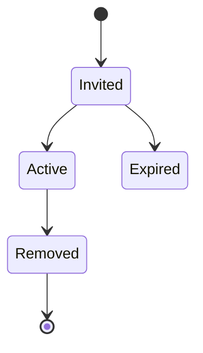

# Organization Membership

**Document** : FSPEC.19

**Fichier** : 02-FSPEC.19-OrganizationMembership-v3.0.md

**Version** : 3.0

**Statut** : Validé

---

# 1. Objectif

Cette spécification décrit la gestion des collaborateurs d'une organisation.

Son objectif est de permettre à une organisation de répartir les responsabilités nécessaires à la création et à la publication d'événements sur EventFoundry.

Elle couvre :

- les fonctions disponibles ;
- l'invitation de collaborateurs ;
- l'adhésion à une organisation ;
- le retrait d'un collaborateur ;
- le transfert de propriété.

Les permissions détaillées sont définies dans les ADR de sécurité.

---

# 2. Principes généraux

Une organisation représente un acteur publiant des événements sur EventFoundry.

Une organisation possède un ou plusieurs collaborateurs.

Chaque collaborateur dispose d'une fonction au sein de cette organisation.

Un utilisateur peut appartenir à plusieurs organisations.

La gestion des collaborateurs doit rester simple afin de faciliter la publication d'événements sans transformer EventFoundry en outil de gestion interne d'organisation.

---

# 3. Cycle de vie d'une adhésion

---

# 4. Fonctions disponibles

Trois fonctions sont proposées.

| Fonction | Description |
|-----------|-------------|
| **Owner** | Crée l'organisation, en est responsable et possède tous les droits. |
| **Administrator** | Assiste le Owner dans la gestion de l'organisation et des collaborateurs. |
| **Event Manager** | Crée, modifie, publie et archive les événements de l'organisation. |

Le nombre de fonctions est volontairement limité afin de conserver un modèle simple.

Le Owner peut naturellement exercer toutes les responsabilités des autres fonctions.

---

# 5. Création d'une organisation

Lorsqu'une organisation est créée :

- son créateur devient automatiquement Owner ;
- il est initialement le seul collaborateur.

---

# 6. Invitation d'un collaborateur

Le Owner ou un Administrator peut inviter un collaborateur.

L'invitation précise :

- l'organisation concernée ;
- la fonction attribuée ;
- une date d'expiration ;
- un lien sécurisé.

---

# 7. Acceptation d'une invitation

Si l'utilisateur possède déjà un compte EventFoundry, il rejoint immédiatement l'organisation après acceptation.

Dans le cas contraire, il crée son compte puis rejoint automatiquement l'organisation.

---

# 8. Expiration ou annulation

Une invitation peut :

- être annulée ;
- expirer automatiquement.

Une invitation expirée ne peut plus être utilisée.

---

# 9. Gestion des collaborateurs

Le Owner et les Administrator peuvent :

- consulter les collaborateurs ;
- inviter un collaborateur ;
- modifier une fonction ;
- retirer un collaborateur ;
- renvoyer une invitation.

Toutes ces opérations sont historisées.

---

# 10. Modification d'une fonction

Une fonction peut être modifiée à tout moment par un utilisateur autorisé.

La modification prend effet immédiatement.

---

# 11. Retrait d'un collaborateur

Le retrait met fin à l'appartenance de l'utilisateur à l'organisation.

Le compte utilisateur reste actif sur la plateforme.

Les contenus produits pour l'organisation restent attachés à celle-ci.

---

# 12. Départ volontaire

Un collaborateur peut quitter une organisation.

Le dernier Owner ne peut toutefois pas quitter l'organisation tant qu'un autre Owner n'a pas été désigné.

---

# 13. Transfert de propriété

Le rôle de Owner peut être transféré à un autre collaborateur.

Cette opération :

- nécessite une confirmation ;
- est historisée.

Une organisation doit toujours posséder un Owner.

---

# 14. Journalisation

Les opérations suivantes sont historisées :

- création de l'organisation ;
- invitation ;
- acceptation ;
- expiration ;
- modification d'une fonction ;
- retrait ;
- transfert de propriété.

---

# 15. Règles de gestion

| Identifiant | Règle |
|--------------|--------|
| ORG-001 | Un utilisateur peut appartenir à plusieurs organisations. |
| ORG-002 | Une organisation possède un Owner. |
| ORG-003 | Le Owner possède l'ensemble des responsabilités de l'organisation. |
| ORG-004 | Le dernier Owner ne peut quitter l'organisation. |
| ORG-005 | Une invitation possède une date d'expiration. |
| ORG-006 | Une invitation expirée est définitivement invalide. |
| ORG-007 | Le retrait d'un collaborateur ne supprime jamais son compte utilisateur. |
| ORG-008 | Les événements restent attachés à l'organisation après le départ d'un collaborateur. |
| ORG-009 | Toutes les opérations sont historisées. |

---

# 16. Critères d'acceptation

## AC-ORG-001

Une organisation est créée avec un unique Owner.

---

## AC-ORG-002

Le Owner peut inviter un Event Manager.

---

## AC-ORG-003

Le Owner peut inviter un Administrator.

---

## AC-ORG-004

Un collaborateur peut appartenir simultanément à plusieurs organisations.

---

## AC-ORG-005

Le retrait d'un collaborateur n'affecte jamais son compte EventFoundry.

---

## AC-ORG-006

Le dernier Owner ne peut quitter son organisation.

---

## AC-ORG-007

Le transfert de propriété est historisé.

---

# 17. Documents associés

- ADR.08 – Authorization & Roles
- FSPEC.18 – Identity & Account Management
- FSPEC.17 – Operator Configuration
- FSPEC.20 – Platform Moderation