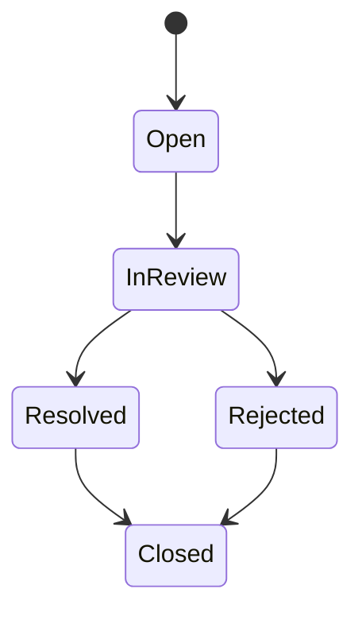

# Platform Moderation

**Document** : FSPEC.20

**Fichier** : 02-FSPEC.20-PlatformModeration-v3.0.md

**Version** : 3.0

**Statut** : Validé

---

# 1. Objectif

Cette spécification décrit le fonctionnement de la modération sur EventFoundry.

Son objectif est de garantir la qualité, la cohérence et la fiabilité des informations publiées sur la plateforme tout en limitant au maximum les interventions humaines.

La modération s'applique à l'ensemble des contenus publiés par les utilisateurs et les organisations.

---

# 2. Principes généraux

La modération constitue un mécanisme de contrôle qualité.

Elle ne doit jamais devenir un frein à la publication des événements.

Le système privilégie systématiquement :

- les contrôles automatiques ;
- l'assistance aux Operators ;
- les interventions humaines uniquement lorsque cela est nécessaire.

Tout contenu conforme aux règles de la plateforme est publié ou maintenu en ligne sans validation manuelle.

---

# 3. Objets soumis à modération

Les objets suivants peuvent être modérés.

| Objet | Description |
|---------|-------------|
| Organisation | Profil public d'un organisateur |
| Événement | Événement publié |
| Activité | Activité utilisée pour classifier un événement |
| Lieu | Lieu associé à un événement |
| Image | Illustrations publiées |
| Contenu IA | Informations extraites ou générées par IA |
| Signalement | Déclaration réalisée par un utilisateur |

Chaque objet possède son propre historique de modération.

---

# 4. Niveaux de modération

Trois niveaux de contrôle existent.

## Automatique

Contrôles réalisés sans intervention humaine.

Exemples :

- champs obligatoires ;
- cohérence des dates ;
- détection de doublons ;
- contenus interdits ;
- vérification des formats.

---

## Assistée

Le système propose une décision.

L'Operator dispose :

- des éléments détectés ;
- d'une recommandation ;
- d'un niveau de confiance.

L'Operator prend la décision finale.

---

## Manuelle

Utilisée lorsque le système ne peut conclure automatiquement.

L'Operator analyse le contenu puis décide de l'action à effectuer.

---

# 5. Contrôles automatiques

Les contrôles peuvent notamment porter sur :

- données obligatoires ;
- cohérence métier ;
- liens invalides ;
- images corrompues ;
- contenu dupliqué ;
- contenu inapproprié ;
- spam ;
- tentative de fraude.

Les règles évoluent sans modifier les objets métier.

---

# 6. Modération des organisations

Les Operators peuvent notamment :

- masquer une organisation ;
- suspendre une organisation ;
- demander des corrections ;
- rétablir une organisation.

La suspension d'une organisation n'entraîne pas la suppression de ses données.

---

# 7. Modération des événements

Les événements peuvent être :

- publiés ;
- masqués ;
- suspendus ;
- archivés.

Une décision de modération doit être motivée.

Les modifications importantes peuvent déclencher une nouvelle vérification automatique.

---

# 8. Modération des lieux

Les contrôles portent notamment sur :

- doublons ;
- coordonnées incohérentes ;
- adresse invalide ;
- géolocalisation incorrecte.

Les Operators peuvent fusionner plusieurs lieux représentant le même emplacement.

---

# 9. Modération des images

Les images peuvent être analysées automatiquement afin de détecter :

- contenu interdit ;
- violence excessive ;
- nudité ;
- logos inappropriés ;
- qualité insuffisante.

Les Operators peuvent remplacer ou supprimer une image.

---

# 10. Modération des contenus IA

Les informations générées ou extraites par IA peuvent être contrôlées.

Exemples :

- informations incohérentes ;
- données manquantes ;
- faible niveau de confiance ;
- contradiction avec les données existantes.

Le système peut demander une validation humaine avant publication.

---

# 11. Signalements

Tout utilisateur peut signaler un contenu.

Le signalement doit préciser un motif.

Exemples :

- information incorrecte ;
- contenu offensant ;
- doublon ;
- spam ;
- fraude ;
- autre.

Chaque signalement reçoit un statut.

---

# 12. Cycle de vie d'un signalement

---

# 13. Décisions de modération

Les décisions possibles sont :

- aucune action ;
- demande de correction ;
- masquage ;
- suspension ;
- suppression ;
- fusion ;
- restauration.

Toutes les décisions sont historisées.

---

# 14. Notifications

Les actions suivantes peuvent générer des notifications.

- contenu signalé ;
- décision de modération ;
- demande de correction ;
- restauration ;
- suspension.

Les notifications respectent les préférences définies par l'utilisateur.

---

# 15. Historique

Chaque opération de modération enregistre notamment :

- l'objet concerné ;
- la date ;
- l'Operator ;
- la décision ;
- la justification.

Les historiques sont conservés conformément aux règles de conservation des données.

---

# 16. Tableaux de bord

Les Operators disposent d'indicateurs permettant de suivre l'activité de modération.

Exemples :

- contenus à traiter ;
- signalements ouverts ;
- délais moyens ;
- taux de résolution ;
- décisions prises ;
- contenu restauré.

---

# 17. Règles de gestion

| Identifiant | Règle |
|--------------|--------|
| MOD-001 | Tous les contenus peuvent être soumis à un contrôle automatique. |
| MOD-002 | La modération humaine n'intervient que lorsque cela est nécessaire. |
| MOD-003 | Toute décision de modération est historisée. |
| MOD-004 | Toute décision importante doit être justifiée. |
| MOD-005 | Les contenus suspendus restent conservés. |
| MOD-006 | Les signalements possèdent un cycle de vie propre. |
| MOD-007 | Une décision peut être révisée par un Operator autorisé. |
| MOD-008 | Les contrôles automatiques sont configurables sans modification du modèle métier. |
| MOD-009 | Les contenus issus de l'IA peuvent être soumis à une validation complémentaire. |
| MOD-010 | La plateforme privilégie toujours la publication automatique lorsque les règles sont satisfaites. |

---

# 18. Critères d'acceptation

## AC-MOD-001

Un contenu conforme est publié sans intervention humaine.

---

## AC-MOD-002

Un contenu signalé peut être examiné par un Operator.

---

## AC-MOD-003

Une décision de modération est historisée avec sa justification.

---

## AC-MOD-004

Les contenus suspendus peuvent être restaurés.

---

## AC-MOD-005

Le système détecte automatiquement certains contenus suspects.

---

## AC-MOD-006

Les Operators disposent d'une liste des éléments nécessitant une intervention.

---

## AC-MOD-007

Les signalements suivent un cycle de vie complet jusqu'à leur clôture.

---

## AC-MOD-008

Les contenus générés ou extraits par IA peuvent être soumis à une validation complémentaire.

---

# 19. Documents associés

- FSPEC.18 – Identity & Account Management
- FSPEC.19 – Organization Membership
- FSPEC.17 – Operator Configuration
- ADR.08 – Authorization & Roles
- ADR – Artificial Intelligence
- ADR – Audit & Logging