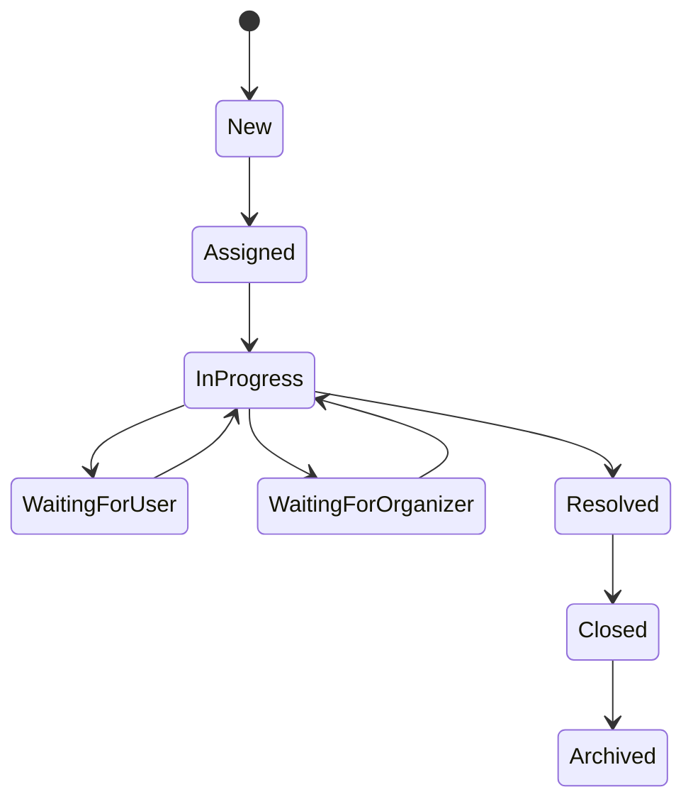

# Case Management

**Document** : FSPEC.21

**Fichier** : 02-FSPEC.21-CaseManagement-v3.0.md

**Version** : 3.0

**Statut** : Validé

---

# 1. Objectif

Cette spécification décrit le système unifié de gestion des dossiers (*Cases*) de la plateforme EventFoundry.

Une **Case** représente toute demande nécessitant une intervention d'un Operator.

Le Case Management constitue le point d'entrée unique pour le traitement des demandes adressées aux équipes Operator, qu'elles proviennent d'un Explorer, d'un Organizer, d'un Operator lui-même ou d'un processus automatisé.

Il couvre notamment :

- les signalements de contenus ;
- les incidents techniques ;
- les demandes de support ;
- les demandes de vérification ;
- les corrections de données ;
- les traitements issus de la modération ;
- les traitements générés automatiquement par la plateforme.

---

# 2. Principes généraux

Le système de Case Management poursuit les objectifs suivants :

- disposer d'un mécanisme unique de traitement ;
- orienter automatiquement chaque Case vers le domaine compétent ;
- assurer une traçabilité complète ;
- permettre le suivi opérationnel des équipes.

Une Case n'est jamais supprimée.

Elle est clôturée puis archivée.

Le moteur de gestion des Cases est indépendant des domaines fonctionnels de la plateforme.

---

# 3. Concepts

Le système repose sur les concepts suivants.

| Concept | Description |
|----------|-------------|
| Case | Dossier représentant une demande ou un incident. |
| Case Type | Nature de la demande. |
| Domain | Domaine métier chargé du traitement. |
| Work Queue | File de travail d'un domaine. |
| Assignment | Affectation d'une Case à un Operator. |

---

# 4. Types de Cases

Chaque Case possède un type.

Exemples :

| Type |
|------|
| Content Report |
| Abuse Report |
| Technical Incident |
| Support Request |
| Organization Verification |
| Data Correction |
| AI Review |
| Billing Request |
| GDPR Request |
| Other |

Le catalogue des types est entièrement configurable.

---

# 5. Domaines de traitement

Chaque type de Case est traité par un domaine métier.

Exemples :

| Domaine | Description |
|-----------|-------------|
| Moderation | Modération des contenus |
| Frontend Support | Assistance utilisateur |
| Backend Support | Services techniques |
| AI Operations | IA, OCR et traitements automatiques |
| Finance | Questions financières |
| Compliance | RGPD et conformité |
| Platform Administration | Administration générale |

Un Domain représente une compétence métier.

Les droits d'accès sont définis dans les ADR de sécurité.

---

# 6. Work Queues

Chaque Domain possède une ou plusieurs Work Queues.

Exemples :

- Moderation Queue
- Frontend Support Queue
- Backend Support Queue
- AI Operations Queue
- Finance Queue
- Compliance Queue

Une Work Queue constitue la file opérationnelle dans laquelle les Operators récupèrent les Cases à traiter.

Un Operator peut être autorisé à consulter plusieurs Work Queues.

---

# 7. Création d'une Case

Une Case peut être créée :

- par un Explorer ;
- par un Organizer ;
- par un Operator ;
- automatiquement par la plateforme ;
- automatiquement par un moteur IA.

Toutes les Cases utilisent le même modèle de données.

La création d'une Case est immédiatement historisée.

---

# 8. Modèle d'une Case

Chaque Case comporte notamment les informations suivantes.

| Attribut | Description |
|-----------|-------------|
| Identifiant | Référence unique |
| Type | Nature de la demande |
| Domain | Domaine responsable |
| Work Queue | File de traitement |
| Statut | État courant |
| Priorité | Niveau d'urgence |
| Demandeur | Utilisateur à l'origine |
| Organisation | Facultatif |
| Événement | Facultatif |
| Assignee | Operator responsable |
| Date de création | Horodatage |
| Date de mise à jour | Horodatage |
| Date de clôture | Facultatif |

Le modèle peut être enrichi par des métadonnées spécifiques au type de Case.

---

# 9. Routage automatique

Lors de sa création, une Case est automatiquement orientée.

```text
Création

↓

Case Type

↓

Routing Rules

↓

Domain

↓

Work Queue
```

Le routage est entièrement configurable.

Il ne nécessite aucune modification du code métier.

---

# 10. Affectation

Une Case peut être :

- non affectée ;
- affectée à un Operator.

L'affectation peut être :

- automatique ;
- manuelle.

Une seule personne est responsable d'une Case à un instant donné.

L'affectation est historisée.

---

# 11. Cycle de vie



Chaque changement d'état est enregistré dans l'historique de la Case.

# 12. Priorités

Chaque Case possède une priorité.

| Priorité | Description |
|-----------|-------------|
| Low | Faible impact |
| Medium | Traitement normal |
| High | Impact important |
| Critical | Traitement immédiat |

La priorité peut être :

- déterminée automatiquement lors du routage ;
- modifiée par un Operator autorisé ;
- réévaluée pendant le traitement.

Toutes les modifications sont historisées.

---

# 13. Traitement d'une Case

Le traitement d'une Case peut comprendre :

- des commentaires internes ;
- des échanges avec le demandeur ;
- des échanges avec une organisation ;
- des pièces jointes ;
- des changements de statut ;
- une modification de priorité ;
- une réaffectation ;
- une escalade ;
- une résolution.

Toutes les actions sont historisées.

---

# 14. Routing Rules

Les Routing Rules déterminent automatiquement le Domain et la Work Queue d'une Case lors de sa création.

Les règles sont entièrement configurables.

Le moteur de routage est indépendant des développements métier.

---

## Critères de routage

Une règle peut utiliser un ou plusieurs critères.

Exemples :

- Case Type ;
- priorité ;
- organisation ;
- événement ;
- activité ;
- langue ;
- pays ;
- région ;
- origine (Explorer, Organizer, Operator, IA) ;
- niveau de confiance IA ;
- motif du signalement.

---

## Résultat d'une règle

Une règle peut définir :

- le Domain ;
- la Work Queue ;
- la priorité initiale ;
- le statut initial ;
- un Operator par défaut ;
- les notifications à déclencher.

---

## Priorité des règles

Les règles sont évaluées dans un ordre de priorité configurable.

La première règle applicable est utilisée.

Une règle par défaut garantit qu'aucune Case ne reste sans destination.

---

# 15. Réaffectation

Une Case peut être réaffectée à tout moment.

La réaffectation peut être :

- automatique ;
- manuelle.

Elle peut être motivée par :

- une erreur de routage ;
- un changement de domaine ;
- une indisponibilité ;
- une montée en compétence ;
- une escalade.

Toutes les réaffectations sont historisées.

---

# 16. Escalade

Une Case peut faire l'objet d'une escalade.

Une escalade peut être :

- automatique ;
- manuelle.

Elle peut entraîner :

- une augmentation de priorité ;
- un changement de Work Queue ;
- un changement de Domain ;
- une notification supplémentaire.

Toutes les escalades sont historisées.

---

# 17. Files de travail

Chaque Operator dispose de vues adaptées à son périmètre.

Exemples :

- Mes Cases ;
- Cases non affectées ;
- Cases de mon Domain ;
- Cases de ma Work Queue ;
- Cases prioritaires ;
- Cases en attente ;
- Cases récemment résolues.

Les filtres sont entièrement configurables.

---

# 18. Recherche

Les Operators peuvent rechercher une Case selon :

- son identifiant ;
- son type ;
- son Domain ;
- sa Work Queue ;
- son statut ;
- sa priorité ;
- son demandeur ;
- son organisation ;
- son événement ;
- sa date de création ;
- son Operator responsable.

---

# 19. Notifications

Des notifications peuvent être envoyées lors :

- de la création ;
- de l'affectation ;
- de la réaffectation ;
- de l'escalade ;
- d'une demande d'information ;
- d'un changement de statut ;
- de la résolution ;
- de la clôture.

Les notifications respectent les préférences définies dans la configuration utilisateur.

---

# 20. Historique

Chaque Case conserve un historique complet.

Sont notamment enregistrés :

- création ;
- affectations ;
- changements de Domain ;
- changements de Work Queue ;
- changements de statut ;
- changements de priorité ;
- commentaires ;
- pièces jointes ;
- décisions ;
- notifications ;
- clôture.

L'historique est immuable.

---

# 21. Tableaux de bord

Le système fournit des indicateurs opérationnels.

Exemples :

- nombre de Cases ouvertes ;
- nombre de Cases par Domain ;
- nombre de Cases par Work Queue ;
- charge par Operator ;
- délai moyen de prise en charge ;
- délai moyen de résolution ;
- nombre de Cases critiques ;
- répartition par statut.

Ces indicateurs permettent aux Operators de piloter leur activité.

---

# 22. Configuration

Les éléments suivants sont configurables sans modification du code applicatif :

- catalogue des Case Types ;
- catalogue des Domains ;
- catalogue des Work Queues ;
- Routing Rules ;
- priorités ;
- statuts ;
- motifs de clôture ;
- notifications ;
- réponses standard.

---

# 23. Règles de gestion

| Identifiant | Règle |
|--------------|--------|
| CASE-001 | Toute demande adressée à un Operator est représentée par une Case. |
| CASE-002 | Une Case possède un unique Case Type. |
| CASE-003 | Une Case appartient à un unique Domain. |
| CASE-004 | Une Case est rattachée à une unique Work Queue. |
| CASE-005 | Une Case possède au plus un Operator responsable à un instant donné. |
| CASE-006 | Toutes les opérations sont historisées. |
| CASE-007 | Une Case n'est jamais supprimée. |
| CASE-008 | Les Routing Rules sont entièrement configurables. |
| CASE-009 | Une Work Queue appartient à un unique Domain. |
| CASE-010 | Une Case peut être réaffectée à tout moment. |
| CASE-011 | Une escalade est historisée. |
| CASE-012 | Une Case ne peut jamais rester sans Domain ni Work Queue. |
| CASE-013 | Les filtres de consultation sont configurables. |
| CASE-014 | Les tableaux de bord sont calculés à partir des données des Cases. |

---

# 24. Critères d'acceptation

## AC-CASE-001

Toute demande adressée aux Operators crée une Case.

---

## AC-CASE-002

Une Case est automatiquement orientée vers le Domain approprié.

---

## AC-CASE-003

Une Case est automatiquement placée dans une Work Queue.

---

## AC-CASE-004

Les Operators ne visualisent que les Work Queues auxquelles ils sont autorisés.

---

## AC-CASE-005

Une Case peut être réaffectée sans perte d'historique.

---

## AC-CASE-006

Une Case peut être escaladée.

---

## AC-CASE-007

Toutes les actions sont historisées.

---

## AC-CASE-008

Les tableaux de bord permettent de suivre la charge des équipes.

---

## AC-CASE-009

Le système permet d'ajouter de nouveaux Case Types sans modifier le moteur de traitement.

---

## AC-CASE-010

Les règles de routage peuvent être modifiées sans redéploiement de l'application.

---

# 25. Documents associés

- FSPEC.17 – Operator Configuration
- FSPEC.18 – Identity & Account Management
- FSPEC.19 – Organization Membership
- FSPEC.20 – Platform Moderation
- ADR.08 – Authorization & Roles
- ADR – Artificial Intelligence
- ADR – Audit & Logging