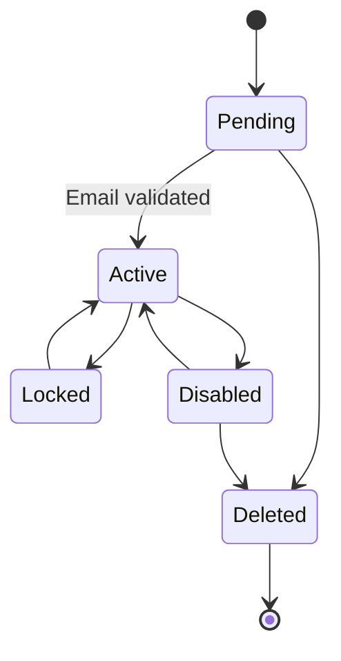
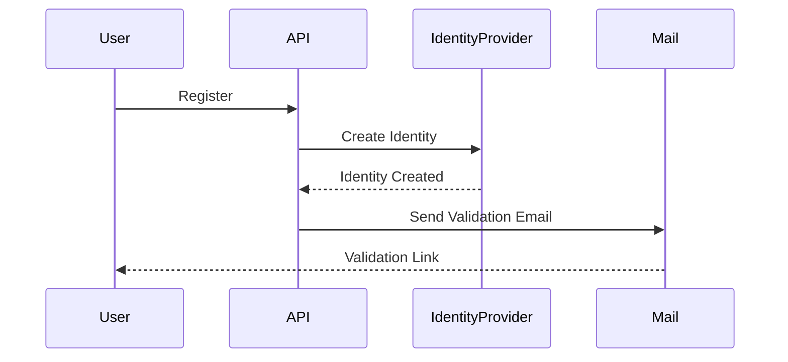
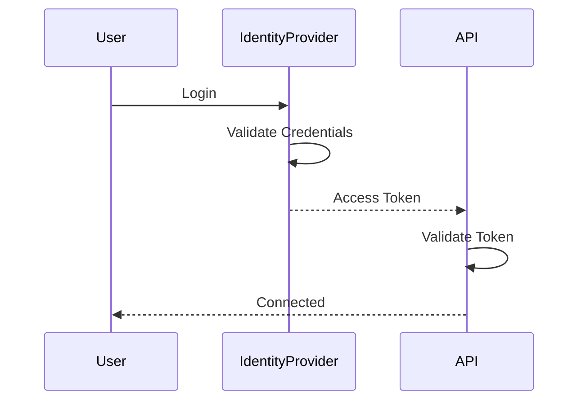
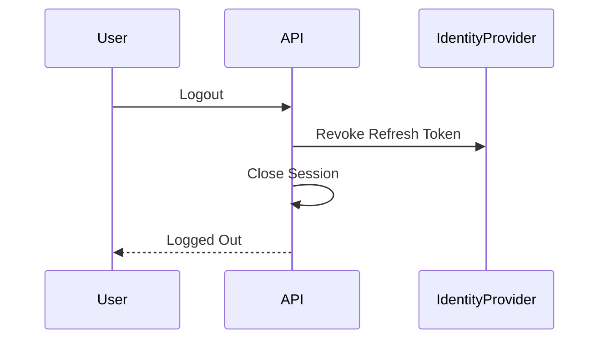
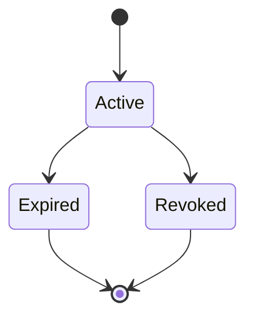

# FSPEC.01 – Authentication

**Document** : FSPEC.01

**Fichier** : `02-FSPEC/01-Core/FSPEC.01-Authentication.md`

**Version** : 3.0

**Statut** : Draft

**Playbook** : PLATFORM

**Capability** : Identity & Access Management

**Owner** : Platform Team

**Dernière mise à jour** : 2026-07

---

# 1. Objectif

Le domaine **Authentication** assure l'identification sécurisée des utilisateurs de la plateforme EventFoundry.

Il garantit qu'un utilisateur est authentifié avant toute interaction avec les services métier.

L'authentification est indépendante :

- des autorisations ;
- des rôles ;
- des organisations ;
- des préférences utilisateur.

Le domaine répond exclusivement à la question :

> **Qui est l'utilisateur ?**

---

# 2. Objectifs fonctionnels

Le domaine doit permettre :

- la création d'un compte ;
- la validation d'une adresse e-mail ;
- la connexion locale ;
- la connexion via un fournisseur externe ;
- la gestion des sessions ;
- le renouvellement des jetons ;
- la déconnexion ;
- la récupération de mot de passe ;
- la modification du mot de passe ;
- l'activation du MFA ;
- la journalisation des opérations de sécurité.

---

# 3. Hors périmètre

Les fonctionnalités suivantes ne font pas partie du domaine Authentication :

- gestion des utilisateurs ;
- gestion des organisations ;
- gestion des rôles ;
- gestion des permissions ;
- gestion des préférences ;
- gestion des abonnements ;
- gestion des événements.

---

# 4. Références

## ADR

- ADR.11 – Platform Architecture Principles
- ADR.17 – Organization Domain Model
- ADR.19 – User Preferences Model
- ADR.20 – Secrets Management
- ADR.21 – Experience Identity Strategy
- ADR.22 – Observability Strategy

---

# 5. Concepts métier

## Identity

Représente une identité technique.

Une Identity possède :

| Attribut | Description |
|----------|-------------|
| Id | Identifiant unique |
| Email | Adresse e-mail |
| Status | Etat de l'identité |
| EmailVerified | Adresse validée |
| Providers | Fournisseurs associés |
| MFAEnabled | MFA activé |
| CreatedAt | Date de création |
| UpdatedAt | Dernière modification |

---

## Session

Une session représente une authentification valide.

Elle possède :

- un Access Token ;
- un Refresh Token ;
- une date de création ;
- une date d'expiration ;
- une adresse IP ;
- un User Agent ;
- un Device Fingerprint.

---

## Identity Provider

Service responsable de l'authentification.

Exemples :

- Keycloak
- Authentik
- Google
- GitHub
- Discord
- Microsoft
- Apple

---

# 6. Cycle de vie



---

# 7. Cas d'utilisation

| ID | Cas d'utilisation |
|----|-------------------|
| AUTH-001 | Créer un compte |
| AUTH-002 | Valider une adresse e-mail |
| AUTH-003 | Se connecter |
| AUTH-004 | Se connecter via OAuth |
| AUTH-005 | Rafraîchir un token |
| AUTH-006 | Se déconnecter |
| AUTH-007 | Réinitialiser un mot de passe |
| AUTH-008 | Modifier son mot de passe |
| AUTH-009 | Activer le MFA |
| AUTH-010 | Désactiver le MFA |
| AUTH-011 | Révoquer une session |

---

# 8. Workflow de création d'un compte



---

# 9. Workflow de connexion



---

# 10. Workflow de déconnexion



---

# 11. Etats d'une session



---

# 12. Règles métier

| ID | Règle |
|----|--------|
| RM-AUTH-001 | Une adresse e-mail est unique. |
| RM-AUTH-002 | Une identité inactive ne peut jamais ouvrir de session. |
| RM-AUTH-003 | Une identité verrouillée ne peut pas être authentifiée. |
| RM-AUTH-004 | Le changement de mot de passe invalide tous les Refresh Tokens. |
| RM-AUTH-005 | Les Access Tokens possèdent une durée de vie limitée. |
| RM-AUTH-006 | Les Refresh Tokens peuvent être révoqués individuellement. |
| RM-AUTH-007 | Les mots de passe ne transitent jamais dans le domaine métier. |
| RM-AUTH-008 | Les secrets sont exclusivement gérés par ADR.20. |
| RM-AUTH-009 | Le domaine Authentication ne connaît aucun rôle. |
| RM-AUTH-010 | Le domaine Authentication ne connaît aucune organisation. |
| RM-AUTH-011 | Une identité supprimée ne peut jamais être restaurée. |
| RM-AUTH-012 | Toutes les opérations sont auditables. |

---

# 13. Authentification locale

La plateforme supporte un fournisseur interne.

Fonctionnalités :

- login
- logout
- changement de mot de passe
- récupération
- MFA

Le mot de passe est exclusivement vérifié par l'Identity Provider.

---

# 14. Authentification fédérée

Les fournisseurs supportés sont :

| Fournisseur | Support |
|--------------|---------|
| Google | Oui |
| GitHub | Oui |
| Discord | Oui |
| Microsoft | Oui |
| Apple | Oui |
| Keycloak | Oui |
| Authentik | Oui |

L'intégration repose sur OpenID Connect.

---

# 15. Multi Factor Authentication

Le MFA est facultatif.

Méthodes supportées :

| Méthode | V3 |
|----------|----|
| TOTP | Oui |
| Email OTP | Oui |
| Passkeys | Non |
| WebAuthn | Non |

---

# 16. Sessions

Une Identity peut posséder plusieurs sessions simultanées.

Exemple :

```text
Desktop Chrome

Desktop Firefox

Mobile Android

Mobile iPhone
```

Chaque session est indépendante.

---

# 17. Permissions

## Utilisateur anonyme

Autorisé à :

- créer un compte ;
- demander un reset ;
- consulter les fournisseurs disponibles.

---

## Utilisateur authentifié

Autorisé à :

- modifier son mot de passe ;
- gérer ses sessions ;
- activer le MFA.

---

## Operator

Autorisé à :

- verrouiller un compte ;
- déverrouiller un compte ;
- désactiver une identité ;
- révoquer toutes les sessions.

---

# 18. API

## Publiques

```http
POST /api/v1/auth/register

POST /api/v1/auth/login

POST /api/v1/auth/logout

POST /api/v1/auth/refresh

POST /api/v1/auth/forgot-password

POST /api/v1/auth/reset-password

GET /api/v1/auth/providers
```

---

## Authentifiées

```http
GET /api/v1/auth/me

POST /api/v1/auth/change-password

POST /api/v1/auth/mfa/enable

POST /api/v1/auth/mfa/disable

GET /api/v1/auth/sessions

DELETE /api/v1/auth/sessions/{id}
```

---

# 19. Evénements publiés

| Evénement |
|------------|
| IdentityCreated |
| IdentityActivated |
| LoginSucceeded |
| LoginFailed |
| LogoutSucceeded |
| SessionCreated |
| SessionRevoked |
| PasswordChanged |
| PasswordResetRequested |
| PasswordResetCompleted |
| MFAEnabled |
| MFADisabled |

---

# 20. Evénements consommés

| Evénement |
|------------|
| UserCreated |
| OrganizationInvitationAccepted |
| AccountDeletionRequested |

---

# 21. Données manipulées

Le domaine manipule :

- Identity
- Session
- IdentityProvider
- RefreshToken
- MFAConfiguration

Le domaine ne manipule jamais :

- Organization
- Role
- Permission
- UserPreference
- Follow
- Event

---

# 22. Observabilité

## Logs

- Login
- Logout
- MFA
- Password Change
- Password Reset
- Session Revocation

---

## Metrics

- Nombre de connexions
- Nombre d'échecs
- Temps moyen d'authentification
- Comptes verrouillés
- MFA activés

---

## Traces

Chaque opération possède :

- CorrelationId
- RequestId
- IdentityId
- SessionId

Conformément à l'ADR.22.

---

# 23. Sécurité

Les mots de passe :

- ne sont jamais enregistrés en clair ;
- ne sont jamais journalisés ;
- ne sont jamais retournés par une API.

Les secrets OAuth sont gérés exclusivement via le mécanisme défini dans ADR.20.

Tous les tokens possèdent :

- une date d'expiration ;
- une signature ;
- une possibilité de révocation.

---

# 24. Critères d'acceptation

| ID | Critère |
|----|----------|
| AC-AUTH-001 | Un utilisateur peut créer un compte. |
| AC-AUTH-002 | L'adresse e-mail doit être validée avant la première connexion si la politique de sécurité l'impose. |
| AC-AUTH-003 | Une identité inactive ne peut jamais être authentifiée. |
| AC-AUTH-004 | Les fournisseurs OAuth peuvent être ajoutés sans modification du domaine métier. |
| AC-AUTH-005 | Toutes les opérations d'authentification sont auditables. |
| AC-AUTH-006 | Les secrets sont externalisés conformément à ADR.20. |
| AC-AUTH-007 | Les opérations exposent les métriques nécessaires à ADR.22. |
| AC-AUTH-008 | Le domaine Authentication reste totalement découplé du domaine Authorization. |