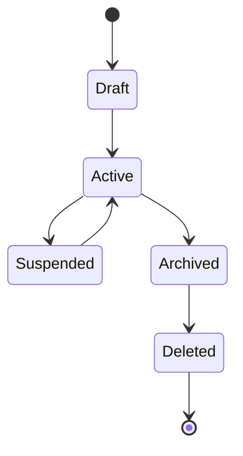
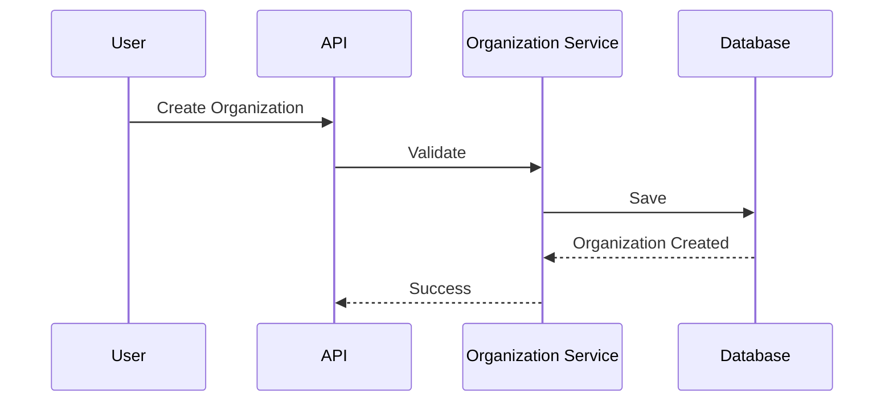
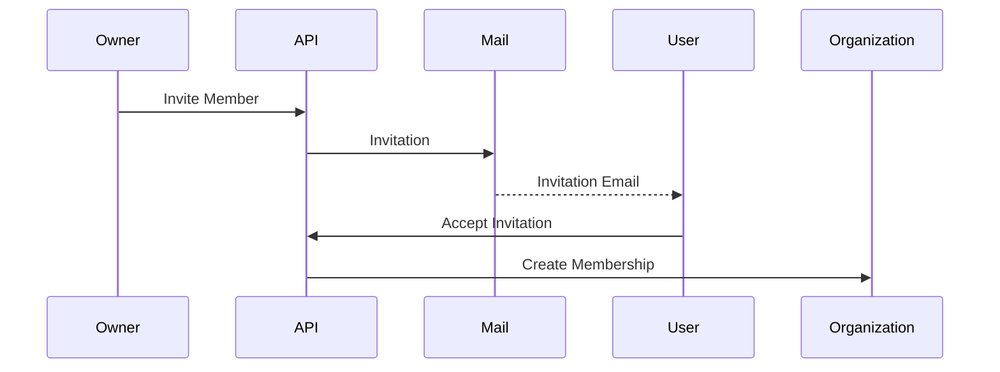
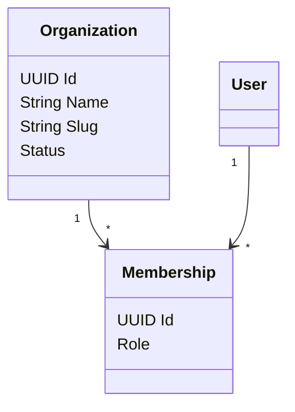
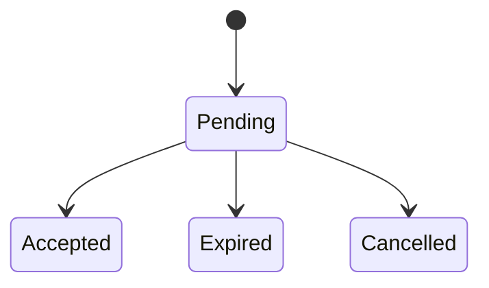

# FSPEC.02 – Organizations

**Document** : FSPEC.02

**Fichier** : `02-FSPEC/01-Core/FSPEC.02-Organizations.md`

**Version** : 3.0

**Statut** : Draft

**Playbook** : PLATFORM

**Capability** : Organization Management

**Owner** : Platform Team

**Dernière mise à jour** : 2026-07

---

# 1. Objectif

Le domaine **Organizations** représente les personnes morales présentes sur EventFoundry.

Une organisation est l'entité propriétaire des ressources métier de la plateforme.

Elle constitue la frontière de sécurité, de gouvernance et de responsabilité.

Toutes les opérations réalisées par un Organizer sont effectuées **au nom d'une Organization**.

---

# 2. Objectifs fonctionnels

Le domaine permet :

- créer une organisation ;
- modifier une organisation ;
- désactiver une organisation ;
- inviter des membres ;
- gérer les rôles des membres ;
- gérer les informations légales ;
- gérer les paramètres publics ;
- gérer les espaces de travail.

---

# 3. Hors périmètre

Le domaine ne gère pas :

- les utilisateurs ;
- l'authentification ;
- les permissions ;
- les événements ;
- les activités ;
- les abonnements ;
- la facturation.

---

# 4. Références

## ADR

- ADR.17 – Organization Domain Model
- ADR.21 – Experience Identity Strategy
- ADR.22 – Observability Strategy

---

# 5. Vision métier

Une Organization représente une structure réelle.

Exemples :

- association ;
- boutique ;
- éditeur ;
- festival ;
- mairie ;
- club ;
- ludothèque ;
- entreprise.

Une Organization possède sa propre identité sur EventFoundry.

Elle peut publier des événements, posséder des membres et être suivie par des utilisateurs.

---

# 6. Concepts métier

## Organization

Entité racine du domaine.

Une Organization possède :

| Attribut | Description |
|----------|-------------|
| Id | Identifiant |
| Name | Nom officiel |
| Slug | Identifiant public |
| Status | Etat |
| Description | Présentation |
| Logo | Image |
| Banner | Bannière |
| Website | Site Web |
| Email | Contact |
| Phone | Téléphone |
| CreatedAt | Création |
| UpdatedAt | Modification |

---

## Organization Member

Représente un utilisateur appartenant à une organisation.

Une relation est toujours :

```
User <-- Membership --> Organization
```

Le Membership contient le rôle.

---

## Workspace

Espace fonctionnel appartenant à une Organization.

Il permet d'isoler :

- les événements ;
- les ressources ;
- les médias.

Une V3 ne possède qu'un Workspace par Organization.

---

# 7. Etats



---

# 8. Cycle de vie

## Création



---

## Invitation



---

# 9. Cas d'utilisation

| ID | Cas |
|----|------|
| ORG-001 | Créer une organisation |
| ORG-002 | Modifier une organisation |
| ORG-003 | Archiver une organisation |
| ORG-004 | Inviter un membre |
| ORG-005 | Retirer un membre |
| ORG-006 | Changer le rôle d'un membre |
| ORG-007 | Modifier les informations publiques |
| ORG-008 | Modifier les coordonnées |
| ORG-009 | Consulter les membres |
| ORG-010 | Consulter les organisations |

---

# 10. Rôles

Chaque Membership possède un rôle.

| Rôle | Description |
|------|-------------|
| Owner | Responsable principal |
| Administrator | Administration complète |
| Manager | Gestion opérationnelle |
| Editor | Modification du contenu |
| Viewer | Lecture uniquement |

Les permissions détaillées sont décrites dans FSPEC.04.

---

# 11. Règles métier

| ID | Règle |
|----|--------|
| RM-ORG-001 | Une Organization possède un identifiant unique. |
| RM-ORG-002 | Le slug est unique. |
| RM-ORG-003 | Une Organization possède au moins un Owner. |
| RM-ORG-004 | Une Organization ne peut jamais être sans Owner. |
| RM-ORG-005 | Un User peut appartenir à plusieurs Organizations. |
| RM-ORG-006 | Un Membership appartient à une seule Organization. |
| RM-ORG-007 | Une Organization archivée devient inaccessible en écriture. |
| RM-ORG-008 | Une Organization supprimée n'est plus visible publiquement. |
| RM-ORG-009 | Le logo est optionnel. |
| RM-ORG-010 | Le nom est obligatoire. |

---

# 12. Modèle métier



---

# 13. Gouvernance

Chaque Organization possède :

- un propriétaire ;
- une équipe ;
- un historique ;
- une traçabilité complète.

Toutes les modifications sont historisées.

---

# 14. Informations publiques

Une Organization peut exposer :

- nom ;
- logo ;
- bannière ;
- description ;
- site web ;
- réseaux sociaux ;
- adresse ;
- téléphone.

Ces informations sont visibles sans authentification si l'organisation est active.

---

# 15. Informations privées

Les informations suivantes ne sont visibles que par les membres :

- historique interne ;
- statistiques ;
- membres ;
- invitations ;
- paramètres.

---

# 16. Invitations

Une invitation possède :

| Champ | Description |
|--------|-------------|
| Id | Identifiant |
| Email | Destinataire |
| Role | Rôle proposé |
| Expiration | Date limite |
| Status | Etat |

Etats :



---

# 17. API

## Lecture

```http
GET /api/v1/organizations

GET /api/v1/organizations/{id}

GET /api/v1/organizations/{slug}

GET /api/v1/organizations/{id}/members
```

---

## Modification

```http
POST /api/v1/organizations

PATCH /api/v1/organizations/{id}

DELETE /api/v1/organizations/{id}

POST /api/v1/organizations/{id}/invite

DELETE /api/v1/organizations/{id}/members/{memberId}
```

---

# 18. Evénements publiés

| Evénement |
|------------|
| OrganizationCreated |
| OrganizationUpdated |
| OrganizationActivated |
| OrganizationArchived |
| OrganizationDeleted |
| MemberInvited |
| MemberJoined |
| MemberRemoved |
| MemberRoleChanged |

---

# 19. Evénements consommés

| Evénement |
|------------|
| UserCreated |
| InvitationAccepted |
| AccountDeleted |

---

# 20. Données manipulées

Le domaine manipule :

- Organization
- Membership
- Invitation
- Workspace

Le domaine ne manipule jamais :

- Authentication
- Event
- Activity
- Follow
- Planning
- Recommendation

---

# 21. Observabilité

Logs :

- création ;
- modification ;
- suppression ;
- invitation ;
- retrait d'un membre.

Metrics :

- nombre d'organisations ;
- nombre de membres ;
- invitations envoyées ;
- invitations acceptées ;
- organisations archivées.

Toutes les opérations possèdent un CorrelationId conformément à ADR.22.

---

# 22. Sécurité

Une modification n'est autorisée qu'à un membre disposant des permissions nécessaires.

Toutes les opérations sensibles sont auditées.

La suppression logique est privilégiée afin de préserver la traçabilité.

---

# 23. Critères d'acceptation

| ID | Critère |
|----|----------|
| AC-ORG-001 | Une organisation peut être créée par un utilisateur authentifié. |
| AC-ORG-002 | Une organisation possède toujours un Owner. |
| AC-ORG-003 | Un utilisateur peut appartenir à plusieurs organisations. |
| AC-ORG-004 | Les invitations possèdent une date d'expiration. |
| AC-ORG-005 | Les rôles sont portés par le Membership et non par le User. |
| AC-ORG-006 | Les événements du domaine sont publiés sur le bus métier. |
| AC-ORG-007 | Toutes les opérations sont historisées. |
| AC-ORG-008 | Une organisation archivée reste consultable mais n'est plus modifiable. |
| AC-ORG-009 | Le domaine est indépendant des mécanismes d'authentification. |
| AC-ORG-010 | Toutes les opérations sont observables conformément à ADR.22. |