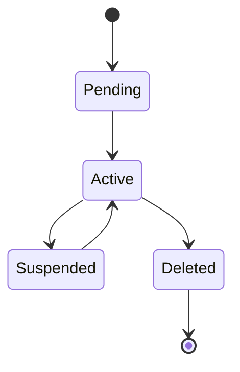
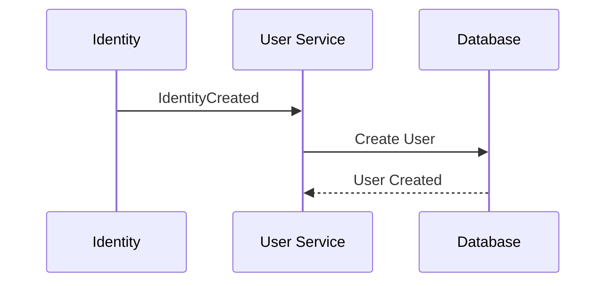
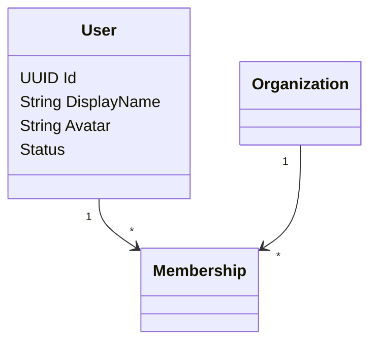

# FSPEC.03 – Users

**Document** : FSPEC.03

**Fichier** : `02-FSPEC/01-Core/FSPEC.03-Users.md`

**Version** : 3.0

**Statut** : Draft

**Playbook** : PLATFORM

**Capability** : User Management

**Owner** : Platform Team

**Dernière mise à jour** : 2026-07

---

# 1. Objectif

Le domaine **Users** représente les personnes utilisant EventFoundry.

Il constitue le profil métier de l'utilisateur.

Le domaine est responsable de :

- l'identité publique ;
- le profil ;
- les informations personnelles ;
- les préférences de visibilité ;
- les appartenances aux organisations.

Le domaine ne gère jamais :

- l'authentification ;
- les mots de passe ;
- les permissions.

---

# 2. Objectifs fonctionnels

Le domaine permet :

- créer un utilisateur ;
- consulter son profil ;
- modifier son profil ;
- supprimer son compte ;
- gérer son avatar ;
- gérer ses informations publiques ;
- consulter les organisations auxquelles il appartient.

---

# 3. Hors périmètre

Le domaine ne gère pas :

- Authentication ;
- Roles ;
- Permissions ;
- Preferences ;
- Events ;
- Activities ;
- Planning.

---

# 4. Références

## ADR

- ADR.17 – Organization Domain Model
- ADR.19 – User Preferences Model
- ADR.21 – Experience Identity Strategy
- ADR.22 – Observability Strategy

---

# 5. Vision métier

Le **User** représente une personne.

Chaque personne possède :

- une identité technique (Authentication)
- un profil métier (Users)

Cette séparation garantit l'indépendance entre les mécanismes d'authentification et les données fonctionnelles.

---

# 6. Concepts métier

## User

Le User possède :

| Attribut | Description |
|-----------|-------------|
| Id | Identifiant |
| DisplayName | Nom affiché |
| FirstName | Prénom |
| LastName | Nom |
| Avatar | Image |
| Bio | Présentation |
| Country | Pays |
| Language | Langue |
| TimeZone | Fuseau horaire |
| Status | Etat |
| CreatedAt | Création |
| UpdatedAt | Modification |

---

## Public Profile

Informations visibles publiquement.

Exemples :

- avatar
- nom affiché
- bio
- pays
- organisations publiques

---

## Private Profile

Informations privées.

Exemples :

- email
- préférences
- invitations
- historique

---

# 7. Cycle de vie



---

# 8. Cas d'utilisation

| ID | Cas |
|----|------|
| USER-001 | Consulter son profil |
| USER-002 | Modifier son profil |
| USER-003 | Modifier son avatar |
| USER-004 | Modifier sa biographie |
| USER-005 | Modifier son nom affiché |
| USER-006 | Consulter un profil public |
| USER-007 | Supprimer son compte |
| USER-008 | Exporter ses données |
| USER-009 | Consulter ses organisations |
| USER-010 | Consulter son activité |

---

# 9. Création

Le User est créé automatiquement après la création d'une Identity.



---

# 10. Modèle métier



---

# 11. Règles métier

| ID | Règle |
|----|--------|
| RM-USER-001 | Un User est associé à une seule Identity. |
| RM-USER-002 | Une Identity possède un seul User. |
| RM-USER-003 | Le DisplayName est obligatoire. |
| RM-USER-004 | L'avatar est optionnel. |
| RM-USER-005 | Un utilisateur supprimé n'est plus visible publiquement. |
| RM-USER-006 | Le pays est optionnel. |
| RM-USER-007 | La langue possède une valeur par défaut. |
| RM-USER-008 | Le fuseau horaire est obligatoire. |
| RM-USER-009 | Toutes les modifications sont historisées. |
| RM-USER-010 | Les données personnelles respectent le RGPD. |

---

# 12. Relations

Un utilisateur peut appartenir à plusieurs organisations.

```text
User

↓

Membership

↓

Organization
```

Le rôle est porté par le Membership.

---

# 13. Avatar

Formats supportés :

- PNG
- JPEG
- WEBP

Contraintes :

- taille maximale configurable ;
- redimensionnement automatique ;
- optimisation des images.

---

# 14. Profil public

Le profil public expose :

- avatar ;
- nom affiché ;
- biographie ;
- pays ;
- organisations publiques ;
- nombre d'événements organisés (si Organizer).

---

# 15. Profil privé

Accessible uniquement par le propriétaire.

Contient :

- email ;
- préférences ;
- invitations ;
- paramètres ;
- sessions ;
- informations personnelles.

---

# 16. Export RGPD

Le User peut exporter :

- profil ;
- préférences ;
- événements ;
- organisations ;
- historique.

Le format d'export est JSON.

---

# 17. Suppression

La suppression d'un compte est logique.

Conséquences :

- anonymisation des données publiques si nécessaire ;
- révocation des sessions ;
- désactivation de l'Identity ;
- publication d'un événement métier.

---

# 18. API

## Lecture

```http
GET /api/v1/users/me

GET /api/v1/users/{id}

GET /api/v1/users/{id}/organizations
```

---

## Modification

```http
PATCH /api/v1/users/me

PATCH /api/v1/users/me/avatar

DELETE /api/v1/users/me

GET /api/v1/users/me/export
```

---

# 19. Evénements publiés

| Evénement |
|------------|
| UserCreated |
| UserUpdated |
| AvatarChanged |
| UserDeleted |
| UserExportRequested |

---

# 20. Evénements consommés

| Evénement |
|------------|
| IdentityCreated |
| IdentityDeleted |
| MembershipCreated |
| MembershipRemoved |

---

# 21. Données manipulées

Le domaine manipule :

- User
- PublicProfile
- PrivateProfile
- Avatar

Le domaine ne manipule jamais :

- Password
- Token
- Role
- Permission
- Event
- Planning

---

# 22. Observabilité

Logs :

- création ;
- modification ;
- suppression ;
- export ;
- changement d'avatar.

Metrics :

- nombre d'utilisateurs ;
- utilisateurs actifs ;
- suppressions ;
- exports RGPD.

Toutes les opérations sont corrélées via un CorrelationId conformément à ADR.22.

---

# 23. Sécurité

Les données personnelles sont accessibles uniquement :

- au propriétaire ;
- aux administrateurs habilités.

Les données publiques respectent les paramètres de visibilité définis dans les préférences utilisateur.

Les exports sont journalisés.

---

# 24. Critères d'acceptation

| ID | Critère |
|----|----------|
| AC-USER-001 | Un User est créé automatiquement après la création d'une Identity. |
| AC-USER-002 | Un User possède un seul profil métier. |
| AC-USER-003 | Le DisplayName est obligatoire. |
| AC-USER-004 | Les informations privées ne sont jamais exposées publiquement. |
| AC-USER-005 | Le User peut appartenir à plusieurs Organizations. |
| AC-USER-006 | Les données sont exportables conformément au RGPD. |
| AC-USER-007 | Les suppressions sont auditables. |
| AC-USER-008 | Les événements métier sont publiés sur le bus d'événements. |
| AC-USER-009 | Le domaine reste indépendant de l'authentification. |
| AC-USER-010 | Toutes les opérations sont observables conformément à ADR.22. |