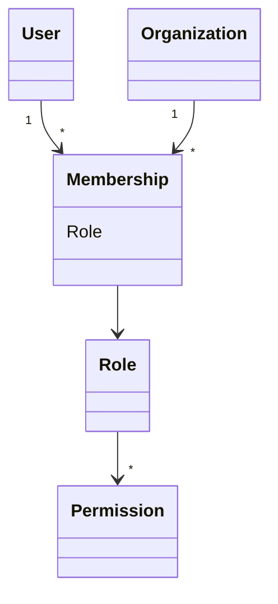
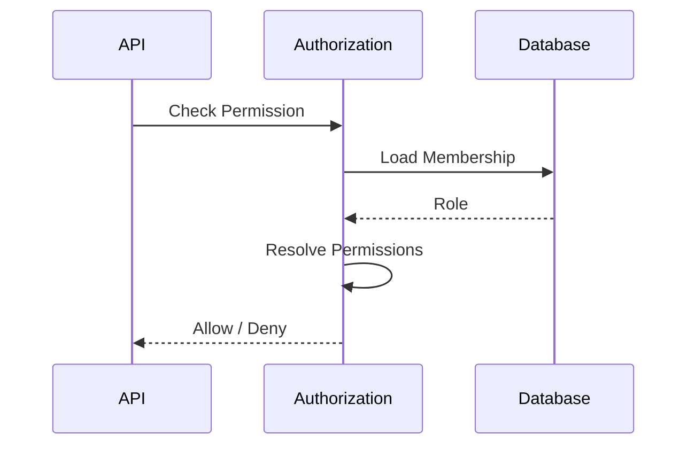

# FSPEC.04 – Roles & Authorization

**Document** : FSPEC.04

**Fichier** : `02-FSPEC/01-Core/FSPEC.04-Roles.md`

**Version** : 3.0

**Statut** : Draft

**Playbook** : PLATFORM

**Capability** : Authorization

**Owner** : Platform Team

**Dernière mise à jour** : 2026-07

---

# 1. Objectif

Le domaine **Roles & Authorization** détermine les actions qu'un utilisateur est autorisé à effectuer dans EventFoundry.

Il répond exclusivement à la question :

> **Que peut faire l'utilisateur ?**

L'autorisation est indépendante de l'authentification.

Authentication identifie un utilisateur.

Authorization décide des actions autorisées.

---

# 2. Objectifs fonctionnels

Le domaine permet :

- attribuer un rôle à un membre ;
- modifier un rôle ;
- retirer un rôle ;
- calculer les permissions effectives ;
- vérifier une autorisation ;
- exposer les permissions au Front-End.

---

# 3. Hors périmètre

Le domaine ne gère pas :

- les mots de passe ;
- les sessions ;
- les utilisateurs ;
- les organisations ;
- les événements ;
- les préférences.

---

# 4. Références

## ADR

- ADR.17 – Organization Domain Model
- ADR.21 – Experience Identity Strategy
- ADR.22 – Observability Strategy

---

# 5. Vision métier

Les permissions ne sont jamais directement attribuées à un utilisateur.

Les permissions sont obtenues grâce :

```
Organization

↓

Membership

↓

Role

↓

Permissions
```

Un utilisateur peut donc posséder plusieurs rôles, dans plusieurs organisations différentes.

---

# 6. Concepts métier

## Role

Décrit une responsabilité métier.

Exemples :

- Owner
- Administrator
- Manager
- Editor
- Viewer

---

## Permission

Une permission représente une action autorisée.

Exemples :

- organization.read
- organization.update
- event.create
- event.publish
- member.invite

---

## Membership

Le Membership relie :

- un User ;
- une Organization ;
- un Role.

---

# 7. Modèle métier



---

# 8. Catalogue des rôles

| Rôle | Description |
|-------|-------------|
| Owner | Responsable de l'organisation |
| Administrator | Administration complète |
| Manager | Gestion opérationnelle |
| Editor | Gestion des contenus |
| Viewer | Consultation uniquement |

---

# 9. Permissions

Les permissions sont exprimées sous la forme :

```
resource.action
```

Exemples :

```
organization.read

organization.update

organization.delete

member.invite

member.remove

event.create

event.publish

event.archive

activity.manage

media.upload

billing.read

billing.update
```

---

# 10. Matrice des permissions

| Permission | Owner | Admin | Manager | Editor | Viewer |
|------------|:----:|:----:|:-------:|:------:|:------:|
| organization.read | ✅ | ✅ | ✅ | ✅ | ✅ |
| organization.update | ✅ | ✅ | ❌ | ❌ | ❌ |
| organization.delete | ✅ | ❌ | ❌ | ❌ | ❌ |
| member.invite | ✅ | ✅ | ✅ | ❌ | ❌ |
| member.remove | ✅ | ✅ | ❌ | ❌ | ❌ |
| role.update | ✅ | ✅ | ❌ | ❌ | ❌ |
| event.create | ✅ | ✅ | ✅ | ✅ | ❌ |
| event.publish | ✅ | ✅ | ✅ | ❌ | ❌ |
| media.upload | ✅ | ✅ | ✅ | ✅ | ❌ |

---

# 11. Workflow de contrôle d'accès



---

# 12. Résolution des permissions

L'autorisation est calculée selon les étapes suivantes :

1. Identifier le User.
2. Identifier l'Organization ciblée.
3. Charger le Membership.
4. Identifier le Role.
5. Résoudre les Permissions.
6. Vérifier la permission demandée.

---

# 13. Règles métier

| ID | Règle |
|----|--------|
| RM-ROLE-001 | Un Membership possède un seul rôle. |
| RM-ROLE-002 | Un utilisateur peut avoir des rôles différents selon l'organisation. |
| RM-ROLE-003 | Les permissions ne sont jamais attribuées directement à un User. |
| RM-ROLE-004 | Les permissions sont définies par le rôle. |
| RM-ROLE-005 | Une permission inconnue est refusée. |
| RM-ROLE-006 | Une organisation possède au moins un Owner. |
| RM-ROLE-007 | Le dernier Owner ne peut pas être retiré. |
| RM-ROLE-008 | Une organisation archivée est accessible uniquement en lecture. |
| RM-ROLE-009 | Les décisions d'autorisation sont auditables. |
| RM-ROLE-010 | Les permissions sont évaluées à chaque requête. |

---

# 14. Héritage

Il n'existe aucun héritage de rôles.

Chaque rôle possède son propre ensemble de permissions.

Cette règle simplifie :

- la compréhension ;
- les audits ;
- les évolutions.

---

# 15. API

## Vérification

```http
GET /api/v1/permissions

GET /api/v1/me/permissions
```

---

## Administration

```http
PATCH /api/v1/organizations/{id}/members/{memberId}/role
```

---

# 16. Evénements publiés

| Evénement |
|------------|
| RoleAssigned |
| RoleUpdated |
| RoleRemoved |
| PermissionGranted |
| PermissionDenied |

---

# 17. Evénements consommés

| Evénement |
|------------|
| MembershipCreated |
| MembershipRemoved |
| OrganizationArchived |
| OrganizationDeleted |

---

# 18. Données manipulées

Le domaine manipule :

- Role
- Permission
- Membership

Le domaine ne manipule jamais :

- Password
- Session
- Identity
- Event
- Activity
- Preference

---

# 19. Observabilité

Logs :

- attribution d'un rôle ;
- modification d'un rôle ;
- refus d'autorisation ;
- suppression d'un rôle.

Metrics :

- nombre de contrôles d'accès ;
- autorisations accordées ;
- autorisations refusées ;
- changements de rôle.

Toutes les opérations sont corrélées via un CorrelationId conformément à ADR.22.

---

# 20. Sécurité

Toute opération protégée passe par le moteur d'autorisation.

Les permissions sont évaluées côté serveur.

Le Front-End ne constitue jamais une autorité de sécurité.

Toutes les décisions sont traçables.

---

# 21. Critères d'acceptation

| ID | Critère |
|----|----------|
| AC-ROLE-001 | Les permissions sont exclusivement portées par les rôles. |
| AC-ROLE-002 | Les rôles sont attribués via le Membership. |
| AC-ROLE-003 | Un utilisateur peut posséder plusieurs rôles dans différentes organisations. |
| AC-ROLE-004 | Une permission inconnue est systématiquement refusée. |
| AC-ROLE-005 | Le dernier Owner ne peut jamais être supprimé. |
| AC-ROLE-006 | Les permissions sont évaluées à chaque requête. |
| AC-ROLE-007 | Toutes les décisions d'autorisation sont auditables. |
| AC-ROLE-008 | Le domaine reste totalement indépendant de l'authentification. |
| AC-ROLE-009 | Les événements du domaine sont publiés sur le bus d'événements. |
| AC-ROLE-010 | Toutes les opérations sont observables conformément à ADR.22. |