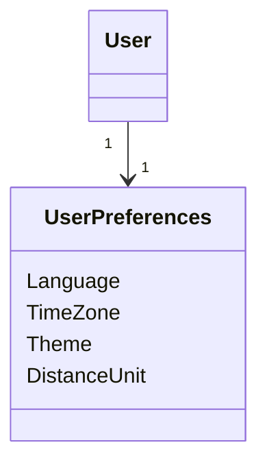
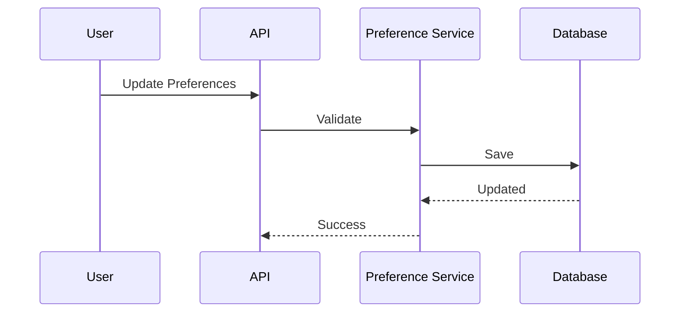

# FSPEC.05 – User Preferences

**Document** : FSPEC.05

**Fichier** : `02-FSPEC/01-Core/FSPEC.05-Preferences.md`

**Version** : 3.0

**Statut** : Draft

**Playbook** : PLATFORM

**Capability** : User Preferences

**Owner** : Platform Team

**Dernière mise à jour** : 2026-07

---

# 1. Objectif

Le domaine **User Preferences** permet à chaque utilisateur de personnaliser son expérience sur EventFoundry.

Les préférences ne modifient jamais les données métier.

Elles influencent uniquement :

- l'expérience utilisateur ;
- les recommandations ;
- les notifications ;
- l'affichage ;
- les valeurs par défaut.

Le domaine est totalement indépendant :

- de l'authentification ;
- des organisations ;
- des événements ;
- des permissions.

---

# 2. Objectifs fonctionnels

Le domaine permet :

- gérer les préférences utilisateur ;
- personnaliser l'interface ;
- définir les langues ;
- définir le fuseau horaire ;
- gérer les notifications ;
- gérer les préférences de confidentialité ;
- gérer les préférences de découverte ;
- définir les valeurs par défaut de création.

---

# 3. Hors périmètre

Le domaine ne gère pas :

- Authentication ;
- Authorization ;
- Organizations ;
- Activities ;
- Events ;
- Planning ;
- Billing.

---

# 4. Références

## ADR

- ADR.19 – User Preferences Model
- ADR.21 – Experience Identity Strategy
- ADR.22 – Observability Strategy

---

# 5. Vision métier

Chaque utilisateur possède un ensemble unique de préférences.

Ces préférences permettent d'adapter l'application sans modifier les données métier.

Les préférences sont persistantes et synchronisées entre tous les appareils.

---

# 6. Concepts métier

## UserPreference

Entité racine du domaine.

Une préférence est toujours liée à un seul utilisateur.

```text
User

↓

UserPreferences
```

---

## Notification Preferences

Détermine :

- quels événements génèrent une notification ;
- quels canaux sont utilisés.

---

## Discovery Preferences

Détermine :

- les activités favorites ;
- les formats favoris ;
- les distances ;
- les langues.

Ces préférences alimentent le moteur de recommandation.

---

## UI Preferences

Personnalisation de l'interface.

Exemples :

- thème ;
- langue ;
- densité ;
- format de date.

---

# 7. Modèle métier



---

# 8. Catégories de préférences

| Catégorie | Description |
|------------|-------------|
| General | Préférences générales |
| Interface | Affichage |
| Notifications | Notifications |
| Discovery | Découverte |
| Privacy | Confidentialité |
| Localization | Langue et formats |

---

# 9. Préférences générales

Les préférences générales comprennent :

| Préférence | Exemple |
|-------------|----------|
| Langue | fr-FR |
| Fuseau horaire | Europe/Paris |
| Format de date | DD/MM/YYYY |
| Premier jour de semaine | Lundi |

---

# 10. Préférences d'interface

L'utilisateur peut personnaliser :

| Préférence | Valeurs |
|-------------|----------|
| Theme | Light / Dark / System |
| Density | Compact / Comfortable |
| Sidebar | Expanded / Collapsed |
| Dashboard | Personnalisé |

---

# 11. Préférences de découverte

Ces préférences influencent les recommandations.

Exemples :

- activités favorites ;
- formats favoris ;
- rayon de recherche ;
- langues des événements ;
- événements en ligne ;
- événements gratuits.

---

# 12. Préférences de notification

Les notifications peuvent être configurées pour :

- invitations ;
- rappels ;
- changements d'horaires ;
- annulations ;
- nouvelles publications ;
- abonnements.

Canaux disponibles :

| Canal | Support |
|--------|---------|
| Email | Oui |
| Push | Oui |
| SMS | Non |
| Webhook | V4 |

---

# 13. Préférences de confidentialité

Les paramètres disponibles sont :

- profil public ;
- avatar public ;
- organisations visibles ;
- statistiques visibles ;
- autoriser les messages privés.

---

# 14. Workflow de modification



---

# 15. Règles métier

| ID | Règle |
|----|--------|
| RM-PREF-001 | Un User possède une seule configuration de préférences. |
| RM-PREF-002 | Les préférences sont personnelles. |
| RM-PREF-003 | Les préférences sont synchronisées entre tous les appareils. |
| RM-PREF-004 | Une modification est immédiatement prise en compte. |
| RM-PREF-005 | Les valeurs invalides sont rejetées. |
| RM-PREF-006 | Les préférences n'accordent jamais de permissions supplémentaires. |
| RM-PREF-007 | Les préférences ne modifient jamais les données métier. |
| RM-PREF-008 | Les préférences possèdent des valeurs par défaut. |
| RM-PREF-009 | Les préférences sont historisées. |
| RM-PREF-010 | Les recommandations utilisent les préférences de découverte. |

---

# 16. Valeurs par défaut

| Préférence | Valeur |
|-------------|--------|
| Theme | System |
| Language | Langue du navigateur |
| TimeZone | Fuseau détecté |
| Notifications Email | Activées |
| Notifications Push | Activées |
| Distance | 50 km |

---

# 17. API

## Lecture

```http
GET /api/v1/preferences
```

---

## Modification

```http
PATCH /api/v1/preferences

PATCH /api/v1/preferences/general

PATCH /api/v1/preferences/interface

PATCH /api/v1/preferences/notifications

PATCH /api/v1/preferences/discovery

PATCH /api/v1/preferences/privacy
```

---

# 18. Evénements publiés

| Evénement |
|------------|
| PreferencesUpdated |
| NotificationPreferencesUpdated |
| DiscoveryPreferencesUpdated |
| PrivacyPreferencesUpdated |

---

# 19. Evénements consommés

| Evénement |
|------------|
| UserCreated |
| UserDeleted |

---

# 20. Données manipulées

Le domaine manipule :

- UserPreferences
- NotificationPreferences
- DiscoveryPreferences
- PrivacyPreferences
- UIPreferences

Le domaine ne manipule jamais :

- Password
- Token
- Role
- Membership
- Event
- Activity

---

# 21. Observabilité

Logs :

- consultation ;
- modification ;
- réinitialisation ;
- erreurs de validation.

Metrics :

- préférences modifiées ;
- langues utilisées ;
- thèmes utilisés ;
- activation des notifications ;
- paramètres de confidentialité.

Toutes les opérations possèdent un CorrelationId conformément à ADR.22.

---

# 22. Sécurité

Les préférences sont accessibles uniquement par leur propriétaire.

Les administrateurs de la plateforme ne peuvent pas modifier les préférences personnelles d'un utilisateur sans une fonctionnalité d'administration dédiée.

Les modifications sont systématiquement historisées.

---

# 23. Critères d'acceptation

| ID | Critère |
|----|----------|
| AC-PREF-001 | Chaque utilisateur possède une configuration unique de préférences. |
| AC-PREF-002 | Les préférences sont synchronisées entre tous les appareils. |
| AC-PREF-003 | Les valeurs par défaut sont automatiquement créées lors de la création du compte. |
| AC-PREF-004 | Les préférences de découverte sont utilisées par le moteur de recommandations. |
| AC-PREF-005 | Les préférences de confidentialité contrôlent uniquement la visibilité des données. |
| AC-PREF-006 | Les préférences n'accordent jamais de permissions supplémentaires. |
| AC-PREF-007 | Toutes les modifications sont auditables. |
| AC-PREF-008 | Les événements du domaine sont publiés sur le bus métier. |
| AC-PREF-009 | Le domaine est totalement indépendant de l'authentification et de l'autorisation. |
| AC-PREF-010 | Toutes les opérations sont observables conformément à ADR.22. |