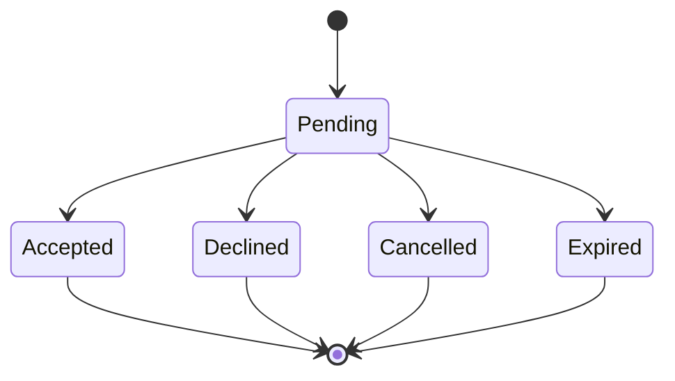
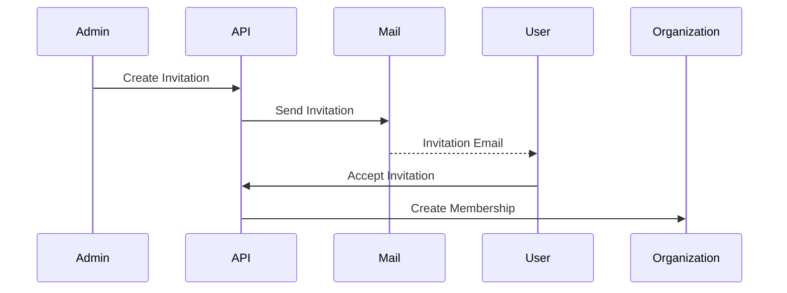
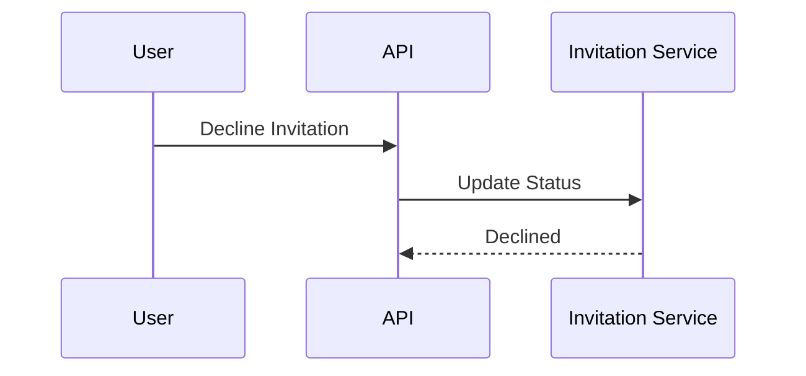

# FSPEC.06 – Invitations

**Document** : FSPEC.06

**Fichier** : `02-FSPEC/01-Core/FSPEC.06-Invitations.md`

**Version** : 3.0

**Statut** : Draft

**Playbook** : PLATFORM

**Capability** : Invitation Management

**Owner** : Platform Team

**Dernière mise à jour** : 2026-07

---

# 1. Objectif

Le domaine **Invitations** permet à une organisation d'inviter un utilisateur à rejoindre son espace de travail.

Le domaine garantit :

- l'envoi sécurisé d'une invitation ;
- l'acceptation ou le refus de l'invitation ;
- la création du Membership associé ;
- la traçabilité complète du processus.

---

# 2. Objectifs fonctionnels

Le domaine permet :

- créer une invitation ;
- envoyer une invitation ;
- accepter une invitation ;
- refuser une invitation ;
- annuler une invitation ;
- réémettre une invitation expirée ;
- consulter les invitations d'une organisation.

---

# 3. Hors périmètre

Le domaine ne gère pas :

- l'authentification ;
- les utilisateurs ;
- les organisations ;
- les rôles ;
- les permissions ;
- les événements.

---

# 4. Références

## ADR

- ADR.17 – Organization Domain Model
- ADR.21 – Experience Identity Strategy
- ADR.22 – Observability Strategy

---

# 5. Vision métier

Une invitation représente une proposition faite à une personne de rejoindre une organisation.

Une invitation ne crée jamais directement un membre.

Le Membership est créé uniquement après acceptation.

---

# 6. Concepts métier

## Invitation

| Attribut | Description |
|----------|-------------|
| Id | Identifiant |
| OrganizationId | Organisation concernée |
| Email | Destinataire |
| Role | Rôle proposé |
| Token | Jeton sécurisé |
| Status | Etat |
| ExpiresAt | Date d'expiration |
| CreatedAt | Date de création |

---

## Invitation Token

Jeton unique permettant de sécuriser l'acceptation de l'invitation.

Il est :

- unique ;
- signé ;
- limité dans le temps.

---

# 7. Cycle de vie



---

# 8. Cas d'utilisation

| ID | Cas |
|----|------|
| INV-001 | Inviter un membre |
| INV-002 | Consulter les invitations |
| INV-003 | Accepter une invitation |
| INV-004 | Refuser une invitation |
| INV-005 | Annuler une invitation |
| INV-006 | Réémettre une invitation |
| INV-007 | Expiration automatique |

---

# 9. Workflow d'invitation



---

# 10. Workflow de refus



---

# 11. Règles métier

| ID | Règle |
|----|--------|
| RM-INV-001 | Une invitation cible une seule organisation. |
| RM-INV-002 | Une invitation concerne une seule adresse e-mail. |
| RM-INV-003 | Une invitation possède une date d'expiration. |
| RM-INV-004 | Une invitation acceptée ne peut plus être modifiée. |
| RM-INV-005 | Une invitation expirée ne peut plus être utilisée. |
| RM-INV-006 | Le Membership est créé uniquement après acceptation. |
| RM-INV-007 | Une invitation annulée devient inutilisable. |
| RM-INV-008 | Le rôle proposé est fixé lors de la création. |
| RM-INV-009 | Toutes les opérations sont historisées. |
| RM-INV-010 | Les tokens d'invitation sont à usage unique. |

---

# 12. Expiration

La durée de validité est configurable.

Valeur recommandée :

| Paramètre | Valeur |
|-----------|---------|
| Expiration | 7 jours |

---

# 13. Sécurité

Les liens d'invitation :

- utilisent HTTPS ;
- sont signés ;
- expirent automatiquement ;
- deviennent invalides après acceptation.

---

# 14. API

## Lecture

```http
GET /api/v1/invitations

GET /api/v1/invitations/{id}

GET /api/v1/invitations/token/{token}
```

---

## Modification

```http
POST /api/v1/invitations

POST /api/v1/invitations/{id}/resend

POST /api/v1/invitations/{token}/accept

POST /api/v1/invitations/{token}/decline

DELETE /api/v1/invitations/{id}
```

---

# 15. Evénements publiés

| Evénement |
|------------|
| InvitationCreated |
| InvitationSent |
| InvitationAccepted |
| InvitationDeclined |
| InvitationCancelled |
| InvitationExpired |

---

# 16. Evénements consommés

| Evénement |
|------------|
| UserCreated |
| OrganizationArchived |
| OrganizationDeleted |

---

# 17. Données manipulées

Le domaine manipule :

- Invitation
- InvitationToken

Le domaine ne manipule jamais :

- Password
- Session
- Event
- Activity
- Preference

---

# 18. Observabilité

Logs :

- création ;
- envoi ;
- acceptation ;
- refus ;
- annulation ;
- expiration.

Metrics :

- invitations créées ;
- invitations acceptées ;
- invitations refusées ;
- taux d'acceptation ;
- invitations expirées.

Toutes les opérations sont corrélées via un CorrelationId conformément à ADR.22.

---

# 19. Critères d'acceptation

| ID | Critère |
|----|----------|
| AC-INV-001 | Une invitation est créée par un membre autorisé. |
| AC-INV-002 | Chaque invitation possède un token unique. |
| AC-INV-003 | Une invitation expirée ne peut pas être acceptée. |
| AC-INV-004 | L'acceptation crée automatiquement le Membership. |
| AC-INV-005 | Le refus ne crée aucun Membership. |
| AC-INV-006 | Les invitations annulées deviennent invalides. |
| AC-INV-007 | Toutes les opérations sont auditables. |
| AC-INV-008 | Les événements métier sont publiés sur le bus d'événements. |
| AC-INV-009 | Le domaine est indépendant de l'authentification. |
| AC-INV-010 | Toutes les opérations respectent ADR.22. |