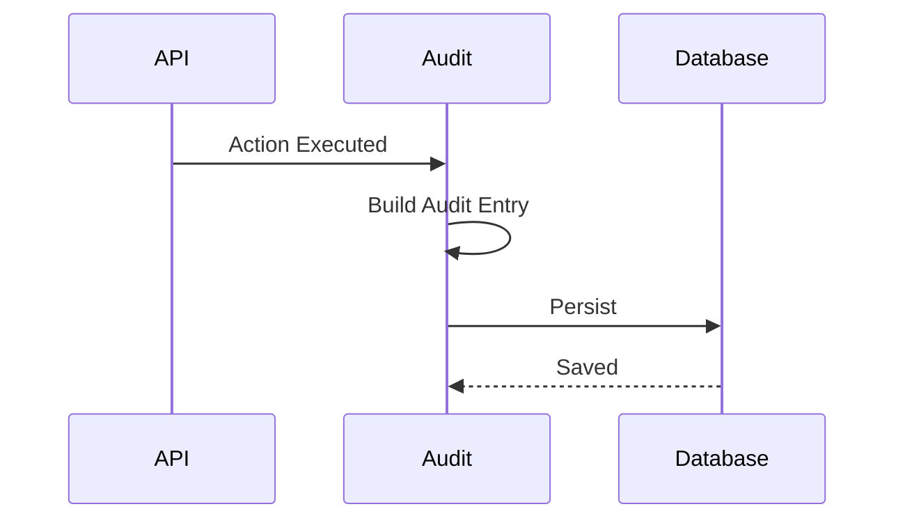
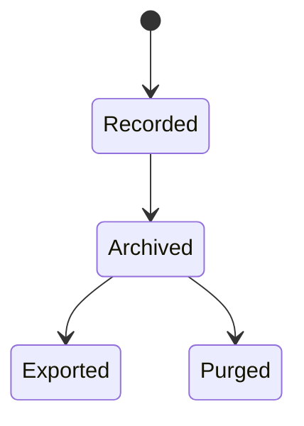

# FSPEC.07 – Audit & Activity Log

**Document** : FSPEC.07

**Fichier** : `02-FSPEC/01-Core/FSPEC.07-Audit.md`

**Version** : 3.0

**Statut** : Draft

**Playbook** : PLATFORM

**Capability** : Audit & Compliance

**Owner** : Platform Team

**Dernière mise à jour** : 2026-07

---

# 1. Objectif

Le domaine **Audit & Activity Log** garantit la traçabilité complète des opérations réalisées dans EventFoundry.

Il constitue la référence de conformité de la plateforme.

Le système permet de répondre aux questions suivantes :

- Qui a effectué une action ?
- Quand ?
- Depuis quel appareil ?
- Depuis quelle adresse IP ?
- Sur quelle ressource ?
- Quelle était la valeur avant ?
- Quelle est la valeur après ?

---

# 2. Objectifs fonctionnels

Le domaine permet :

- enregistrer toutes les opérations critiques ;
- historiser les modifications métier ;
- tracer les opérations d'administration ;
- consulter les journaux d'audit ;
- rechercher dans les événements ;
- exporter les journaux ;
- répondre aux exigences de conformité.

---

# 3. Hors périmètre

Le domaine ne gère pas :

- les permissions ;
- les utilisateurs ;
- les organisations ;
- les événements métier ;
- les statistiques fonctionnelles.

---

# 4. Références

## ADR

- ADR.20 – Secrets Management
- ADR.22 – Observability Strategy

---

# 5. Vision métier

L'audit constitue une preuve.

Les données enregistrées ne doivent jamais être modifiées.

Une entrée d'audit est immuable.

---

# 6. Concepts métier

## AuditEntry

Une entrée d'audit contient :

| Attribut | Description |
|----------|-------------|
| Id | Identifiant |
| Timestamp | Date |
| UserId | Utilisateur |
| OrganizationId | Organisation |
| Action | Action réalisée |
| Resource | Ressource concernée |
| ResourceId | Identifiant métier |
| Before | Valeur précédente |
| After | Nouvelle valeur |
| IP | Adresse IP |
| UserAgent | Navigateur |
| CorrelationId | Identifiant de corrélation |

---

## Audit Event

Représente une action historisée.

Exemples :

- création
- modification
- suppression
- publication
- connexion
- déconnexion
- changement de rôle

---

# 7. Types d'événements

| Catégorie | Exemples |
|-----------|----------|
| Authentication | Login, Logout |
| Organization | Create, Update |
| User | Update Profile |
| Event | Publish |
| Security | MFA, Password |
| Administration | Role Change |
| API | Manual Action |

---

# 8. Workflow



---

# 9. Cycle de vie



---

# 10. Règles métier

| ID | Règle |
|----|--------|
| RM-AUD-001 | Toute opération critique est auditée. |
| RM-AUD-002 | Une entrée est immuable. |
| RM-AUD-003 | Les journaux possèdent un horodatage UTC. |
| RM-AUD-004 | Chaque entrée possède un CorrelationId. |
| RM-AUD-005 | Les suppressions sont historisées. |
| RM-AUD-006 | Les accès refusés sont journalisés. |
| RM-AUD-007 | Les exports sont historisés. |
| RM-AUD-008 | Les données sensibles sont masquées. |
| RM-AUD-009 | Les journaux peuvent être archivés. |
| RM-AUD-010 | Les journaux peuvent être purgés selon la politique de rétention. |

---

# 11. Données historisées

Les informations suivantes sont conservées :

- création ;
- modification ;
- suppression ;
- changement d'état ;
- changement de rôle ;
- changement de propriétaire ;
- authentification ;
- autorisation refusée.

---

# 12. Données exclues

Les informations suivantes ne sont jamais enregistrées :

- mots de passe ;
- secrets ;
- tokens JWT ;
- clés API ;
- secrets OAuth ;
- données bancaires.

---

# 13. Recherche

Les journaux peuvent être filtrés par :

- utilisateur ;
- organisation ;
- date ;
- action ;
- ressource ;
- CorrelationId ;
- adresse IP.

---

# 14. Export

Formats supportés :

- JSON
- CSV

Les exports sont réservés aux administrateurs autorisés.

---

# 15. API

## Consultation

```http
GET /api/v1/audit

GET /api/v1/audit/{id}

GET /api/v1/audit/search
```

---

## Export

```http
POST /api/v1/audit/export
```

---

# 16. Evénements publiés

| Evénement |
|------------|
| AuditRecorded |
| AuditArchived |
| AuditExported |

---

# 17. Evénements consommés

Tous les domaines de la plateforme peuvent publier des événements d'audit.

---

# 18. Données manipulées

Le domaine manipule :

- AuditEntry
- AuditExport

Le domaine ne manipule jamais :

- Password
- Secret
- Session
- Payment

---

# 19. Observabilité

Logs :

- création d'entrée ;
- export ;
- archivage ;
- purge.

Metrics :

- événements audités ;
- volume journalier ;
- temps de conservation ;
- exports réalisés.

Toutes les opérations respectent ADR.22.

---

# 20. Sécurité

Les journaux :

- sont en lecture seule ;
- sont signés logiquement ;
- sont conservés conformément à la politique de rétention ;
- ne peuvent être modifiés.

Les accès sont limités aux utilisateurs autorisés.

---

# 21. Critères d'acceptation

| ID | Critère |
|----|----------|
| AC-AUD-001 | Toute opération critique est historisée. |
| AC-AUD-002 | Les entrées sont immuables. |
| AC-AUD-003 | Les mots de passe et secrets ne sont jamais enregistrés. |
| AC-AUD-004 | Chaque entrée possède un CorrelationId. |
| AC-AUD-005 | Les exports sont audités. |
| AC-AUD-006 | Les journaux sont consultables par recherche multicritère. |
| AC-AUD-007 | Les données peuvent être archivées. |
| AC-AUD-008 | Les politiques de rétention sont respectées. |
| AC-AUD-009 | Toutes les opérations sont observables conformément à ADR.22. |
| AC-AUD-010 | Le domaine reste indépendant des domaines métier. |