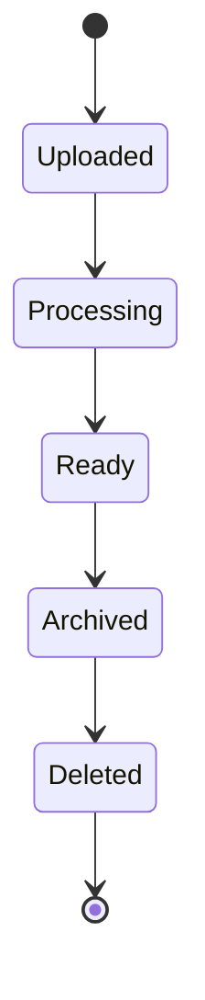
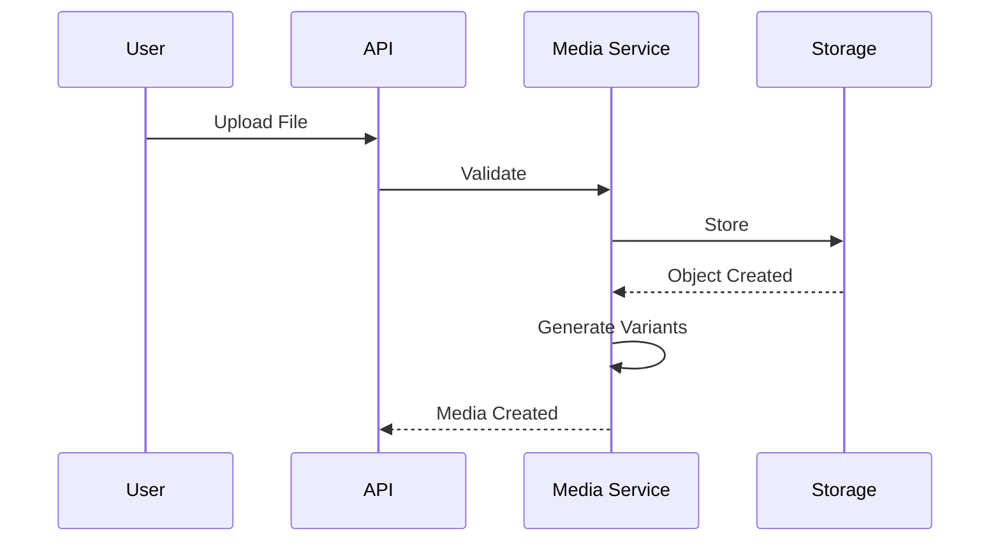
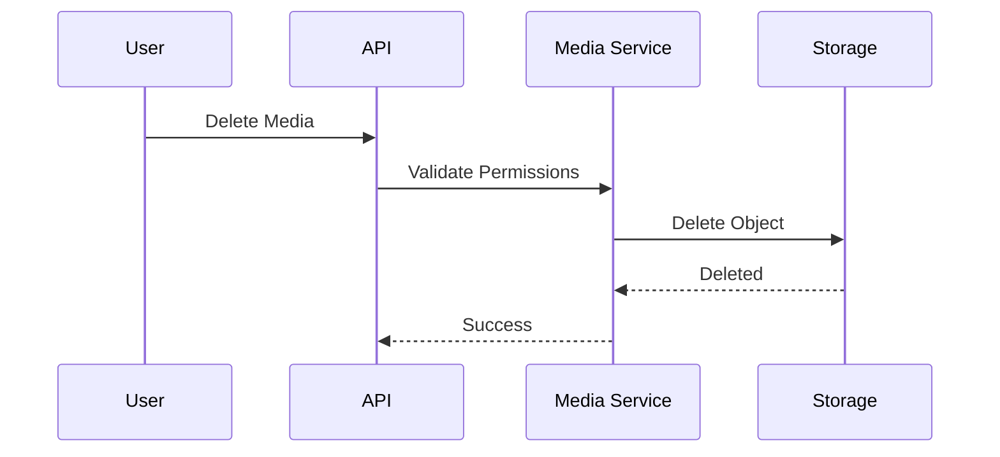

# FSPEC.08 – Media Management

**Document** : FSPEC.08

**Fichier** : `02-FSPEC/01-Core/FSPEC.08-Media.md`

**Version** : 3.0

**Statut** : Draft

**Playbook** : PLATFORM

**Capability** : Media Management

**Owner** : Platform Team

**Dernière mise à jour** : 2026-07

---

# 1. Objectif

Le domaine **Media Management** centralise la gestion de tous les fichiers utilisés par EventFoundry.

Il fournit un service unique pour :

- téléverser des fichiers ;
- stocker des médias ;
- référencer des documents ;
- générer des miniatures ;
- sécuriser l'accès aux fichiers ;
- gérer le cycle de vie des médias.

Les médias sont utilisés par l'ensemble des domaines métier sans être propriétaires des fichiers.

---

# 2. Objectifs fonctionnels

Le domaine permet :

- téléverser un média ;
- supprimer un média ;
- remplacer un média ;
- consulter les métadonnées ;
- générer des miniatures ;
- générer plusieurs résolutions ;
- gérer les fichiers publics ;
- gérer les fichiers privés.

---

# 3. Hors périmètre

Le domaine ne gère pas :

- les événements ;
- les utilisateurs ;
- les organisations ;
- les droits d'accès métier ;
- les préférences.

---

# 4. Références

## ADR

- ADR.20 – Secrets Management
- ADR.22 – Observability Strategy

---

# 5. Vision métier

Les médias sont des ressources techniques.

Ils peuvent être référencés par plusieurs domaines.

Exemples :

- avatar utilisateur ;
- logo d'organisation ;
- bannière ;
- illustration d'événement ;
- document ;
- pièce jointe.

Le domaine ne connaît pas le métier associé au média.

---

# 6. Concepts métier

## Media

| Attribut | Description |
|----------|-------------|
| Id | Identifiant |
| Filename | Nom du fichier |
| MimeType | Type MIME |
| Size | Taille |
| Bucket | Bucket MinIO |
| Path | Chemin physique |
| Visibility | Public / Private |
| Checksum | SHA-256 |
| CreatedAt | Création |

---

## Media Variant

Version dérivée d'un média.

Exemples :

- thumbnail
- small
- medium
- large
- original

---

## Media Owner

Référence métier utilisant le média.

Exemple :

```
Event

Organization

User

Activity
```

Le domaine ne connaît que :

```
OwnerType

OwnerId
```

---

# 7. Cycle de vie



---

# 8. Workflow d'upload



---

# 9. Workflow de suppression



---

# 10. Types supportés

## Images

- PNG
- JPEG
- WEBP
- GIF

---

## Documents

- PDF

---

## Archives

- ZIP

---

Les vidéos ne sont pas supportées en V3.

---

# 11. Variantes

Les variantes générées automatiquement sont :

| Variante | Utilisation |
|-----------|-------------|
| Thumbnail | Listes |
| Small | Mobile |
| Medium | Cartes |
| Large | Détail |
| Original | Archivage |

---

# 12. Visibilité

Deux niveaux sont supportés.

## Public

Accessible sans authentification.

Exemples :

- logo ;
- avatar public ;
- illustration.

---

## Private

Accessible uniquement après vérification des permissions.

Exemples :

- documents internes ;
- pièces jointes privées.

---

# 13. Règles métier

| ID | Règle |
|----|--------|
| RM-MEDIA-001 | Chaque média possède un identifiant unique. |
| RM-MEDIA-002 | Les fichiers sont stockés dans MinIO. |
| RM-MEDIA-003 | Les variantes sont générées automatiquement pour les images. |
| RM-MEDIA-004 | Les fichiers publics sont accessibles sans authentification. |
| RM-MEDIA-005 | Les fichiers privés nécessitent une autorisation. |
| RM-MEDIA-006 | Le checksum est calculé lors de l'upload. |
| RM-MEDIA-007 | Les noms physiques sont indépendants du nom d'origine. |
| RM-MEDIA-008 | Les suppressions sont historisées. |
| RM-MEDIA-009 | Les fichiers orphelins peuvent être nettoyés automatiquement. |
| RM-MEDIA-010 | Les métadonnées sont conservées indépendamment du stockage. |

---

# 14. Stockage

Le stockage est assuré par MinIO.

Structure recommandée :

```
avatars/

organizations/

events/

activities/

documents/

attachments/

thumbnails/
```

---

# 15. API

## Lecture

```http
GET /api/v1/media/{id}

GET /api/v1/media/{id}/download
```

---

## Modification

```http
POST /api/v1/media

DELETE /api/v1/media/{id}

PATCH /api/v1/media/{id}
```

---

# 16. Evénements publiés

| Evénement |
|------------|
| MediaUploaded |
| MediaProcessed |
| MediaDeleted |
| MediaArchived |

---

# 17. Evénements consommés

| Evénement |
|------------|
| UserDeleted |
| OrganizationDeleted |
| EventDeleted |

---

# 18. Données manipulées

Le domaine manipule :

- Media
- MediaVariant
- MediaMetadata

Le domaine ne manipule jamais :

- Event
- Organization
- User
- Password
- Session

---

# 19. Observabilité

Logs :

- upload ;
- téléchargement ;
- suppression ;
- génération des miniatures.

Metrics :

- fichiers stockés ;
- volume total ;
- espace utilisé ;
- nombre de téléchargements ;
- temps moyen de traitement.

Toutes les opérations possèdent un CorrelationId conformément à ADR.22.

---

# 20. Sécurité

Les fichiers sont analysés avant stockage.

Les types MIME sont vérifiés.

La taille maximale est configurable.

Les téléchargements privés sont réalisés via des URLs temporaires signées.

---

# 21. Critères d'acceptation

| ID | Critère |
|----|----------|
| AC-MEDIA-001 | Un média peut être téléversé. |
| AC-MEDIA-002 | Les images génèrent automatiquement leurs variantes. |
| AC-MEDIA-003 | Les fichiers privés nécessitent une autorisation. |
| AC-MEDIA-004 | Les médias sont stockés dans MinIO. |
| AC-MEDIA-005 | Les checksums garantissent l'intégrité. |
| AC-MEDIA-006 | Les suppressions sont auditables. |
| AC-MEDIA-007 | Les fichiers orphelins peuvent être détectés. |
| AC-MEDIA-008 | Les événements métier sont publiés sur le bus d'événements. |
| AC-MEDIA-009 | Toutes les opérations sont observables conformément à ADR.22. |
| AC-MEDIA-010 | Le domaine est indépendant des domaines métier. |