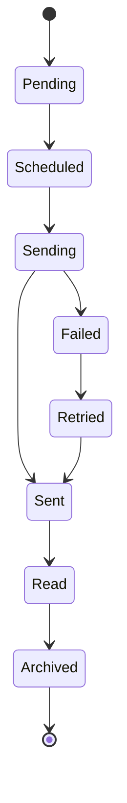
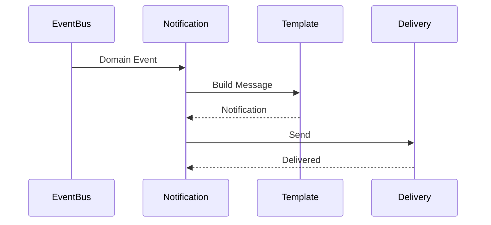

# FSPEC.09 – Notifications

**Document** : FSPEC.09

**Fichier** : `02-FSPEC/01-Core/FSPEC.09-Notifications.md`

**Version** : 3.0

**Statut** : Draft

**Playbook** : PLATFORM

**Capability** : Notification Management

**Owner** : Platform Team

**Dernière mise à jour** : 2026-07

---

# 1. Objectif

Le domaine **Notifications** est responsable de l'ensemble des communications envoyées aux utilisateurs d'EventFoundry.

Il assure la diffusion des informations importantes au bon utilisateur, au bon moment et sur le canal approprié.

Le domaine garantit :

- la centralisation des notifications ;
- le respect des préférences utilisateur ;
- la traçabilité des envois ;
- la gestion des différents canaux de diffusion.

---

# 2. Objectifs fonctionnels

Le domaine permet :

- créer une notification ;
- planifier un envoi ;
- envoyer une notification ;
- consulter les notifications ;
- marquer une notification comme lue ;
- supprimer une notification ;
- relancer un envoi en erreur.

---

# 3. Hors périmètre

Le domaine ne gère pas :

- les préférences utilisateur ;
- les campagnes marketing ;
- les newsletters ;
- les messages privés ;
- les discussions temps réel.

---

# 4. Références

## ADR

- ADR.19 – User Preferences Model
- ADR.22 – Observability Strategy

---

# 5. Vision métier

Une notification est la conséquence d'un événement métier.

Le domaine ne décide jamais qu'une notification doit être envoyée.

Il réagit aux événements publiés par les autres domaines.

Exemples :

- invitation reçue ;
- événement annulé ;
- changement d'horaire ;
- validation d'une inscription ;
- rappel avant un événement.

---

# 6. Concepts métier

## Notification

| Attribut | Description |
|----------|-------------|
| Id | Identifiant |
| RecipientId | Destinataire |
| Type | Type de notification |
| Channel | Canal |
| Status | État |
| Subject | Sujet |
| Content | Contenu |
| CreatedAt | Création |
| SentAt | Envoi |
| ReadAt | Lecture |

---

## Notification Template

Décrit le contenu d'une notification.

Une notification est toujours générée à partir d'un template.

---

## Delivery

Représente un envoi sur un canal donné.

Une notification peut générer plusieurs livraisons.

---

# 7. Cycle de vie



---

# 8. Canaux supportés

| Canal | V3 |
|--------|:--:|
| In-App | ✅ |
| Email | ✅ |
| Push Mobile | ✅ |
| SMS | ❌ |
| Webhook | ❌ |

---

# 9. Types de notifications

## Système

- création de compte ;
- validation d'e-mail ;
- réinitialisation de mot de passe.

---

## Organisation

- invitation ;
- changement de rôle ;
- suppression d'un accès.

---

## Événement

- publication ;
- modification ;
- annulation ;
- report ;
- rappel.

---

## Plateforme

- maintenance ;
- incident ;
- évolution majeure.

---

# 10. Workflow



---

# 11. Templates

Chaque notification est générée à partir d'un modèle.

Un template contient :

- identifiant ;
- langue ;
- sujet ;
- corps ;
- variables ;
- canal compatible.

---

# 12. Variables

Les templates peuvent utiliser des variables.

Exemple :

```text
{{UserName}}

{{OrganizationName}}

{{EventTitle}}

{{EventDate}}

{{VenueName}}
```

---

# 13. Règles métier

| ID | Règle |
|----|--------|
| RM-NOTIF-001 | Une notification possède un destinataire unique. |
| RM-NOTIF-002 | Une notification est générée par un événement métier. |
| RM-NOTIF-003 | Les préférences utilisateur sont toujours respectées. |
| RM-NOTIF-004 | Une notification peut être envoyée sur plusieurs canaux. |
| RM-NOTIF-005 | Les notifications échouées peuvent être rejouées. |
| RM-NOTIF-006 | Les notifications lues restent historisées. |
| RM-NOTIF-007 | Les modèles sont versionnés. |
| RM-NOTIF-008 | Les variables manquantes empêchent l'envoi. |
| RM-NOTIF-009 | Les notifications expirées ne sont plus envoyées. |
| RM-NOTIF-010 | Toutes les livraisons sont historisées. |

---

# 14. Priorité

| Priorité | Description |
|-----------|-------------|
| Critical | Envoi immédiat |
| High | Prioritaire |
| Normal | Standard |
| Low | Différé |

---

# 15. API

## Consultation

```http
GET /api/v1/notifications

GET /api/v1/notifications/{id}

GET /api/v1/notifications/unread
```

---

## Modification

```http
PATCH /api/v1/notifications/{id}/read

PATCH /api/v1/notifications/read-all

DELETE /api/v1/notifications/{id}
```

---

# 16. Evénements publiés

| Evénement |
|------------|
| NotificationCreated |
| NotificationSent |
| NotificationRead |
| NotificationFailed |
| NotificationDeleted |

---

# 17. Evénements consommés

| Evénement |
|------------|
| InvitationCreated |
| MembershipCreated |
| EventPublished |
| EventUpdated |
| EventCancelled |
| ReservationConfirmed |
| ReservationCancelled |
| PasswordResetRequested |

---

# 18. Données manipulées

Le domaine manipule :

- Notification
- NotificationTemplate
- Delivery
- DeliveryAttempt

Le domaine ne manipule jamais :

- Password
- Session
- Organization
- Activity
- Event

---

# 19. Observabilité

Logs :

- création ;
- génération ;
- envoi ;
- lecture ;
- suppression ;
- erreur d'envoi.

Metrics :

- notifications créées ;
- notifications envoyées ;
- taux de lecture ;
- taux d'échec ;
- délai moyen d'envoi.

Toutes les opérations utilisent un CorrelationId conformément à ADR.22.

---

# 20. Sécurité

Les notifications ne contiennent jamais :

- mot de passe ;
- token JWT ;
- secret ;
- clé API.

Les liens intégrés sont signés lorsque nécessaire.

Les notifications respectent les paramètres de confidentialité de l'utilisateur.

---

# 21. Critères d'acceptation

| ID | Critère |
|----|----------|
| AC-NOTIF-001 | Une notification est générée à partir d'un événement métier. |
| AC-NOTIF-002 | Les préférences utilisateur sont appliquées avant l'envoi. |
| AC-NOTIF-003 | Les templates sont versionnés. |
| AC-NOTIF-004 | Les notifications sont historisées. |
| AC-NOTIF-005 | Les notifications peuvent être envoyées sur plusieurs canaux. |
| AC-NOTIF-006 | Les notifications en erreur peuvent être rejouées. |
| AC-NOTIF-007 | Les notifications peuvent être marquées comme lues. |
| AC-NOTIF-008 | Les événements du domaine sont publiés sur le bus d'événements. |
| AC-NOTIF-009 | Toutes les opérations respectent ADR.22. |
| AC-NOTIF-010 | Le domaine reste indépendant des autres domaines métier. |