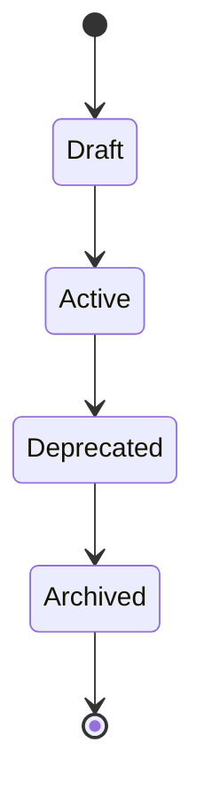
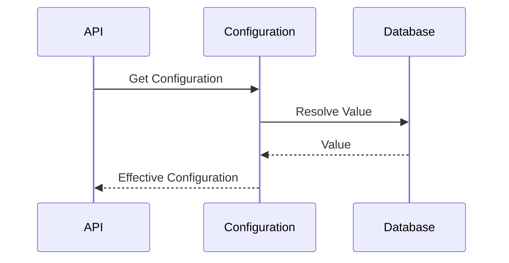

# FSPEC.10 – Configuration Management

**Document** : FSPEC.10

**Fichier** : `02-FSPEC/01-Core/FSPEC.10-Configuration.md`

**Version** : 3.0

**Statut** : Draft

**Playbook** : PLATFORM

**Capability** : Configuration Management

**Owner** : Platform Team

**Dernière mise à jour** : 2026-07

---

# 1. Objectif

Le domaine **Configuration Management** centralise l'ensemble des paramètres de fonctionnement de la plateforme.

Il garantit que les applications EventFoundry utilisent une configuration cohérente, versionnée, sécurisée et observable.

Le domaine permet de distinguer :

- les paramètres globaux de la plateforme ;
- les paramètres propres à une organisation ;
- les paramètres techniques ;
- les Feature Flags.

---

# 2. Objectifs fonctionnels

Le domaine permet :

- gérer la configuration globale ;
- gérer la configuration d'une organisation ;
- activer ou désactiver une fonctionnalité ;
- versionner les configurations ;
- historiser les modifications ;
- consulter les valeurs effectives ;
- restaurer une version précédente.

---

# 3. Hors périmètre

Le domaine ne gère pas :

- les secrets (ADR.20) ;
- les préférences utilisateur (FSPEC.05) ;
- les permissions ;
- les données métier.

---

# 4. Références

## ADR

- ADR.20 – Secrets Management
- ADR.22 – Observability Strategy

---

# 5. Vision métier

La configuration représente les paramètres nécessaires au fonctionnement de la plateforme.

Elle ne contient jamais :

- de données métier ;
- de mots de passe ;
- de secrets ;
- de tokens.

Les secrets sont exclusivement gérés par ADR.20.

---

# 6. Concepts métier

## Configuration

| Attribut | Description |
|----------|-------------|
| Id | Identifiant |
| Scope | Niveau de portée |
| Category | Catégorie |
| Key | Clé |
| Value | Valeur |
| Version | Version |
| UpdatedAt | Dernière modification |

---

## Configuration Scope

Une configuration peut appartenir à :

| Scope | Description |
|--------|-------------|
| Platform | Toute la plateforme |
| Organization | Une organisation |
| Environment | Un environnement |
| Feature | Une fonctionnalité |

---

## Feature Flag

Permet d'activer progressivement une fonctionnalité.

Une Feature Flag possède :

- un nom ;
- un état ;
- une date d'activation ;
- une date d'expiration optionnelle.

---

# 7. Cycle de vie



---

# 8. Catégories

| Catégorie | Description |
|------------|-------------|
| General | Paramètres globaux |
| Discovery | Recherche |
| Notification | Notifications |
| Security | Sécurité |
| Upload | Médias |
| Search | Recherche |
| FeatureFlags | Fonctionnalités |
| Integration | Intégrations externes |

---

# 9. Hiérarchie

La résolution d'une configuration suit l'ordre suivant :

```text
Platform

↓

Environment

↓

Organization

↓

Default Value
```

La première valeur trouvée est utilisée.

---

# 10. Workflow



---

# 11. Feature Flags

Les Feature Flags permettent :

- activation progressive ;
- A/B Testing ;
- bêta privée ;
- désactivation immédiate.

Exemples :

```
event.ai.enabled

recommendation.v2.enabled

new-search.enabled

marketplace.enabled
```

---

# 12. Configuration d'organisation

Chaque organisation peut personnaliser :

- logo par défaut ;
- couleurs ;
- paramètres publics ;
- notifications ;
- workflow.

Les paramètres métier restent indépendants de la plateforme.

---

# 13. Validation

Chaque clé possède :

- un type ;
- une valeur par défaut ;
- des contraintes.

Exemple :

| Clé | Type |
|------|------|
| SearchRadius | Integer |
| DefaultLanguage | String |
| EnableAI | Boolean |

---

# 14. Règles métier

| ID | Règle |
|----|--------|
| RM-CONF-001 | Une clé est unique dans son scope. |
| RM-CONF-002 | Les secrets sont interdits dans ce domaine. |
| RM-CONF-003 | Toute modification est historisée. |
| RM-CONF-004 | Les Feature Flags sont évaluées dynamiquement. |
| RM-CONF-005 | Les valeurs invalides sont rejetées. |
| RM-CONF-006 | Une configuration possède toujours une valeur par défaut. |
| RM-CONF-007 | Les modifications sont auditables. |
| RM-CONF-008 | Une configuration archivée est en lecture seule. |
| RM-CONF-009 | Les clés sont documentées. |
| RM-CONF-010 | Les changements sont immédiatement disponibles si la configuration est dynamique. |

---

# 15. API

## Lecture

```http
GET /api/v1/configuration

GET /api/v1/configuration/{key}

GET /api/v1/configuration/effective
```

---

## Modification

```http
POST /api/v1/configuration

PATCH /api/v1/configuration/{id}

DELETE /api/v1/configuration/{id}

POST /api/v1/configuration/{id}/restore
```

---

# 16. Evénements publiés

| Evénement |
|------------|
| ConfigurationCreated |
| ConfigurationUpdated |
| ConfigurationDeleted |
| FeatureFlagEnabled |
| FeatureFlagDisabled |

---

# 17. Evénements consommés

| Evénement |
|------------|
| OrganizationCreated |
| OrganizationDeleted |

---

# 18. Données manipulées

Le domaine manipule :

- Configuration
- ConfigurationVersion
- FeatureFlag

Le domaine ne manipule jamais :

- Secret
- Password
- Token
- User
- Event

---

# 19. Observabilité

Logs :

- création ;
- modification ;
- suppression ;
- activation d'une Feature Flag ;
- restauration.

Metrics :

- nombre de clés ;
- Feature Flags actives ;
- modifications quotidiennes ;
- temps de résolution ;
- erreurs de validation.

Toutes les opérations possèdent un CorrelationId conformément à ADR.22.

---

# 20. Sécurité

Les paramètres critiques sont accessibles uniquement aux administrateurs de plateforme.

Les secrets sont systématiquement externalisés.

Toutes les modifications sont historisées.

Les valeurs sont validées avant enregistrement.

---

# 21. Critères d'acceptation

| ID | Critère |
|----|----------|
| AC-CONF-001 | Les paramètres sont résolus selon leur scope. |
| AC-CONF-002 | Les Feature Flags sont évaluées dynamiquement. |
| AC-CONF-003 | Les secrets ne peuvent jamais être enregistrés. |
| AC-CONF-004 | Toutes les modifications sont historisées. |
| AC-CONF-005 | Les valeurs sont validées avant enregistrement. |
| AC-CONF-006 | Les versions précédentes peuvent être restaurées. |
| AC-CONF-007 | Les événements métier sont publiés sur le bus d'événements. |
| AC-CONF-008 | Les paramètres critiques sont protégés par le système d'autorisation. |
| AC-CONF-009 | Toutes les opérations respectent ADR.22. |
| AC-CONF-010 | Le domaine reste indépendant des domaines métier. |