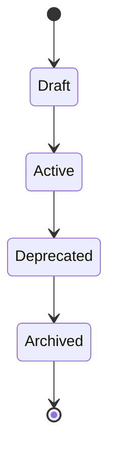
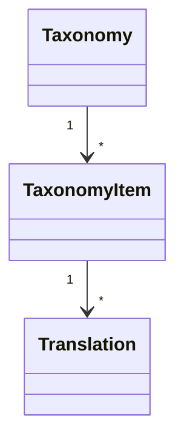

# FSPEC.11 – Taxonomy Management

**Document** : FSPEC.11

**Fichier** : `02-FSPEC/01-Core/FSPEC.11-Taxonomy.md`

**Version** : 3.0

**Statut** : Draft

**Playbook** : PLATFORM

**Capability** : Taxonomy Management

**Owner** : Platform Team

**Dernière mise à jour** : 2026-07

---

# 1. Objectif

Le domaine **Taxonomy Management** est responsable de la gestion des référentiels utilisés par l'ensemble de la plateforme EventFoundry.

Il fournit un langage commun permettant de classifier les données métier.

Toutes les taxonomies sont administrées de manière centralisée afin de garantir :

- la cohérence fonctionnelle ;
- la qualité des recherches ;
- la qualité des recommandations ;
- la stabilité des API ;
- la compatibilité entre les domaines métier.

---

# 2. Objectifs fonctionnels

Le domaine permet de gérer :

- les activités ;
- les formats ;
- les catégories ;
- les tags ;
- les langues ;
- les pays ;
- les devises ;
- les niveaux de difficulté ;
- les publics ;
- toute autre liste de référence.

---

# 3. Hors périmètre

Le domaine ne gère pas :

- les événements ;
- les organisations ;
- les utilisateurs ;
- les préférences ;
- les médias ;
- les permissions.

---

# 4. Références

## ADR

- ADR.22 – Observability Strategy

---

# 5. Vision métier

Une taxonomie est un référentiel partagé.

Les domaines métier utilisent les identifiants de taxonomie mais n'en sont jamais propriétaires.

Exemple :

```
Activity

↓

Board Game
```

Le domaine Event stocke uniquement :

```
ActivityId
```

---

# 6. Concepts métier

## Taxonomy

Référentiel logique.

Exemples :

- Activities
- Formats
- Countries
- Languages
- Tags

---

## Taxonomy Item

Un élément appartenant à une taxonomie.

Exemple :

```
Activities

Board Game

Role Playing Game

Trading Card Game

Escape Game
```

---

## Taxonomy Translation

Chaque élément peut posséder plusieurs traductions.

---

# 7. Cycle de vie



---

# 8. Structure



---

# 9. Types de taxonomies

| Type | Exemple |
|------|----------|
| Activity | Board Game |
| Format | Tournament |
| Country | France |
| Language | Français |
| Audience | Family |
| Difficulty | Beginner |
| Currency | EUR |
| Tag | Cooperative |

---

# 10. Hiérarchie

Une taxonomie peut être hiérarchique.

Exemple :

```text
Games

├── Board Games

├── Card Games

│   ├── TCG

│   └── Deck Building

└── Role Playing Games
```

---

# 11. Traductions

Chaque élément peut posséder plusieurs traductions.

Exemple :

| Locale | Valeur |
|----------|--------|
| fr-FR | Jeu de société |
| en-US | Board Game |
| es-ES | Juego de mesa |

---

# 12. Recherche

Les recherches peuvent être effectuées :

- par identifiant ;
- par nom ;
- par traduction ;
- par alias.

---

# 13. Versionnement

Chaque modification crée une nouvelle version logique.

Les identifiants restent stables.

Les suppressions physiques sont interdites.

---

# 14. Règles métier

| ID | Règle |
|----|--------|
| RM-TAX-001 | Une taxonomie possède un identifiant unique. |
| RM-TAX-002 | Les éléments possèdent un identifiant immuable. |
| RM-TAX-003 | Les traductions sont indépendantes des identifiants. |
| RM-TAX-004 | Les suppressions physiques sont interdites. |
| RM-TAX-005 | Les éléments dépréciés restent résolvables. |
| RM-TAX-006 | Les références métier utilisent uniquement les identifiants. |
| RM-TAX-007 | Les taxonomies sont versionnées. |
| RM-TAX-008 | Les hiérarchies ne peuvent pas contenir de boucle. |
| RM-TAX-009 | Toutes les modifications sont historisées. |
| RM-TAX-010 | Les éléments archivés ne sont plus proposés dans les interfaces. |

---

# 15. API

## Consultation

```http
GET /api/v1/taxonomies

GET /api/v1/taxonomies/{taxonomy}

GET /api/v1/taxonomies/{taxonomy}/{itemId}
```

---

## Administration

```http
POST /api/v1/taxonomies

POST /api/v1/taxonomies/{taxonomy}/items

PATCH /api/v1/taxonomies/{taxonomy}/items/{id}

DELETE /api/v1/taxonomies/{taxonomy}/items/{id}
```

---

# 16. Evénements publiés

| Evénement |
|------------|
| TaxonomyCreated |
| TaxonomyUpdated |
| TaxonomyArchived |
| TaxonomyItemCreated |
| TaxonomyItemUpdated |
| TaxonomyItemDeprecated |

---

# 17. Evénements consommés

Aucun.

Le domaine constitue une source de référence.

---

# 18. Données manipulées

Le domaine manipule :

- Taxonomy
- TaxonomyItem
- Translation
- Alias

Le domaine ne manipule jamais :

- User
- Organization
- Event
- Authentication
- Media

---

# 19. Observabilité

Logs :

- création ;
- modification ;
- archivage ;
- ajout de traduction ;
- consultation.

Metrics :

- nombre de taxonomies ;
- nombre d'éléments ;
- nombre de traductions ;
- consultations ;
- temps moyen de résolution.

Toutes les opérations possèdent un CorrelationId conformément à ADR.22.

---

# 20. Sécurité

La modification des taxonomies est réservée aux administrateurs de plateforme.

Les consultations sont accessibles à tous les domaines.

Les modifications sont historisées et auditables.

---

# 21. Critères d'acceptation

| ID | Critère |
|----|----------|
| AC-TAX-001 | Les taxonomies sont centralisées. |
| AC-TAX-002 | Les identifiants sont immuables. |
| AC-TAX-003 | Les traductions sont supportées. |
| AC-TAX-004 | Les hiérarchies sont supportées. |
| AC-TAX-005 | Les suppressions physiques sont interdites. |
| AC-TAX-006 | Les éléments dépréciés restent compatibles avec les données existantes. |
| AC-TAX-007 | Toutes les modifications sont historisées. |
| AC-TAX-008 | Les événements du domaine sont publiés sur le bus d'événements. |
| AC-TAX-009 | Toutes les opérations respectent ADR.22. |
| AC-TAX-010 | Le domaine est réutilisable par tous les autres domaines de la plateforme. |