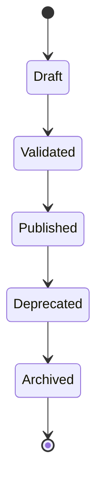
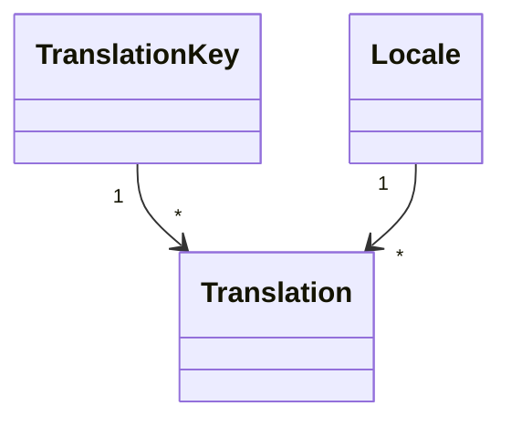
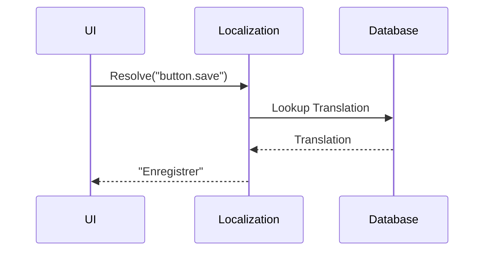

# FSPEC.12 – Localization & Internationalization

**Document** : FSPEC.12

**Fichier** : `02-FSPEC/01-Core/FSPEC.12-Localization.md`

**Version** : 3.0

**Statut** : Draft

**Playbook** : PLATFORM

**Capability** : Localization & Internationalization

**Owner** : Platform Team

**Dernière mise à jour** : 2026-07

---

# 1. Objectif

Le domaine **Localization & Internationalization** fournit tous les services permettant à EventFoundry d'être utilisé dans plusieurs langues, pays et contextes culturels.

Il garantit que l'ensemble de la plateforme peut adapter automatiquement :

- les textes ;
- les formats de date ;
- les formats numériques ;
- les devises ;
- les fuseaux horaires ;
- les unités de mesure.

Ce domaine est transversal et ne contient aucune logique métier.

---

# 2. Objectifs fonctionnels

Le domaine permet :

- gérer les langues supportées ;
- gérer les traductions ;
- résoudre une traduction ;
- gérer les paramètres régionaux (Locale) ;
- formater les dates ;
- formater les devises ;
- formater les nombres ;
- gérer les fuseaux horaires.

---

# 3. Hors périmètre

Le domaine ne gère pas :

- les préférences utilisateur ;
- les taxonomies ;
- les contenus métier ;
- les campagnes marketing ;
- la traduction automatique.

---

# 4. Références

## ADR

- ADR.22 – Observability Strategy

---

# 5. Vision métier

La plateforme est **multilingue** dès sa conception.

Toutes les interfaces utilisateur doivent être localisables.

Les données métier restent indépendantes des langues.

Les traductions sont des ressources techniques et non des données métier.

---

# 6. Concepts métier

## Locale

Une locale est définie par :

| Attribut | Description |
|----------|-------------|
| Language | Langue |
| Country | Pays |
| TimeZone | Fuseau horaire |
| Currency | Devise |
| DateFormat | Format des dates |
| NumberFormat | Format numérique |

Exemple :

```
fr-FR

en-US

es-ES

de-DE
```

---

## Translation Key

Chaque texte possède une clé unique.

Exemple :

```
button.save

button.cancel

menu.events

notification.invitation
```

---

## Translation

Une traduction associe :

```
TranslationKey

↓

Locale

↓

Translated Value
```

---

# 7. Cycle de vie



---

# 8. Architecture



---

# 9. Résolution

L'ordre de résolution est :

```text
User Locale

↓

Organization Default Locale

↓

Platform Default Locale

↓

Fallback (en-US)
```

---

# 10. Workflow



---

# 11. Paramètres culturels

Le domaine gère notamment :

## Dates

Exemple :

```
14/07/2026

07/14/2026
```

---

## Heures

Exemple :

```
14:30

2:30 PM
```

---

## Devises

Exemple :

```
25 €

$25.00
```

---

## Nombres

Exemple :

```
1 234,56

1,234.56
```

---

# 12. Langues supportées (V3)

| Langue | Locale |
|---------|--------|
| Français | fr-FR |
| English | en-US |
| Español | es-ES |
| Deutsch | de-DE |

De nouvelles langues peuvent être ajoutées sans modification du code applicatif.

---

# 13. Règles métier

| ID | Règle |
|----|--------|
| RM-I18N-001 | Toutes les chaînes d'interface utilisent une clé de traduction. |
| RM-I18N-002 | Les traductions sont indépendantes du code métier. |
| RM-I18N-003 | Les clés sont immuables. |
| RM-I18N-004 | Une locale possède un identifiant unique. |
| RM-I18N-005 | Les valeurs manquantes utilisent le mécanisme de fallback. |
| RM-I18N-006 | Les traductions sont versionnées. |
| RM-I18N-007 | Les formats de date respectent la locale active. |
| RM-I18N-008 | Les devises sont affichées selon la locale. |
| RM-I18N-009 | Les traductions archivées ne sont plus distribuées. |
| RM-I18N-010 | Toutes les modifications sont historisées. |

---

# 14. API

## Consultation

```http
GET /api/v1/localization/locales

GET /api/v1/localization/translations

GET /api/v1/localization/translations/{key}
```

---

## Administration

```http
POST /api/v1/localization/translations

PATCH /api/v1/localization/translations/{id}

DELETE /api/v1/localization/translations/{id}
```

---

# 15. Evénements publiés

| Evénement |
|------------|
| TranslationCreated |
| TranslationUpdated |
| TranslationArchived |
| LocaleCreated |
| LocaleUpdated |

---

# 16. Evénements consommés

Aucun.

Le domaine fournit un service de résolution aux autres domaines.

---

# 17. Données manipulées

Le domaine manipule :

- Locale
- Translation
- TranslationKey
- CurrencyFormat
- DateFormat

Le domaine ne manipule jamais :

- User
- Organization
- Event
- Notification
- Media

---

# 18. Observabilité

Logs :

- création d'une traduction ;
- modification ;
- publication ;
- résolution d'une clé ;
- fallback utilisé.

Metrics :

- nombre de locales ;
- nombre de traductions ;
- taux de fallback ;
- temps moyen de résolution ;
- traductions manquantes.

Toutes les opérations utilisent un CorrelationId conformément à ADR.22.

---

# 19. Sécurité

Les modifications des traductions sont réservées aux administrateurs de plateforme.

Les consultations sont accessibles à tous les domaines.

Les ressources distribuées sont en lecture seule.

Toutes les modifications sont historisées.

---

# 20. Performance

Les traductions sont :

- mises en cache ;
- chargées par locale ;
- invalidées automatiquement après modification.

Les temps de résolution doivent rester inférieurs à **5 ms** en cache.

---

# 21. Critères d'acceptation

| ID | Critère |
|----|----------|
| AC-I18N-001 | La plateforme supporte plusieurs langues. |
| AC-I18N-002 | Toutes les chaînes utilisent des clés de traduction. |
| AC-I18N-003 | Les formats culturels respectent la locale active. |
| AC-I18N-004 | Les traductions utilisent un mécanisme de fallback. |
| AC-I18N-005 | Les traductions sont versionnées. |
| AC-I18N-006 | Les nouvelles langues peuvent être ajoutées sans modification du code. |
| AC-I18N-007 | Les ressources sont distribuées de manière performante. |
| AC-I18N-008 | Toutes les modifications sont historisées. |
| AC-I18N-009 | Toutes les opérations respectent ADR.22. |
| AC-I18N-010 | Le domaine reste totalement indépendant des domaines métier. |