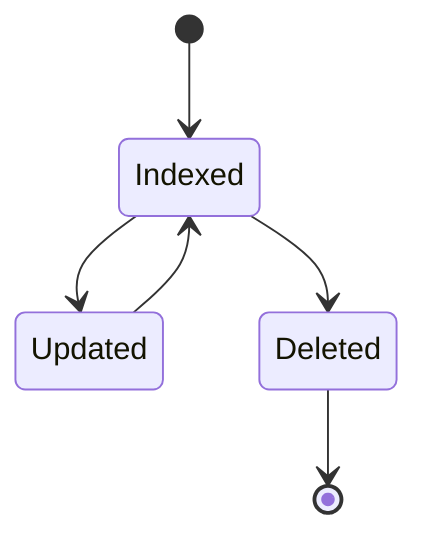
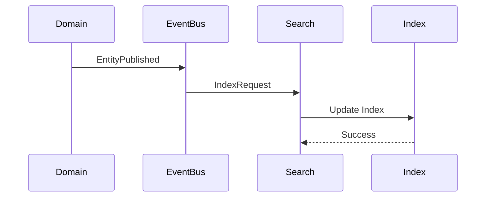

# FSPEC.13 – Search & Indexing

**Document** : FSPEC.13

**Fichier** : `02-FSPEC/01-Core/FSPEC.13-Search.md`

**Version** : 3.0

**Statut** : Draft

**Playbook** : PLATFORM

**Capability** : Search & Indexing

**Owner** : Platform Team

**Dernière mise à jour** : 2026-07

---

# 1. Objectif

Le domaine **Search & Indexing** fournit les capacités de recherche transverses de la plateforme EventFoundry.

Il permet aux différents domaines métier de rendre leurs données recherchables sans implémenter leur propre moteur de recherche.

Le domaine est responsable :

- de l'indexation des données ;
- de la recherche plein texte ;
- de la recherche multicritère ;
- de l'autocomplétion ;
- de la pondération des résultats ;
- de la pagination.

Le domaine ne possède aucune donnée métier.

---

# 2. Objectifs fonctionnels

Le domaine permet de :

- indexer une ressource ;
- supprimer une ressource d'un index ;
- reconstruire un index ;
- effectuer une recherche ;
- suggérer des résultats ;
- trier les résultats ;
- filtrer les résultats.

---

# 3. Hors périmètre

Le domaine ne gère pas :

- les recommandations ;
- les permissions métier ;
- les favoris ;
- les préférences utilisateur ;
- les événements.

---

# 4. Références

## ADR

- ADR.18 – Search Architecture
- ADR.22 – Observability Strategy

---

# 5. Vision métier

Le moteur de recherche est un service partagé.

Les domaines métier publient des événements d'indexation.

Le domaine Search construit des index optimisés sans connaître les règles fonctionnelles des ressources.

---

# 6. Concepts métier

## Search Document

Représente une ressource indexée.

| Attribut | Description |
|----------|-------------|
| Id | Identifiant technique |
| Type | Type de document |
| ExternalId | Identifiant métier |
| Title | Titre |
| Summary | Résumé |
| Keywords | Mots-clés |
| Locale | Langue |
| IndexedAt | Date d'indexation |

---

## Search Index

Collection de documents appartenant à une même famille.

Exemples :

- Events
- Organizations
- Activities
- Venues

---

## Search Query

Représente une requête utilisateur.

Elle contient notamment :

- texte recherché ;
- langue ;
- filtres ;
- pagination ;
- tri.

---

# 7. Cycle de vie



---

# 8. Architecture



---

# 9. Types d'index

| Index | Description |
|--------|-------------|
| Events | Evénements |
| Organizations | Organisations |
| Activities | Activités |
| Venues | Lieux |
| Users | Profils publics |

Chaque index est indépendant.

---

# 10. Recherche

Le moteur supporte :

- recherche plein texte ;
- recherche par identifiant ;
- recherche par catégorie ;
- recherche géographique ;
- recherche par tags ;
- recherche par dates.

---

# 11. Filtres

Les filtres peuvent être combinés.

Exemples :

- activité ;
- format ;
- pays ;
- ville ;
- date ;
- organisateur ;
- langue ;
- accessibilité.

---

# 12. Tri

Les résultats peuvent être triés par :

- pertinence ;
- date ;
- ordre alphabétique ;
- distance ;
- popularité.

---

# 13. Pagination

Les recherches utilisent une pagination standard :

```text
Page Number

Page Size

Total Results

Total Pages
```

---

# 14. Suggestions

Le domaine fournit :

- autocomplétion ;
- suggestions orthographiques ;
- suggestions de recherche populaire.

---

# 15. Réindexation

Une réindexation complète peut être déclenchée :

- manuellement ;
- automatiquement ;
- après une migration.

La réindexation est réalisée sans interruption de service.

---

# 16. Règles métier

| ID | Règle |
|----|--------|
| RM-SEARCH-001 | Les index sont reconstruis de manière atomique. |
| RM-SEARCH-002 | Les ressources supprimées sont désindexées. |
| RM-SEARCH-003 | Les résultats sont paginés. |
| RM-SEARCH-004 | Les recherches utilisent les filtres disponibles. |
| RM-SEARCH-005 | Les suggestions sont calculées indépendamment des résultats. |
| RM-SEARCH-006 | Les permissions sont appliquées avant le retour des résultats. |
| RM-SEARCH-007 | Les index sont indépendants des bases métier. |
| RM-SEARCH-008 | Les recherches sont localisées selon la langue. |
| RM-SEARCH-009 | Les réindexations sont auditables. |
| RM-SEARCH-010 | Les index sont reconstruis sans interruption de service. |

---

# 17. API

## Recherche

```http
GET /api/v1/search

GET /api/v1/search/suggestions
```

---

## Administration

```http
POST /api/v1/search/reindex

POST /api/v1/search/reindex/{index}

DELETE /api/v1/search/index/{type}/{id}
```

---

# 18. Evénements publiés

| Evénement |
|------------|
| SearchIndexed |
| SearchUpdated |
| SearchDeleted |
| ReindexStarted |
| ReindexCompleted |

---

# 19. Evénements consommés

| Evénement |
|------------|
| EventPublished |
| EventUpdated |
| EventDeleted |
| OrganizationUpdated |
| ActivityUpdated |
| VenueUpdated |

---

# 20. Données manipulées

Le domaine manipule :

- SearchDocument
- SearchIndex
- SearchQuery
- SearchResult

Le domaine ne manipule jamais :

- Password
- Session
- Secret
- Payment
- Notification

---

# 21. Observabilité

Logs :

- indexation ;
- désindexation ;
- recherche ;
- réindexation ;
- erreur d'indexation.

Metrics :

- nombre de documents indexés ;
- temps moyen d'indexation ;
- temps moyen de recherche ;
- taille des index ;
- taux d'erreur.

Toutes les opérations utilisent un CorrelationId conformément à ADR.22.

---

# 22. Sécurité

Les résultats retournés respectent systématiquement les règles d'autorisation.

Les documents privés ne sont jamais retournés à un utilisateur non autorisé.

Les opérations d'administration (réindexation, suppression d'index) sont réservées aux administrateurs de plateforme.

---

# 23. Performance

Objectifs de performance :

| Indicateur | Objectif |
|------------|----------|
| Recherche simple | < 100 ms |
| Recherche avec filtres | < 200 ms |
| Suggestions | < 50 ms |
| Réindexation incrémentale | Temps réel |
| Réindexation complète | Sans interruption de service |

---

# 24. Critères d'acceptation

| ID | Critère |
|----|----------|
| AC-SEARCH-001 | Les ressources peuvent être indexées automatiquement. |
| AC-SEARCH-002 | Les recherches plein texte sont supportées. |
| AC-SEARCH-003 | Les filtres peuvent être combinés. |
| AC-SEARCH-004 | Les résultats sont paginés. |
| AC-SEARCH-005 | Les suggestions sont disponibles en temps réel. |
| AC-SEARCH-006 | Les permissions sont appliquées avant le retour des résultats. |
| AC-SEARCH-007 | Les index peuvent être reconstruits sans interruption de service. |
| AC-SEARCH-008 | Toutes les opérations sont observables conformément à ADR.22. |
| AC-SEARCH-009 | Les événements du domaine sont publiés sur le bus d'événements. |
| AC-SEARCH-010 | Le domaine reste totalement indépendant des domaines métier. |