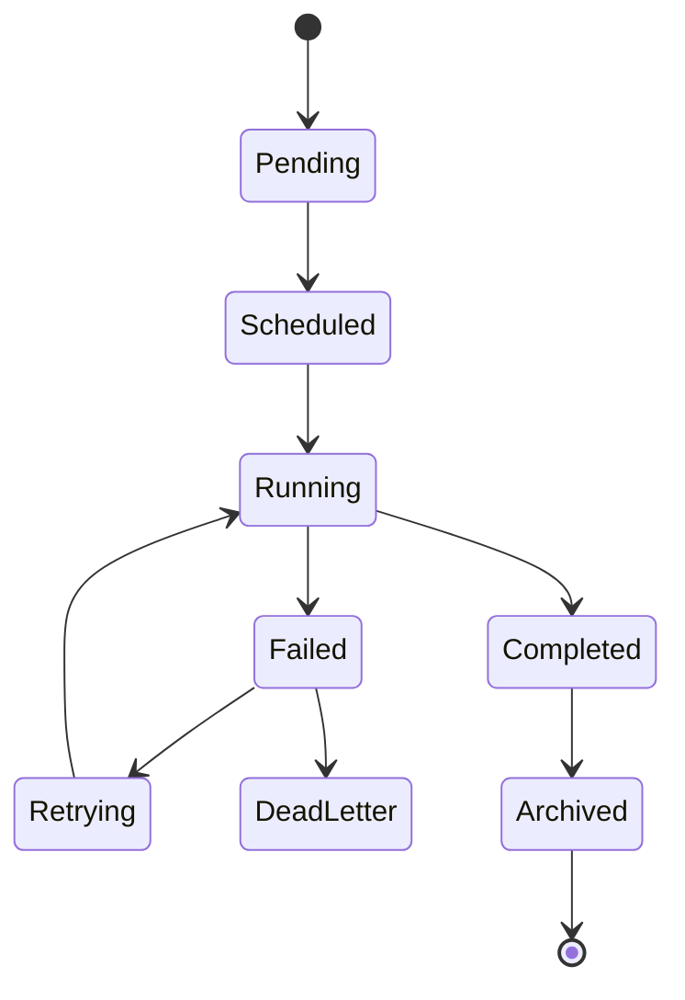
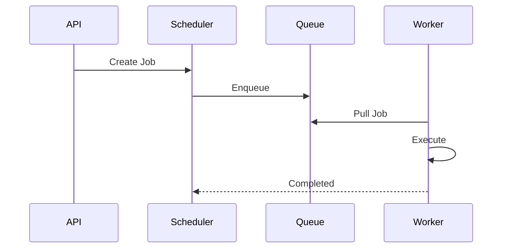

# FSPEC.14 – Background Jobs & Scheduler

**Document** : FSPEC.14

**Fichier** : `02-FSPEC/01-Core/FSPEC.14-Background-Jobs.md`

**Version** : 3.0

**Statut** : Draft

**Playbook** : PLATFORM

**Capability** : Background Jobs & Scheduler

**Owner** : Platform Team

**Dernière mise à jour** : 2026-07

---

# 1. Objectif

Le domaine **Background Jobs & Scheduler** est responsable de l'exécution des traitements asynchrones de la plateforme EventFoundry.

Il permet de déléguer les traitements longs, coûteux ou planifiés afin de garantir une excellente réactivité des API tout en assurant une exécution fiable et traçable.

Le domaine fournit un moteur unique pour :

- les traitements différés ;
- les tâches planifiées ;
- les traitements périodiques ;
- les reprises automatiques ;
- les traitements distribués.

---

# 2. Objectifs fonctionnels

Le domaine permet de :

- créer un Job ;
- planifier une exécution ;
- exécuter un traitement différé ;
- relancer automatiquement un Job en erreur ;
- annuler un Job ;
- suivre l'avancement d'un traitement ;
- consulter l'historique des exécutions.

---

# 3. Hors périmètre

Le domaine ne gère pas :

- la logique métier ;
- les notifications ;
- les workflows ;
- les événements fonctionnels ;
- les permissions.

---

# 4. Références

## ADR

- ADR.17 – Event-Driven Architecture
- ADR.22 – Observability Strategy

---

# 5. Vision métier

Les traitements asynchrones sont indépendants des API.

Une requête utilisateur ne doit jamais attendre l'exécution complète d'un traitement long.

Les domaines métier délèguent leurs traitements au Scheduler.

---

# 6. Concepts métier

## Job

| Attribut | Description |
|----------|-------------|
| Id | Identifiant |
| Type | Nature du traitement |
| Status | État |
| Priority | Priorité |
| Payload | Données d'exécution |
| Attempts | Nombre de tentatives |
| ScheduledAt | Date prévue |
| StartedAt | Début |
| FinishedAt | Fin |

---

## Job Queue

Une file d'attente logique contenant les traitements d'une même famille.

Exemples :

- Notifications
- Media
- OCR
- Search
- Cleanup

---

## Worker

Processus chargé de l'exécution des Jobs.

Les Workers sont distribuables horizontalement.

---

# 7. Cycle de vie



---

# 8. Architecture



---

# 9. Types de Jobs

| Type | Exemple |
|------|----------|
| Immediate | Notification |
| Delayed | Rappel d'événement |
| Scheduled | Tâche planifiée |
| Recurring | Nettoyage quotidien |
| Batch | Réindexation |
| Maintenance | Archivage |

---

# 10. Priorités

| Priorité | Description |
|----------|-------------|
| Critical | Exécution immédiate |
| High | Haute priorité |
| Normal | Priorité standard |
| Low | Traitement différé |

---

# 11. Planification

Le Scheduler supporte :

- exécution immédiate ;
- exécution différée ;
- exécution à une date précise ;
- exécution périodique (Cron) ;
- exécution récurrente.

Exemple :

```text
Tous les jours à 02:00 UTC

Toutes les heures

Chaque lundi

Toutes les 15 minutes
```

---

# 12. Politique de reprise

Les Jobs en erreur peuvent être automatiquement relancés.

La politique est configurable.

Exemple :

| Tentative | Délai |
|-----------|--------|
| 1 | immédiat |
| 2 | 30 s |
| 3 | 5 min |
| 4 | 30 min |
| 5 | Dead Letter Queue |

---

# 13. Dead Letter Queue

Les traitements définitivement en échec sont déplacés dans une file dédiée.

Ils peuvent être :

- consultés ;
- analysés ;
- relancés manuellement.

---

# 14. Règles métier

| ID | Règle |
|----|--------|
| RM-JOB-001 | Chaque Job possède un identifiant unique. |
| RM-JOB-002 | Les traitements sont idempotents. |
| RM-JOB-003 | Les Workers sont sans état (Stateless). |
| RM-JOB-004 | Les Jobs peuvent être relancés automatiquement. |
| RM-JOB-005 | Les Jobs expirés sont annulés. |
| RM-JOB-006 | Les traitements sont historisés. |
| RM-JOB-007 | Les Dead Letter Queues sont auditables. |
| RM-JOB-008 | Les Jobs critiques sont prioritaires. |
| RM-JOB-009 | Les traitements peuvent être distribués sur plusieurs Workers. |
| RM-JOB-010 | Les exécutions possèdent un CorrelationId. |

---

# 15. API

## Consultation

```http
GET /api/v1/jobs

GET /api/v1/jobs/{id}

GET /api/v1/jobs/{id}/history
```

---

## Administration

```http
POST /api/v1/jobs

POST /api/v1/jobs/{id}/retry

POST /api/v1/jobs/{id}/cancel

DELETE /api/v1/jobs/{id}
```

---

# 16. Evénements publiés

| Evénement |
|------------|
| JobCreated |
| JobStarted |
| JobCompleted |
| JobFailed |
| JobRetried |
| JobCancelled |

---

# 17. Evénements consommés

| Evénement |
|------------|
| NotificationRequested |
| MediaUploaded |
| SearchReindexRequested |
| OCRRequested |
| CleanupRequested |

---

# 18. Données manipulées

Le domaine manipule :

- Job
- JobExecution
- JobQueue
- Worker
- DeadLetterJob

Le domaine ne manipule jamais :

- User
- Organization
- Event
- Payment
- Authentication

---

# 19. Observabilité

Logs :

- création d'un Job ;
- début d'exécution ;
- fin d'exécution ;
- échec ;
- reprise automatique ;
- annulation.

Metrics :

- Jobs créés ;
- Jobs exécutés ;
- Jobs échoués ;
- temps moyen d'exécution ;
- taille des files d'attente ;
- taux de reprise.

Toutes les opérations utilisent un CorrelationId conformément à ADR.22.

---

# 20. Sécurité

Les Jobs héritent du contexte de sécurité de leur créateur lorsque nécessaire.

Les données sensibles du Payload sont chiffrées ou référencées, jamais exposées en clair dans les journaux.

Les opérations d'administration (annulation, reprise, purge) sont réservées aux administrateurs autorisés.

---

# 21. Performance

Objectifs de performance :

| Indicateur | Objectif |
|------------|----------|
| Mise en file | < 20 ms |
| Démarrage d'un Job immédiat | < 1 s |
| Débit des Workers | Horizontalement scalable |
| Disponibilité | 99,9 % |
| Traitements bloqués | Détection automatique |

---

# 22. Critères d'acceptation

| ID | Critère |
|----|----------|
| AC-JOB-001 | Les traitements longs sont exécutés de manière asynchrone. |
| AC-JOB-002 | Les Jobs peuvent être planifiés ou exécutés immédiatement. |
| AC-JOB-003 | Les Jobs en erreur sont automatiquement relancés selon une politique configurable. |
| AC-JOB-004 | Les traitements définitivement en échec sont déplacés en Dead Letter Queue. |
| AC-JOB-005 | Les Workers peuvent être répartis horizontalement. |
| AC-JOB-006 | Toutes les exécutions sont historisées. |
| AC-JOB-007 | Les traitements sont idempotents. |
| AC-JOB-008 | Toutes les opérations sont observables conformément à ADR.22. |
| AC-JOB-009 | Les événements du domaine sont publiés sur le bus d'événements. |
| AC-JOB-010 | Le domaine reste totalement indépendant des domaines métier. |