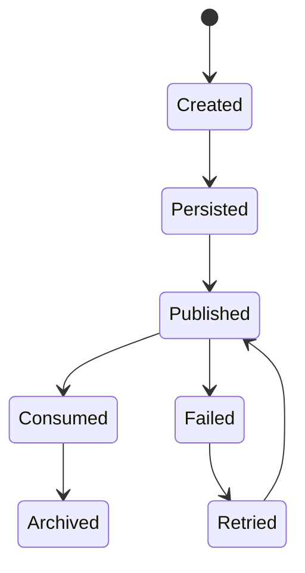
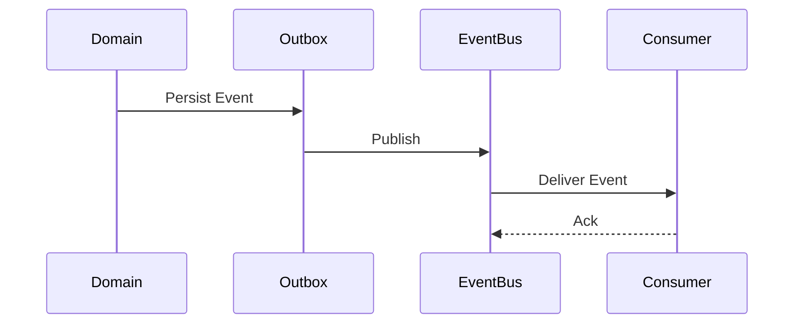

# FSPEC.15 – Event Bus & Domain Events

**Document** : FSPEC.15

**Fichier** : `02-FSPEC/01-Core/FSPEC.15-Event-Bus.md`

**Version** : 3.0

**Statut** : Draft

**Playbook** : PLATFORM

**Capability** : Event Bus & Domain Events

**Owner** : Platform Team

**Dernière mise à jour** : 2026-07

---

# 1. Objectif

Le domaine **Event Bus & Domain Events** fournit l'infrastructure de communication asynchrone entre les domaines fonctionnels de la plateforme EventFoundry.

Il garantit un couplage faible entre les services tout en permettant la propagation fiable des événements métier.

Le domaine est responsable :

- de la publication des événements ;
- de leur distribution ;
- de leur persistance (Outbox Pattern) ;
- de leur consommation ;
- de leur rejeu ;
- de leur traçabilité.

Le domaine ne contient aucune logique métier.

---

# 2. Objectifs fonctionnels

Le domaine permet de :

- publier un Domain Event ;
- consommer un événement ;
- rejouer un événement ;
- consulter l'historique des événements ;
- superviser les abonnements ;
- gérer les erreurs de traitement.

---

# 3. Hors périmètre

Le domaine ne gère pas :

- les workflows métier ;
- les notifications ;
- les traitements asynchrones (FSPEC.14) ;
- les API REST ;
- les permissions.

---

# 4. Références

## ADR

- ADR.17 – Event-Driven Architecture
- ADR.22 – Observability Strategy

---

# 5. Vision métier

Les domaines métier communiquent exclusivement par publication d'événements.

Aucun domaine ne connaît directement ses consommateurs.

Chaque domaine est responsable de publier les événements décrivant les changements de son propre modèle.

---

# 6. Concepts métier

## Domain Event

Un Domain Event représente un fait métier ayant déjà eu lieu.

Exemples :

- UserCreated
- OrganizationCreated
- EventPublished
- EventCancelled
- InvitationAccepted

---

## Event Envelope

Tous les événements utilisent une enveloppe standardisée.

| Attribut | Description |
|----------|-------------|
| EventId | Identifiant unique |
| EventType | Type d'événement |
| AggregateId | Ressource concernée |
| AggregateType | Type de ressource |
| Version | Version du schéma |
| OccurredAt | Date UTC |
| CorrelationId | Corrélation |
| CausationId | Cause |
| Producer | Domaine émetteur |
| Payload | Données métier |

---

## Subscription

Une souscription décrit l'intérêt d'un domaine pour un type d'événement.

Chaque abonnement est indépendant.

---

# 7. Cycle de vie



---

# 8. Architecture



---

# 9. Publication

La publication d'un événement suit les étapes suivantes :

1. Transaction métier validée.
2. Écriture de l'événement dans l'Outbox.
3. Publication sur le Bus.
4. Confirmation de publication.
5. Consommation par les abonnés.

Cette approche garantit la cohérence transactionnelle.

---

# 10. Versionnement

Chaque événement possède un numéro de version.

Exemple :

```text
EventPublished v1

EventPublished v2
```

Les consommateurs doivent rester compatibles avec les versions précédentes.

---

# 11. Idempotence

Les consommateurs doivent être idempotents.

La réception multiple d'un même événement ne doit jamais produire plusieurs effets métier.

Chaque événement est identifié par son `EventId`.

---

# 12. Gestion des erreurs

En cas d'échec :

- nouvelle tentative automatique ;
- stratégie de backoff exponentiel ;
- placement éventuel dans une Dead Letter Queue ;
- supervision.

Les événements ne sont jamais perdus.

---

# 13. Rejeu

Le domaine permet le rejeu :

- d'un événement ;
- d'un intervalle temporel ;
- d'un type d'événement ;
- d'un agrégat spécifique.

Le rejeu est réservé aux administrateurs de plateforme.

---

# 14. Règles métier

| ID | Règle |
|----|--------|
| RM-EVT-001 | Les événements sont immuables. |
| RM-EVT-002 | Chaque événement possède un EventId unique. |
| RM-EVT-003 | Les événements sont horodatés en UTC. |
| RM-EVT-004 | Les publications utilisent le pattern Outbox. |
| RM-EVT-005 | Les consommateurs sont idempotents. |
| RM-EVT-006 | Les événements sont versionnés. |
| RM-EVT-007 | Les événements sont historisés. |
| RM-EVT-008 | Les erreurs de publication sont rejouables. |
| RM-EVT-009 | Tous les événements possèdent un CorrelationId. |
| RM-EVT-010 | Les abonnements sont indépendants les uns des autres. |

---

# 15. API

## Consultation

```http
GET /api/v1/events

GET /api/v1/events/{eventId}

GET /api/v1/events/subscriptions
```

---

## Administration

```http
POST /api/v1/events/replay

POST /api/v1/events/republish

GET /api/v1/events/dead-letter
```

---

# 16. Événements publiés

Le domaine publie principalement des événements techniques :

| Événement |
|------------|
| EventPublished |
| EventRepublished |
| EventReplayStarted |
| EventReplayCompleted |
| DeadLetterCreated |

---

# 17. Événements consommés

Tous les Domain Events produits par les domaines EventFoundry peuvent être consommés.

Le domaine est totalement agnostique vis-à-vis des événements métier.

---

# 18. Données manipulées

Le domaine manipule :

- DomainEvent
- EventEnvelope
- Subscription
- OutboxEntry
- DeadLetterEvent

Le domaine ne manipule jamais :

- User
- Organization
- Event
- Activity
- Media

---

# 19. Observabilité

Logs :

- création d'un événement ;
- publication ;
- consommation ;
- rejeu ;
- erreur de livraison.

Metrics :

- événements publiés ;
- événements consommés ;
- taux d'échec ;
- temps moyen de publication ;
- temps moyen de consommation ;
- taille des Dead Letter Queues.

Toutes les opérations utilisent un `CorrelationId` conformément à ADR.22.

---

# 20. Sécurité

Les événements ne doivent jamais contenir :

- mots de passe ;
- secrets ;
- tokens ;
- clés API ;
- données sensibles non nécessaires.

Les consommateurs sont authentifiés.

Les accès aux fonctions de rejeu sont limités aux administrateurs de plateforme.

---

# 21. Performance

Objectifs de performance :

| Indicateur | Objectif |
|------------|----------|
| Publication | < 50 ms |
| Distribution | Temps réel |
| Disponibilité | 99,9 % |
| Rejeu | Sans interruption de service |
| Débit | Horizontalement scalable |

---

# 22. Critères d'acceptation

| ID | Critère |
|----|----------|
| AC-EVT-001 | Les événements sont publiés via le pattern Outbox. |
| AC-EVT-002 | Les événements sont immuables. |
| AC-EVT-003 | Les consommateurs sont idempotents. |
| AC-EVT-004 | Les événements sont versionnés. |
| AC-EVT-005 | Les erreurs de publication sont automatiquement rejouées. |
| AC-EVT-006 | Les événements peuvent être rejoués manuellement. |
| AC-EVT-007 | Toutes les publications sont historisées. |
| AC-EVT-008 | Toutes les opérations sont observables conformément à ADR.22. |
| AC-EVT-009 | Les événements techniques sont publiés sur le bus. |
| AC-EVT-010 | Le domaine reste totalement indépendant des domaines métier. |