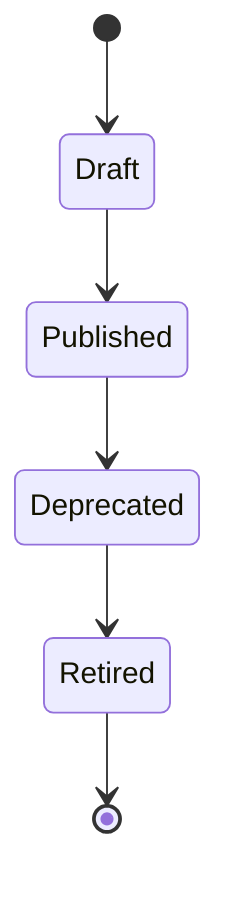
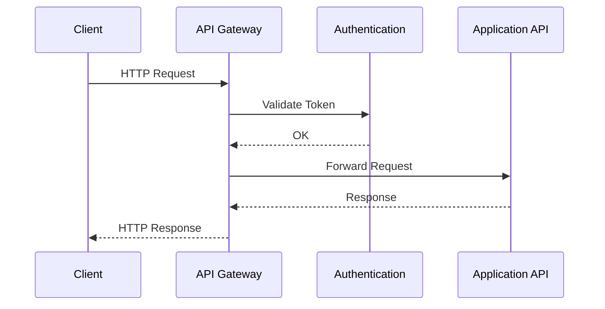

# FSPEC.16 – API Management

**Document** : FSPEC.16

**Fichier** : `02-FSPEC/01-Core/FSPEC.16-API-Management.md`

**Version** : 3.0

**Statut** : Draft

**Playbook** : PLATFORM

**Capability** : API Management

**Owner** : Platform Team

**Dernière mise à jour** : 2026-07

---

# 1. Objectif

Le domaine **API Management** fournit l'ensemble des capacités nécessaires à l'exposition, la sécurisation, le versionnement et la gouvernance des API de la plateforme EventFoundry.

Toutes les API publiques et internes transitent par cette couche.

Le domaine garantit :

- une interface cohérente ;
- une sécurité homogène ;
- un versionnement maîtrisé ;
- une observabilité complète ;
- une documentation centralisée.

---

# 2. Objectifs fonctionnels

Le domaine permet de :

- exposer des API REST ;
- gérer les versions d'API ;
- publier une documentation OpenAPI ;
- appliquer des politiques de sécurité ;
- limiter le trafic (Rate Limiting) ;
- superviser les appels ;
- déprécier une API.

---

# 3. Hors périmètre

Le domaine ne gère pas :

- la logique métier ;
- les permissions fonctionnelles ;
- les traitements asynchrones ;
- les événements métier.

---

# 4. Références

## ADR

- ADR.09 – API Design Guidelines
- ADR.10 – Versioning Strategy
- ADR.22 – Observability Strategy

---

# 5. Vision métier

Toutes les API exposées par EventFoundry respectent les mêmes conventions.

Chaque domaine métier expose ses propres endpoints mais leur gouvernance est centralisée.

Toutes les API sont :

- documentées ;
- versionnées ;
- observables ;
- sécurisées.

---

# 6. Concepts métier

## API

Une API représente un ensemble cohérent de ressources exposées.

Exemple :

- Authentication API
- Events API
- Organizations API
- Notifications API

---

## Endpoint

Un endpoint est défini par :

| Attribut | Description |
|----------|-------------|
| Method | GET, POST, PUT... |
| Path | URI |
| Version | Version d'API |
| Visibility | Public / Internal |
| Status | Active / Deprecated |

---

## API Version

Une API possède une version majeure.

Exemple :

```text
/api/v1/events

/api/v2/events
```

Plusieurs versions peuvent coexister.

---

# 7. Cycle de vie



---

# 8. Architecture



---

# 9. Standards REST

Les API respectent les conventions REST.

Exemple :

```http
GET    /api/v1/events

GET    /api/v1/events/{id}

POST   /api/v1/events

PATCH  /api/v1/events/{id}

DELETE /api/v1/events/{id}
```

---

# 10. Versionnement

Le versionnement est porté par l'URL.

Exemple :

```text
/api/v1

/api/v2
```

Les changements incompatibles nécessitent une nouvelle version majeure.

---

# 11. Gestion des erreurs

Toutes les erreurs utilisent un format unique.

Exemple :

```json
{
  "code": "EVENT_NOT_FOUND",
  "message": "The requested event does not exist.",
  "correlationId": "...",
  "timestamp": "2026-07-20T10:00:00Z"
}
```

---

# 12. Rate Limiting

Le domaine supporte plusieurs politiques :

| Politique | Exemple |
|------------|----------|
| Anonymous | 30 req/min |
| Authenticated | 300 req/min |
| Service Account | configurable |

Les limites sont configurables.

---

# 13. Documentation

Chaque API publie automatiquement :

- OpenAPI 3.1 ;
- exemples ;
- schémas JSON ;
- codes d'erreur ;
- modèles de requêtes.

---

# 14. Sécurité

Toutes les API utilisent :

- HTTPS ;
- OAuth2 / OIDC ;
- JWT ;
- RBAC ;
- validation des entrées.

Les API publiques n'exposent jamais d'informations sensibles.

---

# 15. Règles métier

| ID | Règle |
|----|--------|
| RM-API-001 | Toutes les API sont versionnées. |
| RM-API-002 | Les API utilisent HTTPS exclusivement. |
| RM-API-003 | Toutes les réponses possèdent un CorrelationId. |
| RM-API-004 | Les erreurs utilisent un format standard. |
| RM-API-005 | Les API dépréciées restent supportées pendant la période de transition. |
| RM-API-006 | Les quotas sont appliqués avant le traitement métier. |
| RM-API-007 | Toutes les API publient une documentation OpenAPI. |
| RM-API-008 | Les paramètres sont validés avant traitement. |
| RM-API-009 | Les réponses sont paginées lorsque nécessaire. |
| RM-API-010 | Les appels sont historisés dans les journaux techniques. |

---

# 16. API

## Découverte

```http
GET /api

GET /api/v1

GET /api/openapi.json

GET /api/swagger
```

---

## Administration

```http
GET /api/v1/apis

POST /api/v1/apis/cache/clear

POST /api/v1/apis/reload
```

---

# 17. Événements publiés

| Événement |
|------------|
| ApiPublished |
| ApiDeprecated |
| RateLimitExceeded |
| ApiVersionReleased |

---

# 18. Événements consommés

| Événement |
|------------|
| ConfigurationUpdated |
| FeatureFlagEnabled |
| FeatureFlagDisabled |

---

# 19. Données manipulées

Le domaine manipule :

- ApiDefinition
- ApiVersion
- EndpointDefinition
- ErrorDefinition
- RateLimitPolicy

Le domaine ne manipule jamais :

- User
- Organization
- Event
- Notification
- Payment

---

# 20. Observabilité

Logs :

- appels API ;
- erreurs ;
- dépassements de quota ;
- temps de réponse ;
- dépréciations.

Metrics :

- nombre de requêtes ;
- taux d'erreur ;
- temps moyen de réponse ;
- taux de disponibilité ;
- consommation par endpoint.

Toutes les requêtes possèdent un `CorrelationId` conformément à ADR.22.

---

# 21. Performance

Objectifs :

| Indicateur | Objectif |
|------------|----------|
| Latence moyenne | < 100 ms |
| Disponibilité | 99,9 % |
| Débit | Horizontalement scalable |
| Documentation | Génération automatique |
| Validation | Temps réel |

---

# 22. Critères d'acceptation

| ID | Critère |
|----|----------|
| AC-API-001 | Toutes les API sont versionnées. |
| AC-API-002 | Toutes les API disposent d'une documentation OpenAPI 3.1. |
| AC-API-003 | Les erreurs utilisent un format standardisé. |
| AC-API-004 | Les quotas sont appliqués avant l'exécution métier. |
| AC-API-005 | Toutes les communications utilisent HTTPS. |
| AC-API-006 | Les changements incompatibles créent une nouvelle version majeure. |
| AC-API-007 | Les réponses incluent un `CorrelationId`. |
| AC-API-008 | Toutes les opérations sont observables conformément à ADR.22. |
| AC-API-009 | Les événements techniques sont publiés sur le bus d'événements. |
| AC-API-010 | Le domaine reste totalement indépendant des domaines métier. |