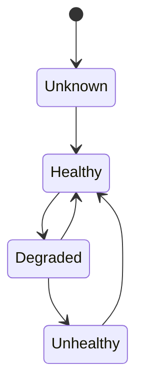
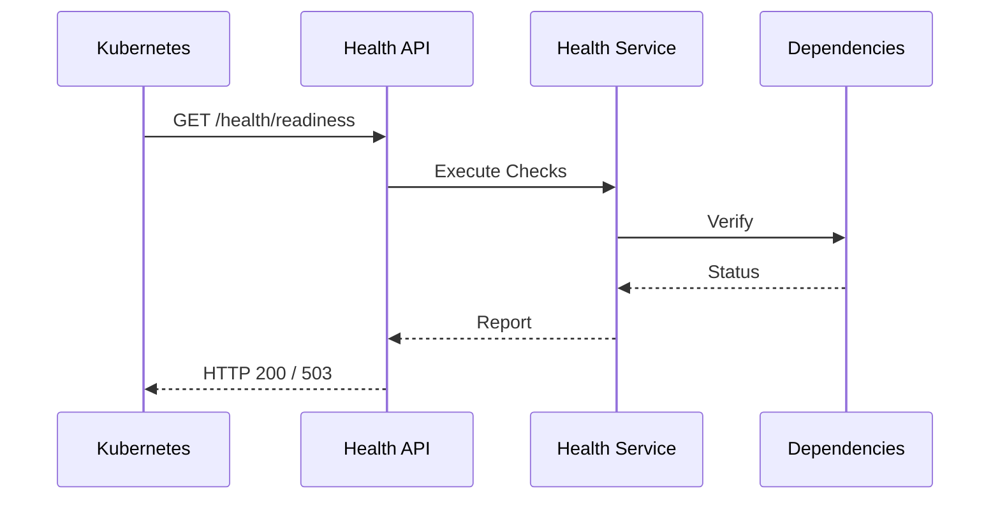

# FSPEC.17 – Health Monitoring & Platform Diagnostics

**Document** : FSPEC.17

**Fichier** : `02-FSPEC/01-Core/FSPEC.17-Health-Monitoring.md`

**Version** : 3.0

**Statut** : Draft

**Playbook** : PLATFORM

**Capability** : Health Monitoring & Platform Diagnostics

**Owner** : Platform Team

**Dernière mise à jour** : 2026-07

---

# 1. Objectif

Le domaine **Health Monitoring & Platform Diagnostics** fournit les capacités de supervision technique de la plateforme EventFoundry.

Il permet de mesurer en permanence l'état de santé des composants afin de garantir :

- la disponibilité de la plateforme ;
- la détection rapide des incidents ;
- le diagnostic des pannes ;
- l'intégration avec Kubernetes ;
- l'intégration avec les systèmes d'observabilité.

Ce domaine est entièrement technique et ne contient aucune logique métier.

---

# 2. Objectifs fonctionnels

Le domaine permet de :

- publier un état de santé ;
- vérifier la disponibilité des dépendances ;
- exposer les métriques techniques ;
- contrôler l'état de préparation (Readiness) ;
- contrôler l'état de fonctionnement (Liveness) ;
- détecter les dégradations ;
- agréger les diagnostics.

---

# 3. Hors périmètre

Le domaine ne gère pas :

- les alertes métier ;
- les workflows ;
- les notifications utilisateur ;
- les permissions ;
- les données fonctionnelles.

---

# 4. Références

## ADR

- ADR.22 – Observability Strategy
- ADR.23 – Kubernetes Deployment Strategy

---

# 5. Vision métier

Chaque service EventFoundry doit être capable d'indiquer automatiquement son état de fonctionnement.

Les plateformes d'orchestration (Kubernetes) utilisent ces informations pour :

- démarrer un Pod ;
- retirer un Pod du trafic ;
- redémarrer un Pod défaillant ;
- superviser l'infrastructure.

---

# 6. Concepts métier

## Health Check

Contrôle un composant spécifique.

Exemples :

- PostgreSQL
- Redis
- MinIO
- Event Bus
- Search Engine
- SMTP

---

## Health Status

Chaque composant possède un état.

| État | Description |
|------|-------------|
| UP | Fonctionnement normal |
| DEGRADED | Fonctionnement partiel |
| DOWN | Indisponible |
| UNKNOWN | État inconnu |

---

## Diagnostic Report

Rapport agrégé de tous les contrôles exécutés.

Il contient :

- état global ;
- détails par composant ;
- durée d'exécution ;
- horodatage.

---

# 7. Cycle de vie



---

# 8. Architecture



---

# 9. Types de contrôles

| Contrôle | Description |
|-----------|-------------|
| Liveness | Processus actif |
| Readiness | Service prêt à recevoir du trafic |
| Startup | Initialisation terminée |
| Dependency | Vérification des dépendances |
| Custom | Contrôle spécifique |

---

# 10. Dépendances surveillées

Les contrôles peuvent porter sur :

- PostgreSQL ;
- Redis ;
- MinIO ;
- Event Bus ;
- moteur de recherche ;
- SMTP ;
- fournisseur OAuth ;
- stockage objet ;
- services externes.

Chaque contrôle est indépendant.

---

# 11. Endpoints

## Santé

```http
GET /health

GET /health/live

GET /health/ready

GET /health/startup
```

---

## Métriques

```http
GET /metrics
```

Compatible Prometheus.

---

# 12. Rapport de santé

Exemple :

```json
{
  "status": "UP",
  "timestamp": "2026-07-20T09:42:18Z",
  "checks": [
    {
      "component": "PostgreSQL",
      "status": "UP",
      "duration": 12
    },
    {
      "component": "Redis",
      "status": "UP",
      "duration": 3
    }
  ]
}
```

---

# 13. Dégradation

Un composant peut être :

- totalement indisponible ;
- temporairement dégradé ;
- lent ;
- inaccessible.

Chaque dépendance possède son propre seuil de tolérance.

---

# 14. Règles métier

| ID | Règle |
|----|--------|
| RM-HEALTH-001 | Chaque service expose un endpoint de santé. |
| RM-HEALTH-002 | Les contrôles sont indépendants les uns des autres. |
| RM-HEALTH-003 | Les dépendances externes ne bloquent pas les contrôles internes. |
| RM-HEALTH-004 | Les diagnostics sont horodatés en UTC. |
| RM-HEALTH-005 | Les temps d'exécution sont mesurés. |
| RM-HEALTH-006 | Les erreurs sont historisées. |
| RM-HEALTH-007 | Les contrôles sont non bloquants. |
| RM-HEALTH-008 | Les réponses sont sérialisées au format JSON. |
| RM-HEALTH-009 | Les métriques sont compatibles Prometheus. |
| RM-HEALTH-010 | Tous les contrôles possèdent un CorrelationId. |

---

# 15. API

## Consultation

```http
GET /health

GET /health/live

GET /health/ready

GET /health/startup

GET /metrics
```

---

# 16. Événements publiés

| Événement |
|------------|
| HealthStatusChanged |
| DependencyUnavailable |
| DependencyRecovered |
| HealthCheckFailed |

---

# 17. Événements consommés

| Événement |
|------------|
| ConfigurationUpdated |
| FeatureFlagEnabled |
| FeatureFlagDisabled |

---

# 18. Données manipulées

Le domaine manipule :

- HealthCheck
- HealthStatus
- DiagnosticReport
- DependencyStatus

Le domaine ne manipule jamais :

- User
- Organization
- Event
- Notification
- Payment

---

# 19. Observabilité

Logs :

- exécution d'un contrôle ;
- changement d'état ;
- indisponibilité ;
- récupération ;
- dépassement de seuil.

Metrics :

- disponibilité ;
- temps moyen des contrôles ;
- taux d'échec ;
- disponibilité des dépendances ;
- durée de récupération.

Toutes les opérations utilisent un `CorrelationId` conformément à ADR.22.

---

# 20. Sécurité

Les endpoints de santé publique (`/health/live`, `/health/ready`, `/health/startup`) n'exposent aucune information sensible.

Les diagnostics détaillés sont accessibles uniquement aux administrateurs de plateforme.

Les métriques sont protégées lorsqu'elles sont exposées hors du cluster Kubernetes.

---

# 21. Performance

Objectifs :

| Indicateur | Objectif |
|------------|----------|
| Health Check | < 100 ms |
| Readiness | < 100 ms |
| Liveness | < 50 ms |
| Startup Check | < 500 ms |
| Endpoint Metrics | < 200 ms |

Les contrôles ne doivent jamais provoquer de charge significative sur les services supervisés.

---

# 22. Critères d'acceptation

| ID | Critère |
|----|----------|
| AC-HEALTH-001 | Tous les services exposent les endpoints standards de santé. |
| AC-HEALTH-002 | Les contrôles Liveness, Readiness et Startup sont disponibles. |
| AC-HEALTH-003 | Les dépendances sont vérifiées individuellement. |
| AC-HEALTH-004 | Les métriques sont compatibles Prometheus. |
| AC-HEALTH-005 | Les rapports sont produits au format JSON. |
| AC-HEALTH-006 | Les diagnostics détaillés sont sécurisés. |
| AC-HEALTH-007 | Les changements d'état publient des événements techniques. |
| AC-HEALTH-008 | Toutes les opérations sont observables conformément à ADR.22. |
| AC-HEALTH-009 | Les endpoints sont compatibles avec Kubernetes. |
| AC-HEALTH-010 | Le domaine reste totalement indépendant des domaines métier. |