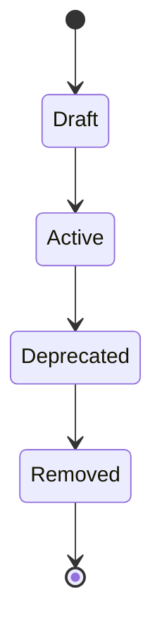
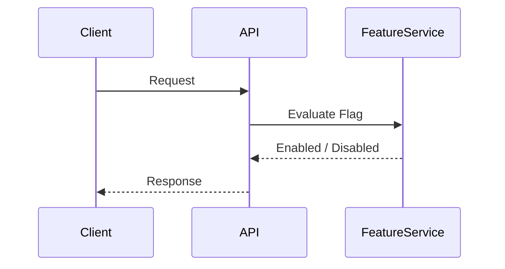

# FSPEC.18 – Feature Flags

**Document** : FSPEC.18

**Fichier** : `02-FSPEC/01-Core/FSPEC.18-Feature-Flags.md`

**Version** : 3.0

**Statut** : Draft

**Playbook** : PLATFORM

**Capability** : Feature Flag Management

**Owner** : Platform Team

**Dernière mise à jour** : 2026-07

---

# 1. Objectif

Le domaine **Feature Flag Management** permet d'activer, désactiver ou déployer progressivement des fonctionnalités de la plateforme EventFoundry sans nécessiter un nouveau déploiement.

Il constitue un mécanisme transversal permettant :

- les déploiements progressifs ;
- les tests fonctionnels ;
- les expérimentations (A/B Testing) ;
- les bêtas privées ;
- les activations ciblées ;
- les désactivations d'urgence.

Les Feature Flags sont exclusivement destinées au contrôle du comportement de l'application et ne remplacent jamais les règles métier.

---

# 2. Objectifs fonctionnels

Le domaine permet de :

- créer une Feature Flag ;
- activer ou désactiver une fonctionnalité ;
- cibler un sous-ensemble d'utilisateurs ;
- définir une stratégie de déploiement ;
- consulter l'état des Flags ;
- historiser les modifications ;
- supprimer une Feature Flag obsolète.

---

# 3. Hors périmètre

Le domaine ne gère pas :

- les paramètres de configuration générale (FSPEC.10) ;
- les permissions ;
- les workflows métier ;
- les données fonctionnelles.

---

# 4. Références

## ADR

- ADR.10 – Versioning Strategy
- ADR.22 – Observability Strategy

---

# 5. Vision métier

Une Feature Flag représente une décision technique permettant de contrôler dynamiquement l'activation d'une fonctionnalité.

Une fonctionnalité peut être :

- inactive ;
- active pour tous ;
- active pour un groupe ;
- active progressivement.

Les Feature Flags doivent être temporaires.

Une fonctionnalité stabilisée doit intégrer définitivement le code applicatif.

---

# 6. Concepts métier

## Feature Flag

| Attribut | Description |
|----------|-------------|
| Id | Identifiant |
| Key | Clé unique |
| Name | Nom |
| Description | Description |
| Status | Active / Inactive |
| Strategy | Stratégie de déploiement |
| CreatedAt | Création |
| UpdatedAt | Dernière modification |

---

## Target Rule

Définit les conditions d'activation.

Exemples :

- Organisation ;
- Utilisateur ;
- Groupe ;
- Pays ;
- Environnement ;
- Pourcentage.

---

## Evaluation

Résultat du calcul de la Feature Flag.

Valeurs possibles :

- Enabled
- Disabled

---

# 7. Cycle de vie



---

# 8. Architecture



---

# 9. Stratégies de déploiement

| Stratégie | Description |
|-----------|-------------|
| Global | Tous les utilisateurs |
| Environment | DEV / TEST / PROD |
| Organization | Une organisation spécifique |
| User | Un utilisateur |
| Group | Un groupe |
| Percentage | Déploiement progressif |

Les stratégies peuvent être combinées.

---

# 10. Déploiement progressif

Le domaine supporte les déploiements par pourcentage.

Exemple :

```text
5 %

↓

20 %

↓

50 %

↓

100 %
```

La sélection des utilisateurs est déterministe afin de garantir une expérience cohérente.

---

# 11. Environnements

Une Feature Flag peut être différente selon :

- Development ;
- Integration ;
- Staging ;
- Production.

Chaque environnement possède sa propre configuration.

---

# 12. Évaluation

L'évaluation d'une Feature Flag suit l'ordre suivant :

```text
Environment

↓

Organization

↓

User

↓

Group

↓

Percentage

↓

Global
```

La première règle applicable est retenue.

---

# 13. Règles métier

| ID | Règle |
|----|--------|
| RM-FF-001 | Une clé de Feature Flag est unique. |
| RM-FF-002 | Les évaluations sont déterministes. |
| RM-FF-003 | Les Feature Flags sont évaluées en temps réel. |
| RM-FF-004 | Les Feature Flags sont historisées. |
| RM-FF-005 | Les Feature Flags obsolètes doivent être supprimées du code. |
| RM-FF-006 | Les stratégies peuvent être combinées. |
| RM-FF-007 | Les modifications prennent effet immédiatement. |
| RM-FF-008 | Les évaluations sont compatibles avec le cache applicatif. |
| RM-FF-009 | Toutes les modifications sont auditables. |
| RM-FF-010 | Chaque évaluation possède un CorrelationId. |

---

# 14. API

## Consultation

```http
GET /api/v1/feature-flags

GET /api/v1/feature-flags/{key}

GET /api/v1/feature-flags/evaluate
```

---

## Administration

```http
POST /api/v1/feature-flags

PATCH /api/v1/feature-flags/{id}

DELETE /api/v1/feature-flags/{id}
```

---

# 15. Événements publiés

| Événement |
|------------|
| FeatureFlagCreated |
| FeatureFlagEnabled |
| FeatureFlagDisabled |
| FeatureFlagUpdated |
| FeatureFlagRemoved |

---

# 16. Événements consommés

| Événement |
|------------|
| OrganizationCreated |
| UserCreated |
| ConfigurationUpdated |

---

# 17. Données manipulées

Le domaine manipule :

- FeatureFlag
- TargetRule
- EvaluationResult
- RolloutStrategy

Le domaine ne manipule jamais :

- UserProfile
- Event
- OrganizationData
- Notification
- Payment

---

# 18. Observabilité

Logs :

- création d'une Feature Flag ;
- activation ;
- désactivation ;
- modification ;
- suppression ;
- évaluation.

Metrics :

- nombre de Feature Flags actives ;
- nombre d'évaluations ;
- temps moyen d'évaluation ;
- répartition par stratégie ;
- taux d'erreur.

Toutes les opérations utilisent un `CorrelationId` conformément à ADR.22.

---

# 19. Sécurité

Les Feature Flags sont administrables uniquement par les administrateurs de plateforme.

Les évaluations sont accessibles aux services autorisés.

Les règles de ciblage ne doivent jamais exposer d'informations personnelles dans les journaux.

Toutes les modifications sont historisées et auditables.

---

# 20. Performance

Objectifs :

| Indicateur | Objectif |
|------------|----------|
| Évaluation d'une Feature Flag | < 5 ms |
| Lecture depuis le cache | < 1 ms |
| Mise à jour d'une règle | Temps réel |
| Disponibilité | 99,9 % |
| Scalabilité | Horizontale |

Les évaluations sont optimisées par un mécanisme de cache distribué.

---

# 21. Critères d'acceptation

| ID | Critère |
|----|----------|
| AC-FF-001 | Les fonctionnalités peuvent être activées ou désactivées sans redéploiement. |
| AC-FF-002 | Les déploiements progressifs sont supportés. |
| AC-FF-003 | Les règles de ciblage peuvent être combinées. |
| AC-FF-004 | Les évaluations sont déterministes. |
| AC-FF-005 | Les modifications prennent effet immédiatement. |
| AC-FF-006 | Toutes les modifications sont historisées. |
| AC-FF-007 | Les Feature Flags obsolètes peuvent être supprimées. |
| AC-FF-008 | Toutes les opérations respectent ADR.22. |
| AC-FF-009 | Les événements techniques sont publiés sur le bus d'événements. |
| AC-FF-010 | Le domaine reste totalement indépendant des domaines métier. |