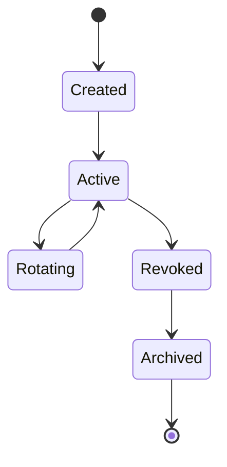
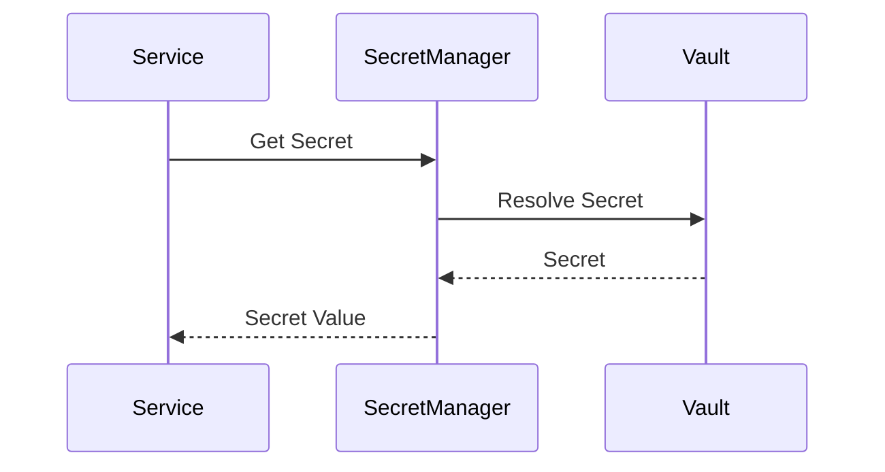

# FSPEC.19 – Secrets Management

**Document** : FSPEC.19

**Fichier** : `02-FSPEC/01-Core/FSPEC.19-Secrets-Management.md`

**Version** : 3.0

**Statut** : Draft

**Playbook** : PLATFORM

**Capability** : Secrets Management

**Owner** : Platform Team

**Dernière mise à jour** : 2026-07

---

# 1. Objectif

Le domaine **Secrets Management** est responsable de la gestion sécurisée des informations sensibles utilisées par la plateforme EventFoundry.

Il garantit que les secrets ne sont jamais stockés dans le code source, les fichiers de configuration ou les bases de données métier.

Le domaine fournit une gestion centralisée des :

- mots de passe techniques ;
- clés API ;
- certificats ;
- secrets OAuth/OIDC ;
- jetons d'accès ;
- clés de chiffrement.

---

# 2. Objectifs fonctionnels

Le domaine permet de :

- stocker un secret ;
- récupérer un secret ;
- mettre à jour un secret ;
- effectuer une rotation ;
- révoquer un secret ;
- contrôler les accès ;
- historiser les opérations.

---

# 3. Hors périmètre

Le domaine ne gère pas :

- les mots de passe des utilisateurs ;
- les préférences utilisateur ;
- les paramètres applicatifs (FSPEC.10) ;
- les données métier.

---

# 4. Références

## ADR

- ADR.20 – Secrets Management
- ADR.22 – Observability Strategy

---

# 5. Vision métier

Les secrets constituent les informations les plus sensibles de la plateforme.

Ils sont gérés exclusivement par un gestionnaire de secrets dédié (ex. Kubernetes Secrets, HashiCorp Vault ou équivalent).

Aucun domaine métier n'est autorisé à persister un secret.

Toutes les applications consomment les secrets au moment de l'exécution.

---

# 6. Concepts métier

## Secret

| Attribut | Description |
|----------|-------------|
| Id | Identifiant |
| Name | Nom logique |
| Type | Nature du secret |
| Status | État |
| Version | Version |
| CreatedAt | Création |
| ExpiresAt | Expiration éventuelle |

---

## Secret Version

Chaque modification crée une nouvelle version.

Les anciennes versions restent consultables uniquement pour audit selon la politique de rétention.

---

## Secret Consumer

Représente un composant autorisé à utiliser un secret.

Exemples :

- API Backend
- Worker
- Scheduler
- OCR Service
- SMTP Connector

---

# 7. Cycle de vie



---

# 8. Types de secrets

| Type | Exemple |
|------|----------|
| Database | PostgreSQL Password |
| API Key | Google Maps |
| OAuth Secret | Google OAuth Client Secret |
| Certificate | TLS Certificate |
| Encryption | AES Key |
| Token | Service Token |

---

# 9. Architecture



---

# 10. Rotation

Les secrets peuvent être renouvelés :

- manuellement ;
- automatiquement ;
- selon une politique temporelle.

Une rotation ne doit jamais interrompre le fonctionnement de la plateforme.

---

# 11. Contrôle d'accès

Chaque secret possède une politique d'accès.

Les autorisations peuvent être définies par :

- application ;
- service ;
- environnement ;
- rôle technique.

Le principe du **moindre privilège** est appliqué systématiquement.

---

# 12. Chiffrement

Les secrets sont :

- chiffrés au repos ;
- chiffrés en transit ;
- jamais enregistrés en clair dans les journaux.

Les clés de chiffrement sont elles-mêmes protégées.

---

# 13. Règles métier

| ID | Règle |
|----|--------|
| RM-SEC-001 | Les secrets ne sont jamais stockés dans le code source. |
| RM-SEC-002 | Les secrets sont chiffrés au repos. |
| RM-SEC-003 | Les accès sont authentifiés et autorisés. |
| RM-SEC-004 | Chaque modification crée une nouvelle version. |
| RM-SEC-005 | Les rotations sont auditables. |
| RM-SEC-006 | Les secrets expirés ne peuvent plus être utilisés. |
| RM-SEC-007 | Les applications utilisent uniquement des références logiques. |
| RM-SEC-008 | Les valeurs des secrets ne sont jamais journalisées. |
| RM-SEC-009 | Les accès sont historisés. |
| RM-SEC-010 | Toutes les opérations possèdent un CorrelationId. |

---

# 14. API

## Consultation

```http
GET /api/v1/secrets/{name}

GET /api/v1/secrets

GET /api/v1/secrets/{name}/versions
```

---

## Administration

```http
POST /api/v1/secrets

PATCH /api/v1/secrets/{id}

POST /api/v1/secrets/{id}/rotate

POST /api/v1/secrets/{id}/revoke
```

---

# 15. Événements publiés

| Événement |
|------------|
| SecretCreated |
| SecretRotated |
| SecretRevoked |
| SecretExpired |
| SecretAccessed |

---

# 16. Événements consommés

| Événement |
|------------|
| ApplicationDeployed |
| ConfigurationUpdated |

---

# 17. Données manipulées

Le domaine manipule :

- Secret
- SecretVersion
- AccessPolicy
- SecretConsumer

Le domaine ne manipule jamais :

- User
- Password
- Organization
- Event
- Notification

---

# 18. Observabilité

Logs :

- création ;
- rotation ;
- révocation ;
- accès ;
- refus d'accès.

Les journaux ne contiennent jamais les valeurs des secrets.

Metrics :

- nombre de secrets ;
- rotations effectuées ;
- secrets expirés ;
- accès autorisés ;
- accès refusés.

Toutes les opérations utilisent un `CorrelationId` conformément à ADR.22.

---

# 19. Sécurité

Le domaine applique les principes suivants :

- chiffrement systématique ;
- authentification forte des consommateurs ;
- contrôle d'accès basé sur les rôles techniques ;
- rotation régulière des secrets ;
- audit complet des opérations.

Les secrets ne transitent jamais dans les réponses des API publiques.

---

# 20. Performance

Objectifs :

| Indicateur | Objectif |
|------------|----------|
| Résolution d'un secret | < 20 ms |
| Lecture depuis le cache sécurisé | < 5 ms |
| Rotation | Sans interruption de service |
| Disponibilité | 99,99 % |
| Scalabilité | Horizontale |

Les secrets fréquemment utilisés peuvent être mis en cache de manière sécurisée avec une durée de vie limitée.

---

# 21. Critères d'acceptation

| ID | Critère |
|----|----------|
| AC-SEC-001 | Les secrets sont stockés exclusivement dans un gestionnaire dédié. |
| AC-SEC-002 | Les secrets sont chiffrés au repos et en transit. |
| AC-SEC-003 | Les valeurs des secrets ne sont jamais journalisées. |
| AC-SEC-004 | Les secrets peuvent être rotés sans interruption de service. |
| AC-SEC-005 | Toutes les modifications sont historisées. |
| AC-SEC-006 | Les politiques d'accès sont appliquées avant toute lecture. |
| AC-SEC-007 | Les secrets expirés sont automatiquement révoqués. |
| AC-SEC-008 | Toutes les opérations respectent ADR.22. |
| AC-SEC-009 | Les événements techniques sont publiés sur le bus d'événements. |
| AC-SEC-010 | Le domaine reste totalement indépendant des domaines métier. |