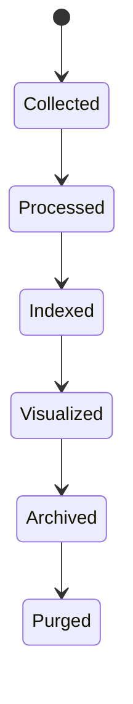
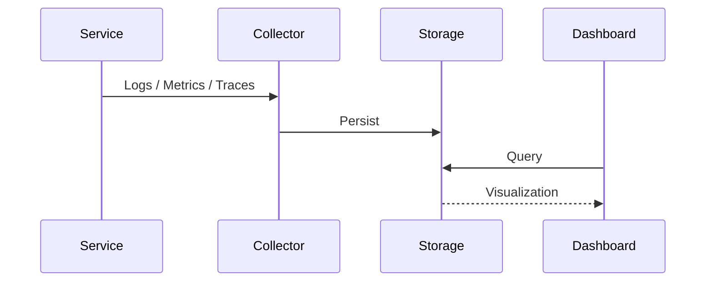

# FSPEC.20 – Observability

**Document** : FSPEC.20

**Fichier** : `02-FSPEC/01-Core/FSPEC.20-Observability.md`

**Version** : 3.0

**Statut** : Draft

**Playbook** : PLATFORM

**Capability** : Observability

**Owner** : Platform Team

**Dernière mise à jour** : 2026-07

---

# 1. Objectif

Le domaine **Observability** fournit l'ensemble des capacités permettant de superviser, mesurer, diagnostiquer et analyser le comportement de la plateforme EventFoundry.

Il constitue la fondation des opérations (DevOps, SRE et exploitation) en offrant une visibilité complète sur :

- les logs ;
- les métriques ;
- les traces distribuées ;
- les événements techniques ;
- les tableaux de bord ;
- les alertes.

Le domaine est transversal et ne contient aucune logique métier.

---

# 2. Objectifs fonctionnels

Le domaine permet de :

- collecter les journaux applicatifs ;
- publier des métriques ;
- tracer les requêtes distribuées ;
- corréler les événements techniques ;
- produire des tableaux de bord ;
- générer des alertes ;
- faciliter le diagnostic des incidents.

---

# 3. Hors périmètre

Le domaine ne gère pas :

- les règles métier ;
- les notifications utilisateur ;
- les workflows ;
- les permissions ;
- les données fonctionnelles.

---

# 4. Références

## ADR

- ADR.22 – Observability Strategy

---

# 5. Vision métier

Chaque composant de la plateforme doit être observable.

Aucune fonctionnalité ne peut être développée sans produire :

- des logs structurés ;
- des métriques ;
- des traces ;
- un `CorrelationId`.

L'observabilité est une exigence de conception et non une fonctionnalité optionnelle.

---

# 6. Concepts métier

## Log

Représente un événement technique.

| Attribut | Description |
|----------|-------------|
| Timestamp | Horodatage UTC |
| Level | Niveau |
| Service | Service émetteur |
| Message | Description |
| CorrelationId | Identifiant de corrélation |
| TraceId | Trace distribuée |
| Metadata | Données complémentaires |

---

## Metric

Mesure quantitative.

Exemples :

- nombre de requêtes ;
- temps de réponse ;
- taux d'erreur ;
- utilisation CPU ;
- mémoire.

---

## Trace

Une trace représente le parcours complet d'une requête au travers de plusieurs services.

Chaque trace est composée de plusieurs **Spans**.

---

## Dashboard

Vue consolidée permettant de superviser un ensemble de métriques et de journaux.

---

# 7. Cycle de vie



---

# 8. Architecture



---

# 9. Journaux

Tous les journaux sont :

- structurés (JSON) ;
- horodatés en UTC ;
- enrichis d'un `CorrelationId` ;
- enrichis d'un `TraceId` lorsqu'il existe.

Les niveaux supportés sont :

| Niveau |
|---------|
| TRACE |
| DEBUG |
| INFO |
| WARN |
| ERROR |
| FATAL |

---

# 10. Métriques

Chaque service expose au minimum :

- nombre de requêtes ;
- temps moyen de réponse ;
- taux d'erreur ;
- consommation mémoire ;
- consommation CPU ;
- nombre de connexions.

Les métriques sont compatibles **Prometheus**.

---

# 11. Traces distribuées

Toutes les requêtes traversant plusieurs services doivent être traçables.

Les traces comprennent :

- TraceId ;
- SpanId ;
- ParentSpanId ;
- durée ;
- service ;
- statut.

Le contexte de traçage est propagé entre les services.

---

# 12. Tableaux de bord

Des tableaux de bord sont disponibles pour :

- disponibilité de la plateforme ;
- API ;
- base de données ;
- Event Bus ;
- Workers ;
- Scheduler ;
- Kubernetes ;
- applications métier.

---

# 13. Alertes

Les alertes peuvent être déclenchées sur :

- indisponibilité d'un service ;
- dépassement d'un seuil ;
- augmentation du taux d'erreur ;
- augmentation de la latence ;
- saturation mémoire ;
- saturation CPU.

Chaque alerte possède :

- un niveau ;
- une description ;
- une règle de déclenchement.

---

# 14. Corrélation

Toutes les opérations utilisent :

- CorrelationId ;
- TraceId ;
- SpanId.

Ces identifiants permettent de reconstruire le parcours complet d'une requête.

---

# 15. Règles métier

| ID | Règle |
|----|--------|
| RM-OBS-001 | Toutes les requêtes possèdent un CorrelationId. |
| RM-OBS-002 | Les logs sont structurés au format JSON. |
| RM-OBS-003 | Les horodatages utilisent UTC. |
| RM-OBS-004 | Les métriques sont compatibles Prometheus. |
| RM-OBS-005 | Les traces utilisent OpenTelemetry. |
| RM-OBS-006 | Les journaux ne contiennent jamais de secrets. |
| RM-OBS-007 | Les niveaux de log sont normalisés. |
| RM-OBS-008 | Les alertes sont configurables. |
| RM-OBS-009 | Les données d'observabilité respectent la politique de rétention. |
| RM-OBS-010 | Toutes les opérations techniques sont traçables. |

---

# 16. API

## Consultation

```http
GET /metrics

GET /health

GET /actuator/loggers

GET /actuator/info
```

---

## Administration

```http
POST /api/v1/observability/log-level

POST /api/v1/observability/cache/flush
```

---

# 17. Événements publiés

| Événement |
|------------|
| AlertTriggered |
| AlertResolved |
| MetricThresholdExceeded |
| TraceCompleted |
| ServiceRecovered |

---

# 18. Événements consommés

Tous les événements techniques de la plateforme peuvent être utilisés pour enrichir les tableaux de bord et les diagnostics.

---

# 19. Données manipulées

Le domaine manipule :

- LogEntry
- Metric
- Trace
- Span
- Dashboard
- AlertRule

Le domaine ne manipule jamais :

- User
- Organization
- Event
- Notification
- Payment

---

# 20. Sécurité

Les journaux ne doivent jamais contenir :

- mots de passe ;
- secrets ;
- tokens ;
- clés API ;
- données personnelles sensibles.

Les tableaux de bord d'administration sont accessibles uniquement aux utilisateurs autorisés.

Les métriques publiques sont limitées aux informations non sensibles.

---

# 21. Performance

Objectifs :

| Indicateur | Objectif |
|------------|----------|
| Écriture d'un log | < 2 ms |
| Publication d'une métrique | < 5 ms |
| Création d'un Span | < 1 ms |
| Disponibilité de la plateforme d'observabilité | 99,9 % |
| Temps de propagation des métriques | < 30 s |

La collecte des données d'observabilité ne doit jamais impacter significativement les performances des services métier.

---

# 22. Critères d'acceptation

| ID | Critère |
|----|----------|
| AC-OBS-001 | Tous les services produisent des logs structurés. |
| AC-OBS-002 | Toutes les requêtes possèdent un CorrelationId. |
| AC-OBS-003 | Les métriques sont compatibles Prometheus. |
| AC-OBS-004 | Les traces distribuées utilisent OpenTelemetry. |
| AC-OBS-005 | Les tableaux de bord permettent de superviser l'ensemble de la plateforme. |
| AC-OBS-006 | Les alertes sont configurables et historisées. |
| AC-OBS-007 | Les journaux ne contiennent jamais de secrets. |
| AC-OBS-008 | Toutes les opérations respectent ADR.22. |
| AC-OBS-009 | Les événements techniques sont publiés sur le bus d'événements. |
| AC-OBS-010 | Le domaine reste totalement indépendant des domaines métier. |